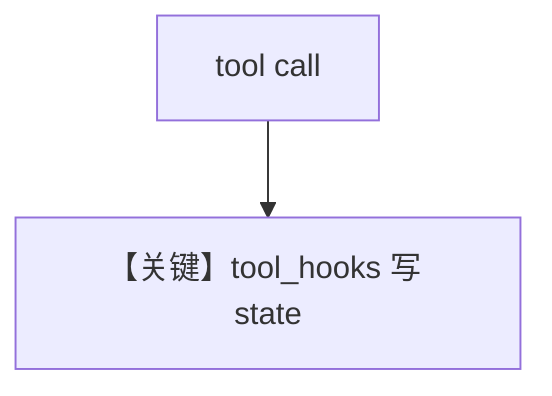

# dynamic_session_state.py — 实现原理分析

> 源文件：`cookbook/02_agents/05_state_and_session/dynamic_session_state.py`

## 概述

**`tool_hooks=[customer_management_hook]`**：在工具 **`process_customer_request`** 调用前后拦截，由 **hook** 直接读写 **`run_context.session_state["customer_profiles"]`**，实现**不依赖模型正确调工具逻辑**的可靠状态更新（示例中工具体故意返回占位）。**`resolve_in_context=True`** + **instructions 含 `{customer_profiles}`**。

**核心配置一览：**

| 配置项 | 值 |
|--------|-----|
| `tool_hooks` | `customer_management_hook` |
| `session_state` | 预置 `customer_profiles` |
| `resolve_in_context` | `True` |
| `db` | `InMemoryDb()` |

## 架构分层

```
工具调用 → hook 改 session_state → 下一轮 system 中 profiles 更新
```

## 核心组件解析

注释指出：第二次工具调用后 **system 可能仍不含新客户**——演示 **hook 与消息组装的时序** 问题，需结合日志理解（`dynamic_session_state.py` L84-87）。

### 运行机制与因果链

**关键**：hook 侧与 `get_system_message` 刷新时机差异。

## System Prompt 组装

```text
Your profiles: {customer_profiles}. Use `process_customer_request`. ...
```

（`resolve_in_context` 展开。）

## 完整 API 请求

**OpenAIResponses**。

## Mermaid 流程图


```mermaid
flowchart TD
    A["tool call"] --> B["【关键】tool_hooks 写 state"]
```

## 关键源码文件索引

| 文件 | 关键函数/类 | 作用 |
|------|------------|------|
| `agno/agent/_hooks.py` 或 `_tools` | tool_hooks | 拦截 |
