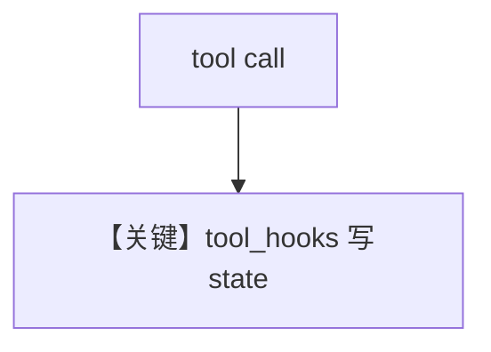

# dynamic_session_state.py — 实现原理分析

<!-- cookbook-py-source:start -->
## 完整源码

```python
"""
Dynamic Session State
=============================

Dynamic Session State.
"""

import json
from typing import Any, Dict

from agno.agent import Agent
from agno.db.in_memory import InMemoryDb
from agno.models.openai import OpenAIResponses
from agno.run import RunContext
from agno.tools.toolkit import Toolkit
from agno.utils.log import log_info, log_warning


class CustomerDBTools(Toolkit):
    def __init__(self, *args, **kwargs):
        super().__init__(*args, **kwargs)
        self.register(self.process_customer_request)

    def process_customer_request(
        self,
        agent: Agent,
        customer_id: str,
        action: str = "retrieve",
        name: str = "John Doe",
    ):
        log_warning("Tool called, this shouldn't happen.")
        return "This should not be seen."


def customer_management_hook(run_context: RunContext, arguments: Dict[str, Any]):
    if run_context.session_state is None:
        run_context.session_state = {}

    action = arguments.get("action", "retrieve")
    cust_id = arguments.get("customer_id")
    name = arguments.get("name", None)

    if not cust_id:
        raise ValueError("customer_id is required.")

    if action == "create":
        run_context.session_state["customer_profiles"][cust_id] = {"name": name}
        log_info(f"Hook: UPDATED session_state for customer '{cust_id}'.")
        return f"Success! Customer {cust_id} has been created."

    if action == "retrieve":
        profile = run_context.session_state.get("customer_profiles", {}).get(cust_id)
        if profile:
            log_info(f"Hook: FOUND customer '{cust_id}' in session_state.")
            return f"Profile for {cust_id}: {json.dumps(profile)}"
        else:
            raise ValueError(f"Customer '{cust_id}' not found.")

    log_info(f"Session state: {run_context.session_state}")


# ---------------------------------------------------------------------------
# Create Agent
# ---------------------------------------------------------------------------
def run_test():
    # ---------------------------------------------------------------------------
    # Create Agent
    # ---------------------------------------------------------------------------

    agent = Agent(
        model=OpenAIResponses(id="gpt-5.2"),
        tools=[CustomerDBTools()],
        tool_hooks=[customer_management_hook],
        session_state={"customer_profiles": {"123": {"name": "Jane Doe"}}},
        instructions="Your profiles: {customer_profiles}. Use `process_customer_request`. Use either create or retrieve as action for the tool.",
        resolve_in_context=True,
        db=InMemoryDb(),
    )

    prompt = "First, create customer 789 named 'Tom'. Then, retrieve Tom's profile. Step by step."
    log_info(f" Prompting: '{prompt}'")
    agent.print_response(prompt, stream=False)

    log_info("\n--- TEST ANALYSIS ---")
    log_info(
        "Check logs for the second tool call. The system prompt will NOT contain customer '789'."
    )


# ---------------------------------------------------------------------------
# Run Agent
# ---------------------------------------------------------------------------
if __name__ == "__main__":
    run_test()
```

<!-- cookbook-py-source:end -->

> 源文件：`cookbook/02_agents/05_state_and_session/dynamic_session_state.py`

## 概述

**`tool_hooks=[customer_management_hook]`**：在工具 **`process_customer_request`** 调用前后拦截，由 **hook** 直接读写 **`run_context.session_state["customer_profiles"]`**，实现**不依赖模型正确调工具逻辑**的可靠状态更新（示例中工具体故意返回占位）。**`resolve_in_context=True`** + **instructions 含 `{customer_profiles}`**。

**核心配置一览：**

| 配置项 | 值 |
|--------|-----|
| `tool_hooks` | `customer_management_hook` |
| `session_state` | 预置 `customer_profiles` |
| `resolve_in_context` | `True` |
| `db` | `InMemoryDb()` |

## 架构分层

```
工具调用 → hook 改 session_state → 下一轮 system 中 profiles 更新
```

## 核心组件解析

注释指出：第二次工具调用后 **system 可能仍不含新客户**——演示 **hook 与消息组装的时序** 问题，需结合日志理解（`dynamic_session_state.py` L84-87）。

### 运行机制与因果链

**关键**：hook 侧与 `get_system_message` 刷新时机差异。

## System Prompt 组装

```text
Your profiles: {customer_profiles}. Use `process_customer_request`. ...
```

（`resolve_in_context` 展开。）

## 完整 API 请求

**OpenAIResponses**。

## Mermaid 流程图


```mermaid
flowchart TD
    A["tool call"] --> B["【关键】tool_hooks 写 state"]
```

## 关键源码文件索引

| 文件 | 关键函数/类 | 作用 |
|------|------------|------|
| `agno/agent/_hooks.py` 或 `_tools` | tool_hooks | 拦截 |
