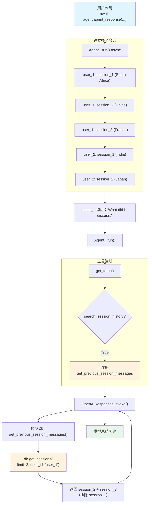

# last_n_session_messages.py — 实现原理分析

> 源文件：`cookbook/02_agents/05_state_and_session/last_n_session_messages.py`

## 概述

本示例展示 Agno 的 **`search_session_history`（跨会话历史搜索）** 机制：启用后 Agent 自动获得一个 `get_previous_session_messages` 内置工具，模型可以搜索当前用户的历史会话消息。配合 `num_history_sessions` 限制搜索范围，展示了多用户场景下的会话隔离和异步运行模式。

**核心配置一览：**

| 配置项 | 值 | 说明 |
|--------|------|------|
| `model` | `OpenAIResponses(id="gpt-5-mini")` | Responses API |
| `db` | `AsyncSqliteDb(db_file="tmp/data.db")` | 异步 SQLite |
| `search_session_history` | `True` | 启用跨会话搜索工具 |
| `num_history_sessions` | `2` | 搜索最近 2 个历史会话 |

## 架构分层

```
用户代码层                          agno.agent 层
┌─────────────────────────┐       ┌──────────────────────────────────────┐
│ last_n_session_messages │       │ Agent._run() (async)                 │
│                         │       │  ├ _tools.py                         │
│ search_session_history  │       │  │  get_tools()                       │
│   = True                │──────>│  │    → 自动注册                      │
│                         │       │  │      get_previous_session_messages│
│ num_history_sessions=2  │       │  │                                    │
│                         │       │  ├ _default_tools.py                 │
│ aprint_response(        │       │  │  get_previous_sessions_messages_  │
│   ...,                  │       │  │  function()                       │
│   session_id="s1",      │       │  │    → db.get_sessions(limit=2,     │
│   user_id="user_1")     │       │  │         user_id=user_id)          │
└─────────────────────────┘       └──────────────────────────────────────┘
                                          │
                                          ▼
                                  ┌──────────────────┐
                                  │ OpenAIResponses   │
                                  │ gpt-5-mini        │
                                  └──────────────────┘
```

## 核心组件解析

### search_session_history 自动注册工具

当 `search_session_history=True`（`agent.py:94`），`get_tools()`（`_tools.py:143-148`）自动注册搜索工具：

```python
# _tools.py:143-148
if agent.search_session_history:
    agent_tools.append(
        _default_tools.get_previous_sessions_messages_function(
            agent, num_history_sessions=agent.num_history_sessions, user_id=user_id
        )
    )
```

### get_previous_session_messages 工具实现

工具函数在 `_default_tools.py:411-480` 中定义：

```python
def get_previous_sessions_messages_function(agent, num_history_sessions=2, user_id=None):
    def get_previous_session_messages() -> str:
        """Use this function to retrieve messages from previous chat sessions."""
        # 从数据库获取最近 N 个会话
        selected_sessions = agent.db.get_sessions(
            session_type=SessionType.AGENT,
            limit=num_history_sessions,  # 限制为 2
            user_id=user_id,             # 按用户过滤
            sort_by="created_at",
            sort_order="desc",
        )
        # 提取 user-assistant 消息对
        all_messages = []
        for session in selected_sessions:
            if isinstance(session, AgentSession) and session.runs:
                for run in session.runs:
                    # ...提取消息对，去重
        return json.dumps([msg.to_dict() for msg in all_messages])
    return get_previous_session_messages
```

### 用户隔离

通过 `user_id` 参数过滤，每个用户只能搜索到自己的历史会话：

- `user_1` 的会话：capitals（South Africa, China, France）
- `user_2` 的会话：population（India）, currency（Japan）

当 `user_1` 询问「What did I discuss?」时，工具只返回 `user_1` 的历史。

### num_history_sessions 限制

`num_history_sessions=2` 意味着只搜索最近 2 个会话。对于 `user_1`：
- session_1: South Africa
- session_2: China
- session_3: France（最新）

搜索时只返回 session_2 和 session_3 的内容（最新 2 个），session_1 被排除。

### AsyncSqliteDb 异步模式

使用 `AsyncSqliteDb` 配合 `aprint_response()`，整个流程异步执行：

```python
async def main():
    await agent.aprint_response(
        "What is the capital of South Africa?",
        session_id="user1_session_1",
        user_id="user_1",
    )
```

## System Prompt 组装

| 序号 | 组成部分 | 本文件中的值/来源 | 是否生效 |
|------|---------|-----------------|---------|
| 1 | `system_message` | `None` | 否 |
| 3.1 | `instructions` | `None` | 否 |
| 3.2.1 | `markdown` | `False`（默认） | 否 |

### 最终 System Prompt

无显式指令。system prompt 可能为空或仅含模型/工具默认指令。

## 完整 API 请求

**用户 1 搜索历史会话：**

```python
client.responses.create(
    model="gpt-5-mini",
    input=[
        # 1. 用户输入
        {
            "role": "user",
            "content": "What did I discuss in my previous conversations?"
        }
    ],
    tools=[
        {
            "type": "function",
            "function": {
                "name": "get_previous_session_messages",
                "description": "Use this function to retrieve messages from previous chat sessions. USE THIS TOOL ONLY WHEN THE QUESTION IS EITHER 'What was my last conversation?' or 'What was my last question?' and similar to it.",
                "parameters": {
                    "type": "object",
                    "properties": {},
                    "required": []
                }
            }
        }
    ],
    stream=True,
    stream_options={"include_usage": True}
)
```

**工具调用返回（仅 user_1 的最近 2 个会话）：**

```json
[
    {"role": "user", "content": "What is the capital of China?"},
    {"role": "assistant", "content": "The capital of China is Beijing."},
    {"role": "user", "content": "What is the capital of France?"},
    {"role": "assistant", "content": "The capital of France is Paris."}
]
```

> 注意：`user_1` 的第一个会话（South Africa）因 `num_history_sessions=2` 被排除。`user_2` 的会话因 `user_id` 过滤不会出现。

## Mermaid 流程图



## 关键源码文件索引

| 文件 | 关键函数/类 | 作用 |
|------|------------|------|
| `agno/agent/agent.py` | `search_session_history` L94 | 启用跨会话搜索 |
| `agno/agent/agent.py` | `num_history_sessions` L95 | 搜索会话数限制 |
| `agno/agent/_tools.py` | `get_tools()` L143-148 | 自动注册搜索工具 |
| `agno/agent/_default_tools.py` | `get_previous_sessions_messages_function()` L411 | 搜索工具工厂 |
| `agno/agent/_default_tools.py` | `get_previous_session_messages()` L425 | 搜索工具实现 |
| `agno/db/sqlite` | `AsyncSqliteDb` | 异步 SQLite 后端 |
