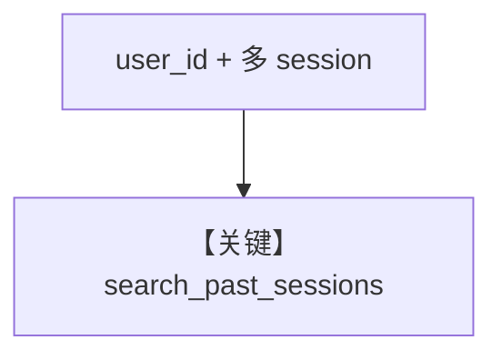

# last_n_session_messages.py — 实现原理分析

> 源文件：`cookbook/02_agents/05_state_and_session/last_n_session_messages.py`

## 概述

**`AsyncSqliteDb`** + **`search_past_sessions=True`** + **`num_past_sessions_to_search=2`**：允许模型在回答「之前聊过什么」时检索**有限数量**的过往会话摘要/消息，且按 **`user_id`** 隔离。异步 **`aprint_response`**。

**核心配置一览：**

| 配置项 | 值 |
|--------|-----|
| `db` | `AsyncSqliteDb(tmp/data.db)` |
| `search_past_sessions` | `True` |
| `num_past_sessions_to_search` | `2` |

## 架构分层

```
多 session_id 写入 → 用户问回顾 → 框架注入可检索的过去会话片段
```

## 核心组件解析

**User 1 / User 2** 各有多 `session_id`，验证 **user 级隔离**（`last_n_session_messages.py` L32-75）。

### 运行机制与因果链

限制 **2** 个 past session 控制上下文长度。

## System Prompt 组装

无显式 instructions；可能内部注入「可搜索历史」说明。

## 完整 API 请求

**异步 OpenAIResponses**。

## Mermaid 流程图


```mermaid
flowchart TD
    A["user_id + 多 session"] --> B["【关键】search_past_sessions"]
```

## 关键源码文件索引

| 文件 | 关键函数/类 | 作用 |
|------|------------|------|
| `agno/agent/_messages.py` / `_run` | 历史搜索 | 与 past sessions 相关 |
