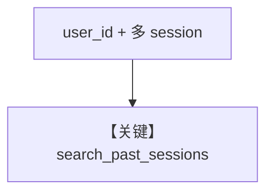

# last_n_session_messages.py — 实现原理分析

<!-- cookbook-py-source:start -->
## 完整源码

```python
"""
Last N Session Messages
=============================

Last N Session Messages.
"""

import asyncio
import os

from agno.agent import Agent
from agno.db.sqlite import AsyncSqliteDb
from agno.models.openai import OpenAIResponses

# ---------------------------------------------------------------------------
# Create Agent
# ---------------------------------------------------------------------------
# Remove the tmp db file before running the script
if os.path.exists("tmp/data.db"):
    os.remove("tmp/data.db")

# Create agents for different users to demonstrate user-specific session history
agent = Agent(
    model=OpenAIResponses(id="gpt-5-mini"),
    db=AsyncSqliteDb(db_file="tmp/data.db"),
    search_past_sessions=True,  # allow searching previous sessions
    num_past_sessions_to_search=2,  # only include the last 2 sessions in the search to avoid context length issues
)


async def main():
    # User 1 sessions
    print("=== User 1 Sessions ===")
    await agent.aprint_response(
        "What is the capital of South Africa?",
        session_id="user1_session_1",
        user_id="user_1",
    )
    await agent.aprint_response(
        "What is the capital of China?", session_id="user1_session_2", user_id="user_1"
    )
    await agent.aprint_response(
        "What is the capital of France?", session_id="user1_session_3", user_id="user_1"
    )

    # User 2 sessions
    print("\n=== User 2 Sessions ===")
    await agent.aprint_response(
        "What is the population of India?",
        session_id="user2_session_1",
        user_id="user_2",
    )
    await agent.aprint_response(
        "What is the currency of Japan?", session_id="user2_session_2", user_id="user_2"
    )

    # Now test session history search - each user should only see their own sessions
    print("\n=== Testing Session History Search ===")
    print(
        "User 1 asking about previous conversations (should only see capitals, not population/currency):"
    )
    await agent.aprint_response(
        "What did I discuss in my previous conversations?",
        session_id="user1_session_4",
        user_id="user_1",
    )

    print(
        "\nUser 2 asking about previous conversations (should only see population/currency, not capitals):"
    )
    await agent.aprint_response(
        "What did I discuss in my previous conversations?",
        session_id="user2_session_3",
        user_id="user_2",
    )


# ---------------------------------------------------------------------------
# Run Agent
# ---------------------------------------------------------------------------
if __name__ == "__main__":
    asyncio.run(main())
```

<!-- cookbook-py-source:end -->

> 源文件：`cookbook/02_agents/05_state_and_session/last_n_session_messages.py`

## 概述

**`AsyncSqliteDb`** + **`search_past_sessions=True`** + **`num_past_sessions_to_search=2`**：允许模型在回答「之前聊过什么」时检索**有限数量**的过往会话摘要/消息，且按 **`user_id`** 隔离。异步 **`aprint_response`**。

**核心配置一览：**

| 配置项 | 值 |
|--------|-----|
| `db` | `AsyncSqliteDb(tmp/data.db)` |
| `search_past_sessions` | `True` |
| `num_past_sessions_to_search` | `2` |

## 架构分层

```
多 session_id 写入 → 用户问回顾 → 框架注入可检索的过去会话片段
```

## 核心组件解析

**User 1 / User 2** 各有多 `session_id`，验证 **user 级隔离**（`last_n_session_messages.py` L32-75）。

### 运行机制与因果链

限制 **2** 个 past session 控制上下文长度。

## System Prompt 组装

无显式 instructions；可能内部注入「可搜索历史」说明。

## 完整 API 请求

**异步 OpenAIResponses**。

## Mermaid 流程图


```mermaid
flowchart TD
    A["user_id + 多 session"] --> B["【关键】search_past_sessions"]
```

## 关键源码文件索引

| 文件 | 关键函数/类 | 作用 |
|------|------------|------|
| `agno/agent/_messages.py` / `_run` | 历史搜索 | 与 past sessions 相关 |
