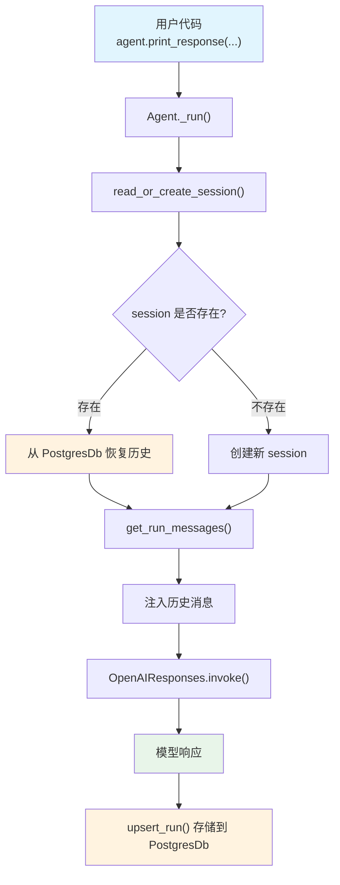

# persistent_session.py — 实现原理分析

> 源文件：`cookbook/02_agents/05_state_and_session/persistent_session.py`

## 概述

本示例展示 Agno 的 **持久化会话** 机制：通过 `PostgresDb` 和固定 `session_id` 实现跨进程的对话持久化。即使程序重启，相同 `session_id` 的历史对话也会从数据库恢复，配合 `add_history_to_context=True` 使模型保持上下文连贯。

**核心配置一览：**

| 配置项 | 值 | 说明 |
|--------|------|------|
| `model` | `OpenAIResponses(id="gpt-5-mini")` | Responses API |
| `db` | `PostgresDb(db_url=..., session_table="sessions")` | PostgreSQL 持久化 |
| `session_id` | `"session_storage"` | 固定会话 ID |
| `add_history_to_context` | `True` | 启用历史消息注入 |

## 架构分层

```
用户代码层                          agno.agent 层
┌─────────────────────────┐       ┌──────────────────────────────────────┐
│ persistent_session.py   │       │ Agent._run()                         │
│                         │       │  ├ read_or_create_session()          │
│ session_id=             │       │  │  → 从 PostgresDb 恢复会话         │
│   "session_storage"     │──────>│  │  → 含历史 RunOutput               │
│                         │       │  │                                    │
│ add_history_to_context  │       │  ├ get_run_messages()                │
│   = True                │       │  │  → 注入历史消息                   │
│                         │       │  │                                    │
│ PostgresDb              │       │  └ 运行结束 → upsert_run() 存储     │
└─────────────────────────┘       └──────────────────────────────────────┘
                                          │
                                          ▼
                                  ┌──────────────────┐
                                  │ OpenAIResponses   │
                                  │ gpt-5-mini        │
                                  └──────────────────┘
```

## 核心组件解析

### 会话恢复机制

`_run()` 开始时调用 `read_or_create_session()`，根据 `session_id` 从 `PostgresDb` 读取已有会话：

- 如果 `session_id="session_storage"` 的会话已存在，恢复所有历史 `RunOutput`
- 如果不存在，创建新会话

### 跨进程持久化

与 `chat_history.py` 类似，但强调**跨进程**场景：

1. 第一次运行程序 → 创建会话，存储对话
2. 程序退出
3. 第二次运行程序 → 从 PostgresDb 恢复会话，历史消息可用

这是 `SqliteDb`（文件级）和 `PostgresDb`（服务级）都支持的核心能力。

### 与 chat_history.py 的区别

| 特性 | persistent_session.py | chat_history.py |
|------|----------------------|-----------------|
| 重点 | 跨进程持久化 | 同进程内多轮对话 |
| 运行次数 | 单次 `print_response` | 两次 `print_response` |
| `get_chat_history()` | 未使用 | 每轮后调用验证 |
| `instructions` | 无 | 限定话题 |

## System Prompt 组装

| 序号 | 组成部分 | 本文件中的值/来源 | 是否生效 |
|------|---------|-----------------|---------|
| 1 | `system_message` | `None` | 否 |
| 3.1 | `instructions` | `None` | �� |
| 3.2.1 | `markdown` | `False`（默认） | 否 |

### 最终 System Prompt

由于没有设置任何指令、描述或其他上下文选项，`get_system_message()` 返回的内容几乎为空（仅含模型级指令，如果有的话）。

```text
（空或仅含模型默认指令）
```

## 完整 API 请求

**首次运行（无历史）：**

```python
client.responses.create(
    model="gpt-5-mini",
    input=[
        # 1. 用户输入（无 system message）
        {"role": "user", "content": "Tell me a new interesting fact about space"}
    ],
    stream=True,
    stream_options={"include_usage": True}
)
```

**再次运行（有历史）：**

```python
client.responses.create(
    model="gpt-5-mini",
    input=[
        # 1. 历史消息（从 PostgresDb 恢复）
        {"role": "user", "content": "Tell me a new interesting fact about space"},
        {"role": "assistant", "content": "...上一次的回答..."},
        # 2. 新的用户输入
        {"role": "user", "content": "Tell me a new interesting fact about space"}
    ],
    stream=True,
    stream_options={"include_usage": True}
)
```

## Mermaid 流程图



## 关键源码文件索引

| 文件 | 关键函数/类 | 作用 |
|------|------------|------|
| `agno/agent/agent.py` | `session_id` L82 | 固定会话 ID |
| `agno/agent/agent.py` | `add_history_to_context` L127 | 启用历史注入 |
| `agno/agent/_messages.py` | `get_run_messages()` L1231-1262 | 历史消息注入逻辑 |
| `agno/db/postgres` | `PostgresDb` | PostgreSQL 持久化后端 |
