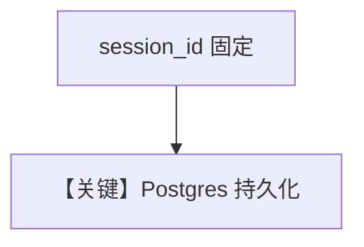

# persistent_session.py — 实现原理分析

<!-- cookbook-py-source:start -->
## 完整源码

```python
"""
Persistent Session
=============================

Persistent Session Example.
"""

from agno.agent.agent import Agent
from agno.db.postgres import PostgresDb
from agno.models.openai import OpenAIResponses

db_url = "postgresql+psycopg://ai:ai@localhost:5532/ai"

db = PostgresDb(db_url=db_url, session_table="sessions")

# ---------------------------------------------------------------------------
# Create Agent
# ---------------------------------------------------------------------------
agent = Agent(
    model=OpenAIResponses(id="gpt-5-mini"),
    db=db,
    session_id="session_storage",
    add_history_to_context=True,
)

# ---------------------------------------------------------------------------
# Run Agent
# ---------------------------------------------------------------------------
if __name__ == "__main__":
    agent.print_response("Tell me a new interesting fact about space")
```

<!-- cookbook-py-source:end -->

> 源文件：`cookbook/02_agents/05_state_and_session/persistent_session.py`

## 概述

最小 **Postgres 持久会话**：**`session_id="session_storage"`** + **`add_history_to_context=True`**，无自定义 instructions。用于验证 **进程重启后** 同 `session_id` 能否续聊（需自行二次运行脚本验证）。

**核心配置一览：**

| 配置项 | 值 |
|--------|-----|
| `db` | `PostgresDb` |
| `session_id` | `"session_storage"` |

## 架构分层

```
Postgres sessions 表 → 跨 run 恢复消息
```

## 核心组件解析

与 `chat_history.py` 同库 URL 模式。

## System Prompt 组装

无 instructions；默认 system。

## 完整 API 请求

**OpenAIResponses**。

## Mermaid 流程图


```mermaid
flowchart TD
    A["session_id 固定"] --> B["【关键】Postgres 持久化"]
```

## 关键源码文件索引

| 文件 | 关键函数/类 | 作用 |
|------|------------|------|
| `agno/db/postgres.py` | `PostgresDb` | 会话表 |
