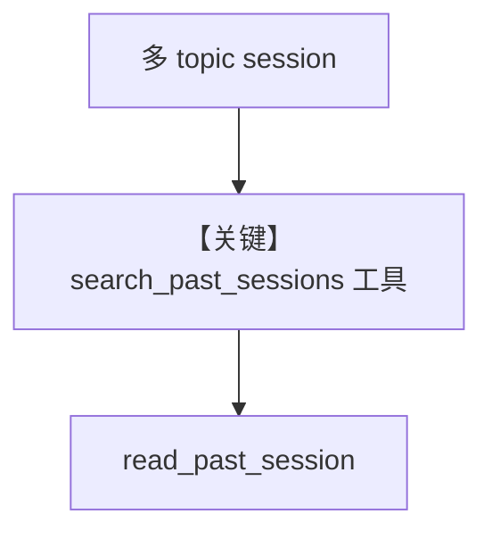

# search_session_history.py — 实现原理分析

> 源文件：`cookbook/02_agents/05_state_and_session/search_session_history.py`

## 概述

**`search_past_sessions=True`**：提供 **search_past_sessions / read_past_session** 类工具（见模块注释），实现 **先列摘要再读全文** 的跨会话回忆；**`AsyncSqliteDb`**，**`user_id`** 隔离，Bob **无** Alice 历史。

**核心配置一览：**

| 配置项 | 值 |
|--------|-----|
| `search_past_sessions` | `True` |
| `num_past_sessions_to_search` | `10` |
| `model` | `OpenAIResponses(gpt-4o)` |

## 架构分层

```
多种子 session 写入 → recall session 提问 → 工具检索 past → 回答
```

## 核心组件解析

文件头注释说明 **list-then-read** 与参数（`search_session_history.py` L1-L14）。

### 运行机制与因果链

**user_id=alice** 多条 session 后，**同一 user** 可跨 session 检索；**bob** 看不到 alice。

## System Prompt 组装

无显式 instructions；工具由框架注入。

## 完整 API 请求

**OpenAIResponses** + 会话检索工具。

## Mermaid 流程图



## 关键源码文件索引

| 文件 | 关键函数/类 | 作用 |
|------|------------|------|
| `agno/agent/agent.py` | `search_past_sessions` | 配置 |
