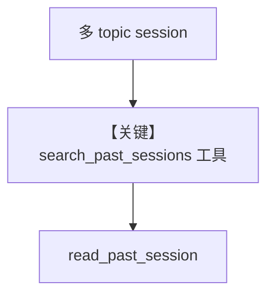

# search_session_history.py — 实现原理分析

<!-- cookbook-py-source:start -->
## 完整源码

```python
"""
Search Session History
======================

Demonstrates the two-step list-then-read pattern for accessing previous sessions.

The agent gets two tools:
  - search_past_sessions() -- lightweight per-run previews of recent sessions
  - read_past_session(session_id) -- full conversation for a specific session

Enable with `search_past_sessions=True`. Optionally set
`num_past_sessions_to_search` to control how many past sessions are searched (default 20)
and `num_past_session_runs_in_search` to control how many runs per session appear in
the preview (default 3).
"""

import asyncio
import os

from agno.agent.agent import Agent
from agno.db.sqlite import AsyncSqliteDb
from agno.models.openai import OpenAIResponses

# ---------------------------------------------------------------------------
# Setup -- fresh DB each run
# ---------------------------------------------------------------------------
DB_FILE = "tmp/agent_session_history.db"
if os.path.exists(DB_FILE):
    os.remove(DB_FILE)

db = AsyncSqliteDb(db_file=DB_FILE)

# ---------------------------------------------------------------------------
# Create Agent
# ---------------------------------------------------------------------------
agent = Agent(
    model=OpenAIResponses(id="gpt-4o"),
    db=db,
    search_past_sessions=True,
    num_past_sessions_to_search=10,
)


# ---------------------------------------------------------------------------
# Run
# ---------------------------------------------------------------------------
async def main() -> None:
    # --- Seed a few sessions with different topics ---
    print("=== Session 1: Space ===")
    await agent.aprint_response(
        "Tell me about black holes",
        session_id="session_space",
        user_id="alice",
    )

    print("\n=== Session 2: Cooking ===")
    await agent.aprint_response(
        "How do I make pasta carbonara?",
        session_id="session_cooking",
        user_id="alice",
    )

    print("\n=== Session 3: Music ===")
    await agent.aprint_response(
        "Who composed the Four Seasons?",
        session_id="session_music",
        user_id="alice",
    )

    # --- Now ask the agent to search and recall ---
    print("\n=== Search: browse all past sessions ===")
    await agent.aprint_response(
        "What topics did we discuss in my previous sessions?",
        session_id="session_recall",
        user_id="alice",
    )

    print("\n=== Search: find cooking session ===")
    await agent.aprint_response(
        "Find my past session where we talked about cooking",
        session_id="session_search",
        user_id="alice",
    )

    # --- Demonstrate user scoping ---
    print("\n=== Different user sees no history ===")
    await agent.aprint_response(
        "What did we discuss before?",
        session_id="bob_session_1",
        user_id="bob",
    )


if __name__ == "__main__":
    asyncio.run(main())
```

<!-- cookbook-py-source:end -->

> 源文件：`cookbook/02_agents/05_state_and_session/search_session_history.py`

## 概述

**`search_past_sessions=True`**：提供 **search_past_sessions / read_past_session** 类工具（见模块注释），实现 **先列摘要再读全文** 的跨会话回忆；**`AsyncSqliteDb`**，**`user_id`** 隔离，Bob **无** Alice 历史。

**核心配置一览：**

| 配置项 | 值 |
|--------|-----|
| `search_past_sessions` | `True` |
| `num_past_sessions_to_search` | `10` |
| `model` | `OpenAIResponses(gpt-4o)` |

## 架构分层

```
多种子 session 写入 → recall session 提问 → 工具检索 past → 回答
```

## 核心组件解析

文件头注释说明 **list-then-read** 与参数（`search_session_history.py` L1-L14）。

### 运行机制与因果链

**user_id=alice** 多条 session 后，**同一 user** 可跨 session 检索；**bob** 看不到 alice。

## System Prompt 组装

无显式 instructions；工具由框架注入。

## 完整 API 请求

**OpenAIResponses** + 会话检索工具。

## Mermaid 流程图



## 关键源码文件索引

| 文件 | 关键函数/类 | 作用 |
|------|------------|------|
| `agno/agent/agent.py` | `search_past_sessions` | 配置 |
