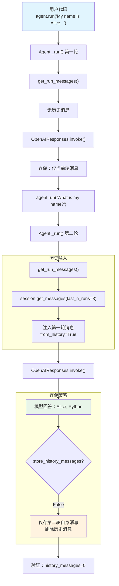

# session_options.py — 实现原理分析

> 源文件：`cookbook/02_agents/05_state_and_session/session_options.py`

## 概述

本示例展示 Agno 的 **`store_history_messages`** 机制：当设置为 `False` 时，Agent 在运行期间仍会使用历史消息（`add_history_to_context=True`），但不会将历史消息存入数据库。这实现了「运行时有记忆，存储时不冗余」的优化策略，避免了存储历史消息导致的二次增长问题。

**核心配置一览：**

| 配置项 | 值 | 说明 |
|--------|------|------|
| `model` | `OpenAIResponses(id="gpt-5-mini")` | Responses API |
| `db` | `SqliteDb(db_file="tmp/example_no_history.db")` | SQLite 持久化 |
| `add_history_to_context` | `True` | 运行时注入历史 |
| `num_history_runs` | `3` | 限制历史运行次数 |
| `store_history_messages` | `False` | 不存储历史消息 |

## 架构分层

```
用户代码层                          agno.agent 层
┌─────────────────────────┐       ┌──────────────────────────────────────┐
│ session_options.py      │       │ Agent._run()                         │
│                         │       │  ├ get_run_messages()                │
│ add_history_to_context  │       │  │  → 历史消息注入（运行时使用）     │
│   = True                │──────>│  │                                    │
│ num_history_runs=3      │       │  ├ Model.response()                  │
│                         │       │  │                                    │
│ store_history_messages  │       │  └ cleanup_and_store()               │
│   = False               │       │    → 存储时剔除 from_history 消息   │
└─────────────────────────┘       └──────────────────────────────────────┘
                                          │
                                          ▼
                                  ┌──────────────────┐
                                  │ OpenAIResponses   │
                                  │ gpt-5-mini        │
                                  └──────────────────┘
```

## 核心组件解析

### store_history_messages 的语义

`store_history_messages`（`agent.py:213`）控制存储行为，文档注释说明了两种模式：

```python
# When False (default): Each run stores only its own messages. History is reconstructed
# on-the-fly by traversing previous runs. This results in linear storage growth.
# When True: Each run stores all messages including history from previous runs.
# This allows inspecting full context in stored runs but causes quadratic storage growth.
store_history_messages: bool = False
```

| 模式 | 运行时 | 存储 | 增长 |
|------|--------|------|------|
| `False`（默认） | 使用历史 | 仅存当前运行消息 | 线性 |
| `True` | 使用历史 | 存储所有消息含历史 | 二次 |

### num_history_runs

`num_history_runs=3` 限制历史消息的来源为最近 3 次运行，避免上下文过长。在 `get_run_messages()` 中传递给 `session.get_messages(last_n_runs=3)`。

### 运行时行为 vs 存储行为的分离

本示例的核心洞察：`add_history_to_context` 控制**运行时行为**，`store_history_messages` 控制**存储行为**。两者独立：

1. **第一轮**：`agent.run("My name is Alice and I love Python programming.")`
   - 无历史（首次运行）
   - 存储：仅当前轮消息

2. **第二轮**：`agent.run("What is my name and what do I love?")`
   - 运行时：注入第一轮的 user+assistant 消息作为历史
   - 模型能回答「Alice, Python programming」
   - 存储：仅第二轮自身消息（不含第一轮历史）

### 验证逻辑

示例通过检查存储的消息来验证行为：

```python
stored_run = agent.get_last_run_output()
if stored_run and stored_run.messages:
    history_messages = [m for m in stored_run.messages if m.from_history]
    print(f"Total messages stored: {len(stored_run.messages)}")
    print(f"History messages: {len(history_messages)} (scrubbed!)")
    # history_messages 应为 0，因为 store_history_messages=False
```

## System Prompt 组装

| 序号 | 组成部分 | 本文件中的值/来源 | 是否生效 |
|------|---------|-----------------|---------|
| 1 | `system_message` | `None` | 否 |
| 3.1 | `instructions` | `None` | 否 |
| 3.2.1 | `markdown` | `False`（默认） | 否 |

### 最终 System Prompt

无显式指令，system prompt 为空或仅含模型默认指令。

## 完整 API 请求

**第二轮（含历史但不存储历史）：**

```python
client.responses.create(
    model="gpt-5-mini",
    input=[
        # 1. 历史消息（运行时注入，from_history=True）
        {"role": "user", "content": "My name is Alice and I love Python programming."},
        {"role": "assistant", "content": "...第一轮的回答..."},
        # 2. 当前用户输入
        {"role": "user", "content": "What is my name and what do I love?"}
    ],
    stream=True,
    stream_options={"include_usage": True}
)
```

> 注意：发送给模型的请求包含历史消息，但存储到数据库时会剔除 `from_history=True` 的消息。

## Mermaid 流程图



## 关键源码文件索引

| 文件 | 关键函数/类 | 作用 |
|------|------------|------|
| `agno/agent/agent.py` | `store_history_messages` L213 | 控制是否存储历史消息 |
| `agno/agent/agent.py` | `add_history_to_context` L127 | 运行时历史注入 |
| `agno/agent/agent.py` | `num_history_runs` L129 | 限制历史运行次数 |
| `agno/agent/_messages.py` | `get_run_messages()` L1231-1262 | 历史消息注入逻辑 |
| `agno/agent/_run.py` | `store_history_messages` L590-591 | 存储配置传递 |
| `agno/db/sqlite` | `SqliteDb` | SQLite 持久化后端 |
