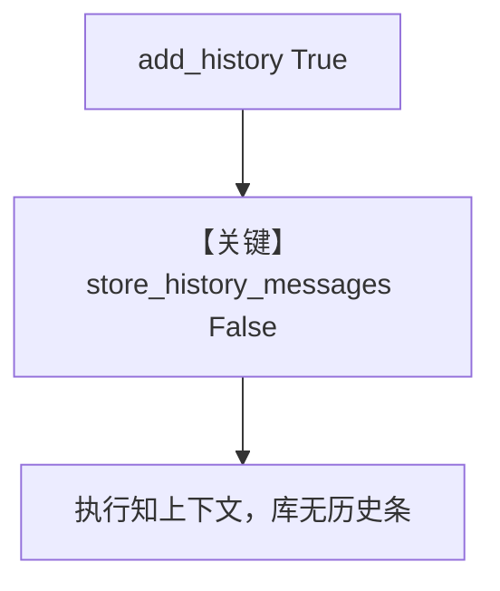

# session_options.py — 实现原理分析

<!-- cookbook-py-source:start -->
## 完整源码

```python
"""
Session Options
=============================

Simple example demonstrating store_history_messages option.
"""

from agno.agent import Agent
from agno.db.sqlite import SqliteDb
from agno.models.openai import OpenAIResponses
from agno.utils.pprint import pprint_run_response

# ---------------------------------------------------------------------------
# Create Agent
# ---------------------------------------------------------------------------
agent = Agent(
    model=OpenAIResponses(id="gpt-5-mini"),
    db=SqliteDb(db_file="tmp/example_no_history.db"),
    add_history_to_context=True,  # Use history during execution
    num_history_runs=3,
    store_history_messages=False,  # Don't store history messages in database
)


# ---------------------------------------------------------------------------
# Run Agent
# ---------------------------------------------------------------------------
if __name__ == "__main__":
    print("\n=== First Run: Establishing context ===")
    response1 = agent.run("My name is Alice and I love Python programming.")
    pprint_run_response(response1)

    print("\n=== Second Run: Using history (but not storing it) ===")
    response2 = agent.run("What is my name and what do I love?")
    pprint_run_response(response2)

    # Check what was stored
    stored_run = agent.get_last_run_output()
    if stored_run and stored_run.messages:
        history_messages = [m for m in stored_run.messages if m.from_history]
        print("\n Storage Info:")
        print(f"   Total messages stored: {len(stored_run.messages)}")
        print(f"   History messages: {len(history_messages)} (scrubbed!)")
        print("\n History was used during execution (agent knew the answer)")
        print("   but history messages are NOT stored in the database!")
```

<!-- cookbook-py-source:end -->

> 源文件：`cookbook/02_agents/05_state_and_session/session_options.py`

## 概述

**`store_history_messages=False`**：**执行时仍 `add_history_to_context=True`**（本轮可读到之前消息），但**不把历史消息持久化进 DB**，适合隐私或减小存储。

**核心配置一览：**

| 配置项 | 值 |
|--------|-----|
| `add_history_to_context` | `True` |
| `num_history_runs` | `3` |
| `store_history_messages` | `False` |

## 架构分层

```
内存中拼历史 → 模型可见 → 落库时剥离 from_history 消息
```

## 核心组件解析

第二次 run 仍答对名字与爱好，但存储中无历史副本（`session_options.py` L37-45）。

### 运行机制与因果链

**与完全关闭 history 不同**：关闭存储 ≠ 关闭上下文（在同进程/同会话内仍可能保留）。

## System Prompt 组装

无 instructions。

## 完整 API 请求

**OpenAIResponses**。

## Mermaid 流程图


```mermaid
flowchart TD
    A["add_history True"] --> B["【关键】store_history_messages False"]
    B --> C["执行知上下文，库无历史条"]
```

## 关键源码文件索引

| 文件 | 关键函数/类 | 作用 |
|------|------------|------|
| `agno/agent/agent.py` | `store_history_messages` | 配置 |
