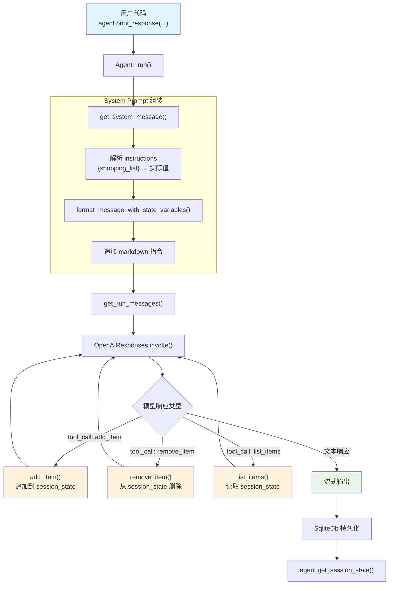

# session_state_advanced.py — 实现原理分析

> 源文件：`cookbook/02_agents/05_state_and_session/session_state_advanced.py`

## 概述

本示例展示 Agno 的 **`session_state` 高级用法**：通过定义多个工具函数（`add_item`、`remove_item`、`list_items`）操作 `RunContext.session_state` 中的购物清单，实现完整的 CRUD 状态管理。配合多行 `instructions` 模板和多轮对话，展示了状态在工具调用中的实时更新和持久化。

**核心配置一览：**

| 配置项 | 值 | 说明 |
|--------|------|------|
| `model` | `OpenAIResponses(id="gpt-5-mini")` | Responses API |
| `session_state` | `{"shopping_list": []}` | 初始会话状态 |
| `db` | `SqliteDb(db_file="tmp/example.db")` | SQLite 持久化 |
| `tools` | `[add_item, remove_item, list_items]` | 三个状态操作工具 |
| `instructions` | 多行 dedent 字符串，含 `{shopping_list}` 模板 | 任务描述 + 状态注入 |
| `markdown` | `True` | markdown 格式化 |

## 架构分层

```
用户代码层                          agno.agent 层
┌─────────────────────────┐       ┌──────────────────────────────────────┐
│ session_state_advanced  │       │ Agent._run()                         │
│                         │       │  ├ _messages.py                      │
│ session_state=           │       │  │  get_system_message()              │
│   {"shopping_list": []} │──────>│  │    → format_message_with_state_    │
│                         │       │  │      variables()                   │
│ tools=[add_item,        │       │  │    → {shopping_list} → 实际值      │
│   remove_item,          │       │  │                                    │
│   list_items]           │       │  ├ _tools.py                         │
│                         │       │  │  get_tools() → 3 个 Function      │
│ instructions=dedent(    │       │  │                                    │
│   "...{shopping_list}") │       │  └ Model.response() → 工具调用循环    │
└─────────────────────────┘       └──────────────────────────────────────┘
                                          │
                                          ▼
                                  ┌──────────────────┐
                                  │ OpenAIResponses   │
                                  │ gpt-5-mini        │
                                  └──────────────────┘
```

## 核心组件解析

### 多工具函数的状态操作

三个工具函数均通过 `run_context.session_state["shopping_list"]` 操作同一状态列表：

```python
# 添加商品（大小写去重）
def add_item(run_context: RunContext, item: str) -> str:
    if item.lower() not in [i.lower() for i in run_context.session_state["shopping_list"]]:
        run_context.session_state["shopping_list"].append(item)
        return f"Added '{item}' to the shopping list"

# 删除商品（大小写不敏感匹配）
def remove_item(run_context: RunContext, item: str) -> str:
    for i, list_item in enumerate(run_context.session_state["shopping_list"]):
        if list_item.lower() == item.lower():
            run_context.session_state["shopping_list"].pop(i)
            return f"Removed '{list_item}' from the shopping list"

# 列出所有商品
def list_items(run_context: RunContext) -> str:
    shopping_list = run_context.session_state["shopping_list"]
    if not shopping_list:
        return "The shopping list is empty."
    items_text = "\n".join([f"- {item}" for item in shopping_list])
    return f"Current shopping list:\n{items_text}"
```

关键点：`RunContext` 通过引用传递，三个函数操作的是同一个字典对象，修改立即生效。

### 多行 instructions 模板

使用 `textwrap.dedent` 构造多行指令，末尾包含状态模板变量：

```python
instructions=dedent("""\
    Your job is to manage a shopping list.
    The shopping list starts empty. You can add items, remove items by name, and list all items.
    Current shopping list: {shopping_list}
""")
```

`{shopping_list}` 在每轮 `get_system_message()` 调用时被 `format_message_with_state_variables()`（`_messages.py:56`）替换为当前列表值。

### 多轮对话状态演进

示例运行 5 轮对话，展示状态的完整生命周期：

1. `"Add milk, eggs, and bread"` → 状态变为 `['milk', 'eggs', 'bread']`
2. `"I got bread"` → `remove_item` 移除 bread → `['milk', 'eggs']`
3. `"I need apples and oranges"` → 追加 → `['milk', 'eggs', 'apples', 'oranges']`
4. `"whats on my list?"` → `list_items` 返回当前列表
5. `"Clear everything... start over with bananas and yogurt"` → 清空后添加 → `['bananas', 'yogurt']`

每轮结束后通过 `agent.get_session_state()` 验证状态。

## System Prompt 组装

| 序号 | 组成部分 | 本文件中的值/来源 | 是否生效 |
|------|---------|-----------------|---------|
| 1 | `system_message`（自定义） | `None` | 否 |
| 3.1 | `instructions` | 多行 dedent 字符串 | 是 |
| 3.2.1 | `markdown` | `True` | 是 |
| 3.2.2 | `add_datetime_to_context` | `False` | 否 |
| 3.2.3 | `add_location_to_context` | `False` | 否 |
| 3.2.4 | `add_name_to_context` | `False` | 否 |
| 3.3.1 | `description` | `None` | 否 |
| 3.3.2 | `role` | `None` | 否 |
| 3.3.3 | instructions 拼接 | 含替换后的 `{shopping_list}` | 是 |
| 3.3.4 | additional_information | `["Use markdown to format your answers."]` | 是 |
| 3.3.5 | `_tool_instructions` | `None` | 否 |
| 3.3.17 | `add_session_state_to_context` | `False` | 否 |

### 最终 System Prompt

```text
Your job is to manage a shopping list.

The shopping list starts empty. You can add items, remove items by name, and list all items.

Current shopping list: []

<additional_information>
- Use markdown to format your answers.
</additional_information>
```

## 完整 API 请求

```python
client.responses.create(
    model="gpt-5-mini",
    input=[
        # 1. System Message（system → developer）
        {
            "role": "developer",
            "content": "Your job is to manage a shopping list.\n\nThe shopping list starts empty. You can add items, remove items by name, and list all items.\n\nCurrent shopping list: []\n\n<additional_information>\n- Use markdown to format your answers.\n</additional_information>"
        },
        # 2. 用户输入
        {
            "role": "user",
            "content": "Add milk, eggs, and bread to the shopping list"
        }
    ],
    tools=[
        {
            "type": "function",
            "function": {
                "name": "add_item",
                "description": "Add an item to the shopping list and return confirmation.",
                "parameters": {
                    "type": "object",
                    "properties": {
                        "item": {"type": "string"}
                    },
                    "required": ["item"]
                }
            }
        },
        {
            "type": "function",
            "function": {
                "name": "remove_item",
                "description": "Remove an item from the shopping list by name.",
                "parameters": {
                    "type": "object",
                    "properties": {
                        "item": {"type": "string"}
                    },
                    "required": ["item"]
                }
            }
        },
        {
            "type": "function",
            "function": {
                "name": "list_items",
                "description": "List all items in the shopping list.",
                "parameters": {
                    "type": "object",
                    "properties": {},
                    "required": []
                }
            }
        }
    ],
    stream=True,
    stream_options={"include_usage": True}
)
```

> 模型会根据用户意图选择调用 `add_item`（可能多次）、`remove_item` 或 `list_items`。

## Mermaid 流程图



## 关键源码文件索引

| 文件 | 关键函数/类 | 作用 |
|------|------------|------|
| `agno/agent/agent.py` | `session_state` L84 | 默认状态字典定义 |
| `agno/agent/agent.py` | `get_session_state()` L939 | 获取当前状态 |
| `agno/run/base.py` | `RunContext` L16 | 运行上下文，承载 session_state |
| `agno/agent/_messages.py` | `format_message_with_state_variables()` L56 | 模板变量替换 |
| `agno/agent/_messages.py` | `get_system_message()` L106 | 组装 system prompt |
| `agno/agent/_tools.py` | `get_tools()` L105 | 解析 3 个工具函数为 Function |
| `agno/db/sqlite` | `SqliteDb` | SQLite 持久化后端 |
