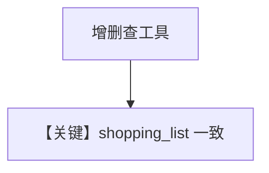

# session_state_advanced.py — 实现原理分析

<!-- cookbook-py-source:start -->
## 完整源码

```python
"""
Session State Advanced
=============================

Session State Advanced.
"""

from textwrap import dedent

from agno.agent import Agent
from agno.db.sqlite import SqliteDb
from agno.models.openai import OpenAIResponses
from agno.run import RunContext


# Define tools to manage our shopping list
def add_item(run_context: RunContext, item: str) -> str:
    """Add an item to the shopping list and return confirmation."""
    # Add the item if it's not already in the list
    if run_context.session_state is None:
        run_context.session_state = {}

    if item.lower() not in [
        i.lower() for i in run_context.session_state["shopping_list"]
    ]:
        run_context.session_state["shopping_list"].append(item)  # type: ignore
        return f"Added '{item}' to the shopping list"
    else:
        return f"'{item}' is already in the shopping list"


def remove_item(run_context: RunContext, item: str) -> str:
    """Remove an item from the shopping list by name."""
    if run_context.session_state is None:
        run_context.session_state = {}

    # Case-insensitive search
    for i, list_item in enumerate(run_context.session_state["shopping_list"]):
        if list_item.lower() == item.lower():
            run_context.session_state["shopping_list"].pop(i)
            return f"Removed '{list_item}' from the shopping list"

    return f"'{item}' was not found in the shopping list"


def list_items(run_context: RunContext) -> str:
    """List all items in the shopping list."""
    if run_context.session_state is None:
        run_context.session_state = {}

    shopping_list = run_context.session_state["shopping_list"]

    if not shopping_list:
        return "The shopping list is empty."

    items_text = "\n".join([f"- {item}" for item in shopping_list])
    return f"Current shopping list:\n{items_text}"


# Create a Shopping List Manager Agent that maintains state
# ---------------------------------------------------------------------------
# Create Agent
# ---------------------------------------------------------------------------
agent = Agent(
    model=OpenAIResponses(id="gpt-5-mini"),
    # Initialize the session state with an empty shopping list (default session state for all sessions)
    session_state={"shopping_list": []},
    db=SqliteDb(db_file="tmp/example.db"),
    tools=[add_item, remove_item, list_items],
    # You can use variables from the session state in the instructions
    instructions=dedent("""\
        Your job is to manage a shopping list.

        The shopping list starts empty. You can add items, remove items by name, and list all items.

        Current shopping list: {shopping_list}
    """),
    markdown=True,
)

# ---------------------------------------------------------------------------
# Run Agent
# ---------------------------------------------------------------------------
if __name__ == "__main__":
    # Example usage
    agent.print_response("Add milk, eggs, and bread to the shopping list", stream=True)
    print(f"Session state: {agent.get_session_state()}")

    agent.print_response("I got bread", stream=True)
    print(f"Session state: {agent.get_session_state()}")

    agent.print_response("I need apples and oranges", stream=True)
    print(f"Session state: {agent.get_session_state()}")

    agent.print_response("whats on my list?", stream=True)
    print(f"Session state: {agent.get_session_state()}")

    agent.print_response(
        "Clear everything from my list and start over with just bananas and yogurt",
        stream=True,
    )
    print(f"Session state: {agent.get_session_state()}")
```

<!-- cookbook-py-source:end -->

> 源文件：`cookbook/02_agents/05_state_and_session/session_state_advanced.py`

## 概述

在 **session_state_basic** 之上增加 **`remove_item`、`list_items`**，并用 **`dedent` instructions** 描述职责与 **`Current shopping list: {shopping_list}`**；**`db=SqliteDb`** 持久化会话状态。

**核心配置一览：**

| 配置项 | 值 |
|--------|-----|
| `session_state` | `{"shopping_list": []}` |
| `tools` | `add_item`, `remove_item`, `list_items` |
| `instructions` | dedent 多行，含 `{shopping_list}` |

## 架构分层

```
工具读写 session_state["shopping_list"] → instructions 占位符展示当前列表
```

## 核心组件解析

多轮对话覆盖增删查与「清空重来」类请求（`session_state_advanced.py` L86-100）。

### 运行机制与因果链

**副作用**：SQLite 存会话；列表在内存与 DB 间由框架同步。

## System Prompt 组装

### 还原后的完整 System 文本（结构）

```text
Your job is to manage a shopping list.
...
Current shopping list: <展开 shopping_list>
```

## 完整 API 请求

**OpenAIResponses**。

## Mermaid 流程图


```mermaid
flowchart TD
    A["增删查工具"] --> B["【关键】shopping_list 一致"]
```

## 关键源码文件索引

| 文件 | 关键函数/类 | 作用 |
|------|------------|------|
| `agno/run/context.py` | `RunContext.session_state` | 工具读写 |
