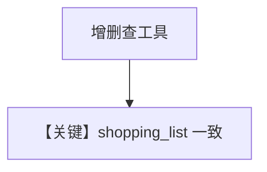

# session_state_advanced.py — 实现原理分析

> 源文件：`cookbook/02_agents/05_state_and_session/session_state_advanced.py`

## 概述

在 **session_state_basic** 之上增加 **`remove_item`、`list_items`**，并用 **`dedent` instructions** 描述职责与 **`Current shopping list: {shopping_list}`**；**`db=SqliteDb`** 持久化会话状态。

**核心配置一览：**

| 配置项 | 值 |
|--------|-----|
| `session_state` | `{"shopping_list": []}` |
| `tools` | `add_item`, `remove_item`, `list_items` |
| `instructions` | dedent 多行，含 `{shopping_list}` |

## 架构分层

```
工具读写 session_state["shopping_list"] → instructions 占位符展示当前列表
```

## 核心组件解析

多轮对话覆盖增删查与「清空重来」类请求（`session_state_advanced.py` L86-100）。

### 运行机制与因果链

**副作用**：SQLite 存会话；列表在内存与 DB 间由框架同步。

## System Prompt 组装

### 还原后的完整 System 文本（结构）

```text
Your job is to manage a shopping list.
...
Current shopping list: <展开 shopping_list>
```

## 完整 API 请求

**OpenAIResponses**。

## Mermaid 流程图


```mermaid
flowchart TD
    A["增删查工具"] --> B["【关键】shopping_list 一致"]
```

## 关键源码文件索引

| 文件 | 关键函数/类 | 作用 |
|------|------------|------|
| `agno/run/context.py` | `RunContext.session_state` | 工具读写 |
