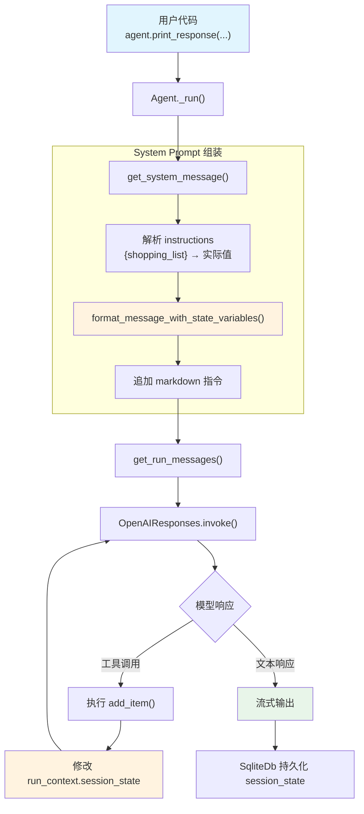

# session_state_basic.py — 实现原理分析

> 源文件：`cookbook/02_agents/05_state_and_session/session_state_basic.py`

## 概述

本示例展示 Agno 的 **`session_state`** 机制：通过在 Agent 构造时声明初始状态字典，并在工具函数中通过 `RunContext.session_state` 读写状态，实现跨轮次的会话状态管理。配合 `instructions` 中的模板变量 `{shopping_list}`，Agent 能在 system prompt 中感知当前状态。

**核心配置一览：**

| 配置项 | 值 | 说明 |
|--------|------|------|
| `model` | `OpenAIResponses(id="gpt-5-mini")` | Responses API |
| `session_state` | `{"shopping_list": []}` | 初始会话状态 |
| `db` | `SqliteDb(db_file="tmp/agents.db")` | SQLite 持久化 |
| `tools` | `[add_item]` | 工具函数（接受 RunContext） |
| `instructions` | `"Current state (shopping list) is: {shopping_list}"` | 含状态模板变量 |
| `markdown` | `True` | markdown 格式化 |

## 架构分层

```
用户代码层                          agno.agent 层
┌─────────────────────────┐       ┌──────────────────────────────────────┐
│ session_state_basic.py  │       │ Agent._run()                         │
│                         │       │  ├ _messages.py                      │
│ session_state=           │       │  │  get_system_message()              │
│   {"shopping_list": []} │──────>│  │    → format_message_with_state_    │
│                         │       │  │      variables()                   │
│ instructions=           │       │  │    → {shopping_list} → 实际值      │
│   "...{shopping_list}"  │       │  │                                    │
│                         │       │  │  get_run_messages()                │
│ tools=[add_item]        │       │  │    → system + user messages        │
│                         │       │  ├ _tools.py                         │
│ add_item(run_context,   │       │  │  get_tools()                       │
│   item) → 修改          │       │  │    → Function(add_item)            │
│   run_context.          │       │  │                                    │
│   session_state         │       │  └ Model.response() → 工具调用循环    │
└─────────────────────────┘       └──────────────────────────────────────┘
                                          │
                                          ▼
                                  ┌──────────────────┐
                                  │ OpenAIResponses   │
                                  │ gpt-5-mini        │
                                  └──────────────────┘
```

## 核心组件解析

### session_state 初始化与传递

`session_state` 在 Agent 类中定义为默认状态字典（`agent.py:84`）：

```python
# Agent 类属性
session_state: Optional[Dict[str, Any]] = None
```

运行时，`session_state` 被传入 `RunContext`（`run/base.py:27`），工具函数通过参数注入获取：

```python
@dataclass
class RunContext:
    run_id: str
    session_id: str
    user_id: Optional[str] = None
    session_state: Optional[Dict[str, Any]] = None  # 状态字典
```

### 工具函数中的状态修改

`add_item` 函数通过 `run_context.session_state` 直接修改状态：

```python
def add_item(run_context: RunContext, item: str) -> str:
    """Add an item to the shopping list."""
    # run_context 由 agno 自动注入
    run_context.session_state["shopping_list"].append(item)
    return f"The shopping list is now {run_context.session_state['shopping_list']}"
```

`RunContext` 是引用传递，工具函数对 `session_state` 的修改立即反映到 Agent 层。

### instructions 模板变量解析

`resolve_in_context=True`（默认值，`agent.py:249`）启用模板变量替换。`format_message_with_state_variables()`（`_messages.py:56`）将 `{shopping_list}` 替换为实际值：

```python
def format_message_with_state_variables(agent, message, run_context=None):
    # 从 run_context 提取 session_state
    session_state = run_context.session_state if run_context else None
    # 构建变量映射
    format_variables = ChainMap(
        session_state if session_state is not None else {},
        # ...dependencies, metadata, user_id
    )
    # 用 string.Template 安全替换
    template = string.Template(converted_msg)
    result = template.safe_substitute(format_variables)
```

### SqliteDb 持久化

`db=SqliteDb(...)` 在每次运行结束后将 `session_state` 序列化存入 SQLite 数据库。下次运行时从数据库恢复状态，实现跨运行持久化。

## System Prompt 组装

| 序号 | 组成部分 | 本文件中的值/来源 | 是否生效 |
|------|---------|-----------------|---------|
| 1 | `system_message`（自定义） | `None` | 否 |
| 2 | `build_context=False` | `True`（默认） | 否（不跳过） |
| 3.1 | `instructions` | `"Current state (shopping list) is: {shopping_list}"` | 是 |
| 3.1.1 | 模型指令（`get_instructions_for_model`） | Responses API 无额外指令 | 否 |
| 3.2.1 | `markdown` | `True` | 是 |
| 3.2.2 | `add_datetime_to_context` | `False`（默认） | 否 |
| 3.2.3 | `add_location_to_context` | `False`（默认） | 否 |
| 3.2.4 | `add_name_to_context` | `False`（默认） | 否 |
| 3.3.1 | `description` | `None` | 否 |
| 3.3.2 | `role` | `None` | 否 |
| 3.3.3 | instructions 拼接 | `"Current state (shopping list) is: ['milk', 'eggs']"` | 是 |
| 3.3.4 | additional_information | `["Use markdown to format your answers."]` | 是 |
| 3.3.5 | `_tool_instructions` | `None` | 否 |
| 3.3.7 | `expected_output` | `None` | 否 |
| 3.3.8 | `additional_context` | `None` | 否 |
| 3.3.9 | `add_memories_to_context` | `None`（默认） | 否 |
| 3.3.17 | `add_session_state_to_context` | `False`（默认） | 否 |

### 最终 System Prompt

```text
Current state (shopping list) is: []

<additional_information>
- Use markdown to format your answers.
</additional_information>
```

> 注意：`{shopping_list}` 在每轮运行前被 `format_message_with_state_variables()` 替换为当前值。首轮为 `[]`，工具调用后下一轮会更新为实际列表。

## 完整 API 请求

```python
client.responses.create(
    model="gpt-5-mini",
    input=[
        # 1. System Message（role_map: system → developer）
        {
            "role": "developer",
            "content": "Current state (shopping list) is: []\n\n<additional_information>\n- Use markdown to format your answers.\n</additional_information>"
        },
        # 2. 当前用户输入
        {
            "role": "user",
            "content": "Add milk, eggs, and bread to the shopping list"
        }
    ],
    tools=[
        {
            "type": "function",
            "function": {
                "name": "add_item",
                "description": "Add an item to the shopping list.",
                "parameters": {
                    "type": "object",
                    "properties": {
                        "item": {"type": "string"}
                    },
                    "required": ["item"]
                }
            }
        }
    ],
    stream=True,
    stream_options={"include_usage": True}
)
```

**第二轮（工具调用后）：**

```python
client.responses.create(
    model="gpt-5-mini",
    input=[
        # 1. System Message
        {"role": "developer", "content": "Current state (shopping list) is: []\n\n..."},
        # 2. 用户输入
        {"role": "user", "content": "Add milk, eggs, and bread to the shopping list"},
        # 3. 模型的工具调用响应
        {"type": "function_call", "name": "add_item", "arguments": "{\"item\": \"milk\"}"},
        # 4. 工具执行结果
        {"type": "function_call_output", "output": "The shopping list is now ['milk']"},
        # ... 更多工具调用（eggs, bread）
    ],
    tools=[...],
    stream=True,
    stream_options={"include_usage": True}
)
```

> 工具函数 `add_item` 通过 `run_context.session_state` 修改状态，模型可能发起多次工具调用来添加每个商品。

## Mermaid 流程图



## 关键源码文件索引

| 文件 | 关键函数/类 | 作用 |
|------|------------|------|
| `agno/agent/agent.py` | `session_state` L84 | 默认状态字典定义 |
| `agno/agent/agent.py` | `resolve_in_context` L249 | 控制模板变量替换 |
| `agno/agent/agent.py` | `get_session_state()` L939 | 获取当前状态 |
| `agno/run/base.py` | `RunContext` L16 | 运行上下文，承载 session_state |
| `agno/agent/_messages.py` | `format_message_with_state_variables()` L56 | 模板变量替换逻辑 |
| `agno/agent/_messages.py` | `get_system_message()` L106 | 组装 system prompt |
| `agno/agent/_messages.py` | `get_run_messages()` L1146 | 组装完整消息列表 |
| `agno/agent/_tools.py` | `get_tools()` L105 | 解析工具函数 |
| `agno/db/sqlite` | `SqliteDb` | SQLite 持久化后端 |
