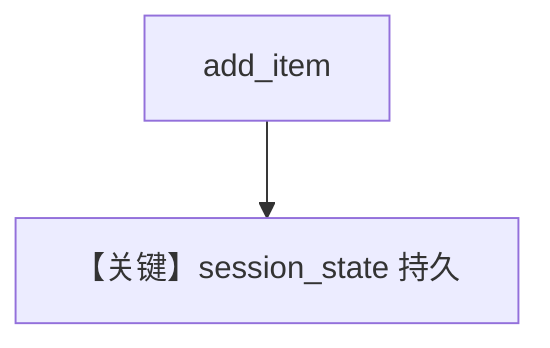

# session_state_basic.py — 实现原理分析

<!-- cookbook-py-source:start -->
## 完整源码

```python
"""
Session State Basic
=============================

Session State Basic.
"""

from agno.agent import Agent, RunOutput  # noqa
from agno.db.sqlite import SqliteDb
from agno.models.openai import OpenAIResponses
from agno.run import RunContext


def add_item(run_context: RunContext, item: str) -> str:
    """Add an item to the shopping list."""
    if run_context.session_state is None:
        run_context.session_state = {}

    run_context.session_state["shopping_list"].append(item)  # type: ignore
    return f"The shopping list is now {run_context.session_state['shopping_list']}"  # type: ignore


# Create an Agent that maintains state
# ---------------------------------------------------------------------------
# Create Agent
# ---------------------------------------------------------------------------
agent = Agent(
    model=OpenAIResponses(id="gpt-5-mini"),
    # Initialize the session state with a counter starting at 0 (this is the default session state for all users)
    session_state={"shopping_list": []},
    db=SqliteDb(db_file="tmp/agents.db"),
    tools=[add_item],
    # You can use variables from the session state in the instructions
    instructions="Current state (shopping list) is: {shopping_list}",
    markdown=True,
)

# ---------------------------------------------------------------------------
# Run Agent
# ---------------------------------------------------------------------------
if __name__ == "__main__":
    # Example usage
    agent.print_response("Add milk, eggs, and bread to the shopping list", stream=True)
    print(f"Final session state: {agent.get_session_state()}")

    # Alternatively,
    # response: RunOutput = agent.run("Add milk, eggs, and bread to the shopping list")
    # print(f"Final session state: {response.session_state}")
```

<!-- cookbook-py-source:end -->

> 源文件：`cookbook/02_agents/05_state_and_session/session_state_basic.py`

## 概述

**最简 session_state**：**`shopping_list`** + 单工具 **`add_item`**，**instructions** 为 **`"Current state (shopping list) is: {shopping_list}"`**。**`db=SqliteDb`**。

**核心配置一览：**

| 配置项 | 值 |
|--------|-----|
| `session_state` | `{"shopping_list": []}` |
| `tools` | `[add_item]` |

## 架构分层

```
add_item 追加 → session_state 更新 → 下一轮占位符反映
```

## 核心组件解析

注释展示 **`response.session_state`** 替代 **`get_session_state()`**（`session_state_basic.py` L46-48）。

### 运行机制与因果链

单会话、单列表，适合入门。

## System Prompt 组装

```text
Current state (shopping list) is: <list>
```

## 完整 API 请求

**OpenAIResponses**。

## Mermaid 流程图


```mermaid
flowchart TD
    A["add_item"] --> B["【关键】session_state 持久"]
```

## 关键源码文件索引

| 文件 | 关键函数/类 | 作用 |
|------|------------|------|
| `agno/agent/_messages.py` | `format_message_with_state_variables` | `{shopping_list}` |
