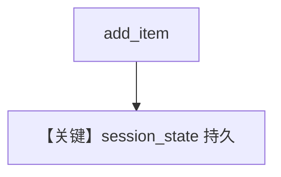

# session_state_basic.py — 实现原理分析

> 源文件：`cookbook/02_agents/05_state_and_session/session_state_basic.py`

## 概述

**最简 session_state**：**`shopping_list`** + 单工具 **`add_item`**，**instructions** 为 **`"Current state (shopping list) is: {shopping_list}"`**。**`db=SqliteDb`**。

**核心配置一览：**

| 配置项 | 值 |
|--------|-----|
| `session_state` | `{"shopping_list": []}` |
| `tools` | `[add_item]` |

## 架构分层

```
add_item 追加 → session_state 更新 → 下一轮占位符反映
```

## 核心组件解析

注释展示 **`response.session_state`** 替代 **`get_session_state()`**（`session_state_basic.py` L46-48）。

### 运行机制与因果链

单会话、单列表，适合入门。

## System Prompt 组装

```text
Current state (shopping list) is: <list>
```

## 完整 API 请求

**OpenAIResponses**。

## Mermaid 流程图


```mermaid
flowchart TD
    A["add_item"] --> B["【关键】session_state 持久"]
```

## 关键源码文件索引

| 文件 | 关键函数/类 | 作用 |
|------|------------|------|
| `agno/agent/_messages.py` | `format_message_with_state_variables` | `{shopping_list}` |
