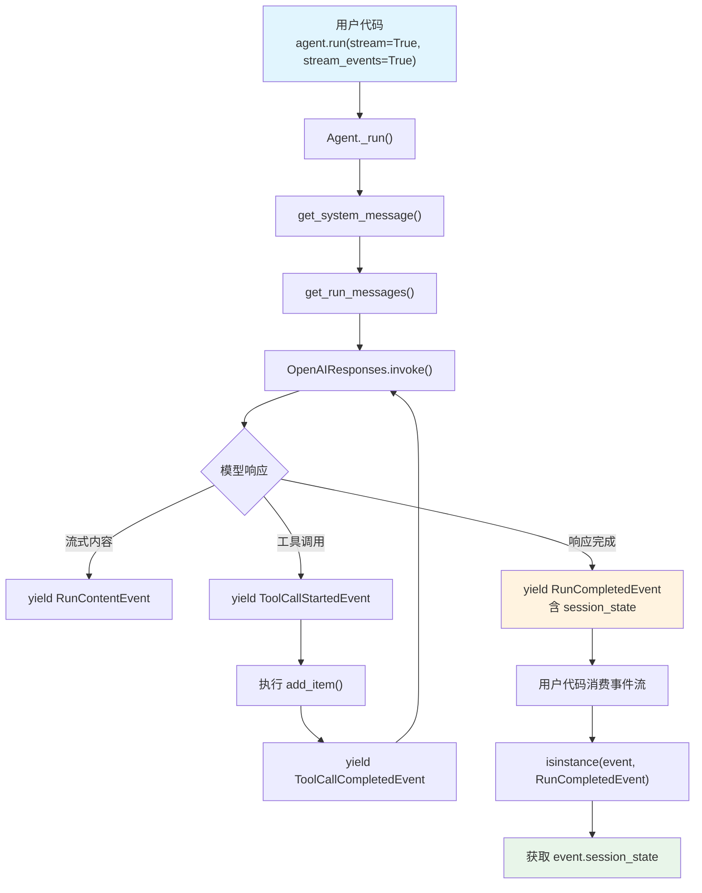

# session_state_events.py — 实现原理分析

> 源文件：`cookbook/02_agents/05_state_and_session/session_state_events.py`

## 概述

本示例展示 Agno 的 **`stream_events`** 机制：通过设置 `stream=True, stream_events=True`，Agent 在流式运行时返回结构化事件流而非纯文本。用户代码通过检查 `RunCompletedEvent` 事件获取最终的 `session_state`，实现事件驱动的状态获取模式。

**核心配置一览：**

| 配置项 | 值 | 说明 |
|--------|------|------|
| `model` | `OpenAIResponses(id="gpt-5-mini")` | Responses API |
| `session_state` | `{"shopping_list": []}` | 初始会话状态 |
| `db` | `SqliteDb(db_file="tmp/agents.db")` | SQLite 持久化 |
| `tools` | `[add_item]` | 工具函数 |
| `instructions` | `"Current state (shopping list) is: {shopping_list}"` | 含模板变量 |
| `markdown` | `True` | markdown 格式化 |

## 架构分层

```
用户代码层                          agno.agent 层
┌─────────────────────────┐       ┌──────────────────────────────────────┐
│ session_state_events.py │       │ Agent.run(stream=True,               │
│                         │       │          stream_events=True)         │
│ response = agent.run(   │       │  ├ _run.py: _run_stream_events()    │
│   ...,                  │       │  │                                    │
│   stream=True,          │       │  │  yield RunContentEvent(...)       │
│   stream_events=True)   │──────>│  │  yield ToolCallStartedEvent(...)  │
│                         │       │  │  yield ToolCallCompletedEvent(...)│
│ for event in response:  │       │  │  ...                              │
│   if isinstance(event,  │       │  │  yield RunCompletedEvent(         │
│     RunCompletedEvent): │       │  │    session_state=...)             │
│     print(event.        │       │  │                                    │
│       session_state)    │       │  └ SqliteDb 持久化                   │
└─────────────────────────┘       └──────────────────────────────────────┘
                                          │
                                          ▼
                                  ┌──────────────────┐
                                  │ OpenAIResponses   │
                                  │ gpt-5-mini        │
                                  └──────────────────┘
```

## 核心组件解析

### stream_events 模式

当 `stream=True` 和 `stream_events=True` 同时设置时，`agent.run()` 返回一个事件迭代器而非 `RunOutput` 对象。事件类型定义在 `run/agent.py` 中：

```python
class RunEvent(str, Enum):
    run_started = "RunStarted"
    run_content = "RunContent"
    run_completed = "RunCompleted"
    tool_call_started = "ToolCallStarted"
    tool_call_completed = "ToolCallCompleted"
    # ...更多事件类型
```

### RunCompletedEvent

`RunCompletedEvent`（`run/agent.py:261`）是运行结束时发出的最终事件，包含完整的运行结果：

```python
@dataclass
class RunCompletedEvent(BaseAgentRunEvent):
    event: str = RunEvent.run_completed.value
    content: Optional[Any] = None
    content_type: str = "str"
    session_state: Optional[Dict[str, Any]] = None  # 最终状态
    metrics: Optional[RunMetrics] = None
    # ...其他字段
```

### 事件消费模式

用户代码通过迭代事件流并类型检查获取状态：

```python
response = agent.run(
    "Add milk, eggs, and bread to the shopping list",
    stream=True,
    stream_events=True,
)
for event in response:
    if isinstance(event, RunCompletedEvent):
        print(f"Session state: {event.session_state}")
```

与 `agent.get_session_state()` 的区别：
- `get_session_state()` 是主动查询，需要在运行结束后调用
- `RunCompletedEvent.session_state` 是被动推送，作为事件流的一部分自动到达

## System Prompt 组装

| 序号 | 组成部分 | 本文件中的值/来源 | 是否生效 |
|------|---------|-----------------|---------|
| 1 | `system_message`（自定义） | `None` | 否 |
| 3.1 | `instructions` | `"Current state (shopping list) is: {shopping_list}"` | 是 |
| 3.2.1 | `markdown` | `True` | 是 |
| 3.3.3 | instructions 拼接 | 含替换后的 `{shopping_list}` | 是 |
| 3.3.4 | additional_information | `["Use markdown to format your answers."]` | 是 |

### 最终 System Prompt

```text
Current state (shopping list) is: []

<additional_information>
- Use markdown to format your answers.
</additional_information>
```

## 完整 API 请求

```python
client.responses.create(
    model="gpt-5-mini",
    input=[
        # 1. System Message（system → developer）
        {
            "role": "developer",
            "content": "Current state (shopping list) is: []\n\n<additional_information>\n- Use markdown to format your answers.\n</additional_information>"
        },
        # 2. 用户输入
        {
            "role": "user",
            "content": "Add milk, eggs, and bread to the shopping list"
        }
    ],
    tools=[
        {
            "type": "function",
            "function": {
                "name": "add_item",
                "description": "Add an item to the shopping list.",
                "parameters": {
                    "type": "object",
                    "properties": {
                        "item": {"type": "string"}
                    },
                    "required": ["item"]
                }
            }
        }
    ],
    stream=True,
    stream_options={"include_usage": True}
)
```

> API 请求本身与非 stream_events 模式相同。差异在于 agno 层如何处理响应——stream_events 模式下将响应拆解为结构化事件流推送给用户代码。

## Mermaid 流程图



## 关键源码文件索引

| 文件 | 关键函数/类 | 作用 |
|------|------------|------|
| `agno/run/agent.py` | `RunEvent` L134 | 事件类型枚举 |
| `agno/run/agent.py` | `RunCompletedEvent` L261 | 运行完成事件，含 session_state |
| `agno/agent/agent.py` | `stream_events` L304 | 控制是否返回事件流 |
| `agno/agent/agent.py` | `session_state` L84 | 默认状态字典 |
| `agno/run/base.py` | `RunContext` L16 | 运行上下文 |
| `agno/agent/_messages.py` | `format_message_with_state_variables()` L56 | 模板变量替换 |
| `agno/agent/_messages.py` | `get_system_message()` L106 | 组装 system prompt |
