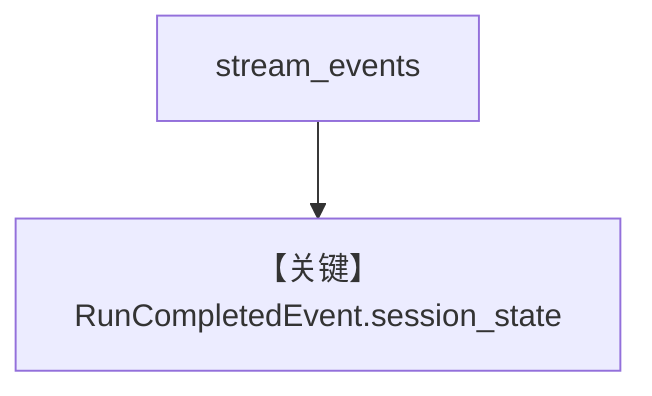

# session_state_events.py — 实现原理分析

<!-- cookbook-py-source:start -->
## 完整源码

```python
"""
Session State Events
=============================

Session State Events.
"""

from agno.agent import Agent, RunCompletedEvent
from agno.db.sqlite import SqliteDb
from agno.models.openai import OpenAIResponses
from agno.run import RunContext


def add_item(run_context: RunContext, item: str) -> str:
    """Add an item to the shopping list."""
    if run_context.session_state is None:
        run_context.session_state = {}

    run_context.session_state["shopping_list"].append(item)  # type: ignore
    return f"The shopping list is now {run_context.session_state['shopping_list']}"  # type: ignore


# Create an Agent that maintains state
# ---------------------------------------------------------------------------
# Create Agent
# ---------------------------------------------------------------------------
agent = Agent(
    model=OpenAIResponses(id="gpt-5-mini"),
    # Initialize the session state with a counter starting at 0 (this is the default session state for all users)
    session_state={"shopping_list": []},
    db=SqliteDb(db_file="tmp/agents.db"),
    tools=[add_item],
    # You can use variables from the session state in the instructions
    instructions="Current state (shopping list) is: {shopping_list}",
    markdown=True,
)

# ---------------------------------------------------------------------------
# Run Agent
# ---------------------------------------------------------------------------
if __name__ == "__main__":
    # Example usage
    response = agent.run(
        "Add milk, eggs, and bread to the shopping list",
        stream=True,
        stream_events=True,
    )
    for event in response:
        if isinstance(event, RunCompletedEvent):
            print(f"Session state: {event.session_state}")
```

<!-- cookbook-py-source:end -->

> 源文件：`cookbook/02_agents/05_state_and_session/session_state_events.py`

## 概述

与 **session_state_basic** 相同 Agent 配置，但使用 **`run(..., stream=True, stream_events=True)`** 迭代事件；在 **`RunCompletedEvent`** 上读取 **`event.session_state`**，演示 **流式 + 完成事件** 中的状态快照。

**核心配置一览：** 同 basic；运行方式不同。

## 架构分层

```
流事件 → RunCompletedEvent → session_state 打印
```

## 核心组件解析

`isinstance(event, RunCompletedEvent)`（`session_state_events.py` L48-50）。

### 运行机制与因果链

适合 UI：流式输出同时于 run 结束拿最终 state。

## System Prompt 组装

同 basic。

## 完整 API 请求

**OpenAIResponses** 流式。

## Mermaid 流程图


```mermaid
flowchart TD
    A["stream_events"] --> B["【关键】RunCompletedEvent.session_state"]
```

## 关键源码文件索引

| 文件 | 关键函数/类 | 作用 |
|------|------------|------|
| `agno/run/agent.py` | `RunCompletedEvent` | 完成事件 |
