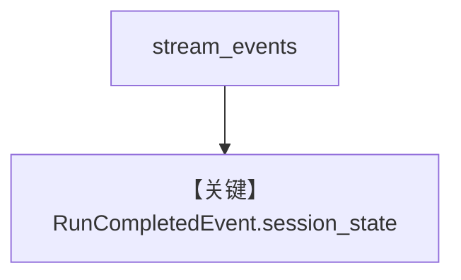

# session_state_events.py — 实现原理分析

> 源文件：`cookbook/02_agents/05_state_and_session/session_state_events.py`

## 概述

与 **session_state_basic** 相同 Agent 配置，但使用 **`run(..., stream=True, stream_events=True)`** 迭代事件；在 **`RunCompletedEvent`** 上读取 **`event.session_state`**，演示 **流式 + 完成事件** 中的状态快照。

**核心配置一览：** 同 basic；运行方式不同。

## 架构分层

```
流事件 → RunCompletedEvent → session_state 打印
```

## 核心组件解析

`isinstance(event, RunCompletedEvent)`（`session_state_events.py` L48-50）。

### 运行机制与因果链

适合 UI：流式输出同时于 run 结束拿最终 state。

## System Prompt 组装

同 basic。

## 完整 API 请求

**OpenAIResponses** 流式。

## Mermaid 流程图


```mermaid
flowchart TD
    A["stream_events"] --> B["【关键】RunCompletedEvent.session_state"]
```

## 关键源码文件索引

| 文件 | 关键函数/类 | 作用 |
|------|------------|------|
| `agno/run/agent.py` | `RunCompletedEvent` | 完成事件 |
