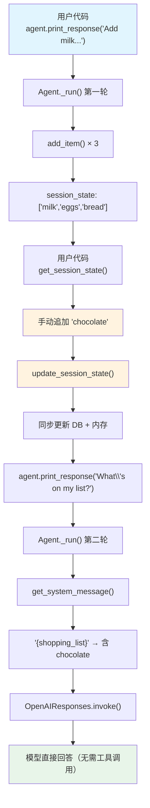

# session_state_manual_update.py — 实现原理分析

> 源文件：`cookbook/02_agents/05_state_and_session/session_state_manual_update.py`

## 概述

本示例展示 Agno 的 **`update_session_state` 手动更新** 机制：在 Agent 运行之间，用户代码可以通过 `agent.get_session_state()` 获取当前状态，修改后通过 `agent.update_session_state()` 写回，实现程序化的状态注入。这种方式适用于外部系统需要向 Agent 状态注入数据的场景。

**核心配置一览：**

| 配置项 | 值 | 说明 |
|--------|------|------|
| `model` | `OpenAIResponses(id="gpt-5-mini")` | Responses API |
| `session_state` | `{"shopping_list": []}` | 初始会话状态 |
| `db` | `SqliteDb(db_file="tmp/agents.db")` | SQLite 持久化 |
| `tools` | `[add_item]` | 工具函数 |
| `instructions` | `"Current state (shopping list) is: {shopping_list}"` | 含模板变量 |
| `markdown` | `True` | markdown 格式化 |

## 架构分层

```
用户代码层                          agno.agent 层
┌─────────────────────────┐       ┌──────────────────────────────────────┐
│ session_state_manual_   │       │ Agent._run()                         │
│   update.py             │       │  ├ get_session_state() → 返回当前状态│
│                         │       │  ├ update_session_state() → 写入状态 │
│ 1. agent.print_response │       │  │                                    │
│    → 工具修改状态       │──────>│  ├ _messages.py                      │
│ 2. get_session_state()  │       │  │  get_system_message()              │
│ 3. 手动追加 "chocolate" │       │  │    → {shopping_list} 包含手动值   │
│ 4. update_session_state │       │  │                                    │
│ 5. agent.print_response │       │  └ 下次运行使用更新后的状态          │
│    → Agent 感知新状态   │       │                                      │
└─────────────────────────┘       └──────────────────────────────────────┘
                                          │
                                          ▼
                                  ┌──────────────────┐
                                  │ OpenAIResponses   │
                                  │ gpt-5-mini        │
                                  └──────────────────┘
```

## 核心组件解析

### get_session_state()

`agent.get_session_state()`（`agent.py:939`）委派到 `_session` 模块，返回当前 `session_state` 字典的引用：

```python
def get_session_state(self, session_id: Optional[str] = None) -> Dict[str, Any]:
    return _session.get_session_state(self, session_id=session_id)
```

### update_session_state()

`agent.update_session_state()`（`agent.py:945`）接受一个字典参数，将更新合并到当前状态：

```python
def update_session_state(self, session_state_updates: Dict[str, Any], session_id: Optional[str] = None) -> str:
    return _session.update_session_state(self, session_state_updates=session_state_updates, session_id=session_id)
```

### 手动更新流程

示例的关键操作序列：

```python
# 1. 第一轮：工具添加 milk, eggs, bread
agent.print_response("Add milk, eggs, and bread to the shopping list")

# 2. 获取当前状态
current_session_state = agent.get_session_state()
# → {"shopping_list": ["milk", "eggs", "bread"]}

# 3. 程序化修改（绕过 Agent/工具）
current_session_state["shopping_list"].append("chocolate")

# 4. 写回更新后的状态
agent.update_session_state(current_session_state)

# 5. 第二轮：Agent 能感知 chocolate（在 instructions 模板中可见）
agent.print_response("What's on my list?", debug_mode=True)
```

关键点：`update_session_state()` 会同步更新数据库和内存中的状态，确保下次 `_run()` 时 `get_system_message()` 使用最新值。

### debug_mode

第二轮调用使用了 `debug_mode=True`，这会在控制台输出调试信息，包括实际发送给模型的消息内容，方便验证 `{shopping_list}` 是否正确替换为包含 `chocolate` 的列表。

## System Prompt 组装

| 序号 | 组成部分 | 本文件中的值/来源 | 是否生效 |
|------|---------|-----------------|---------|
| 1 | `system_message`（自定义） | `None` | 否 |
| 3.1 | `instructions` | `"Current state (shopping list) is: {shopping_list}"` | 是 |
| 3.2.1 | `markdown` | `True` | 是 |
| 3.3.3 | instructions 拼接 | 含替换后的 `{shopping_list}` | 是 |
| 3.3.4 | additional_information | `["Use markdown to format your answers."]` | 是 |

### 最终 System Prompt（第二轮，手动更新后）

```text
Current state (shopping list) is: ['milk', 'eggs', 'bread', 'chocolate']

<additional_information>
- Use markdown to format your answers.
</additional_information>
```

## 完整 API 请求

**第二轮请求（手动更新后）：**

```python
client.responses.create(
    model="gpt-5-mini",
    input=[
        # 1. System Message — 包含手动添加的 chocolate
        {
            "role": "developer",
            "content": "Current state (shopping list) is: ['milk', 'eggs', 'bread', 'chocolate']\n\n<additional_information>\n- Use markdown to format your answers.\n</additional_information>"
        },
        # 2. 历史消息（如有 add_history_to_context，此处无）
        # 3. 用户输入
        {
            "role": "user",
            "content": "What's on my list?"
        }
    ],
    tools=[
        {
            "type": "function",
            "function": {
                "name": "add_item",
                "description": "Add an item to the shopping list.",
                "parameters": {
                    "type": "object",
                    "properties": {
                        "item": {"type": "string"}
                    },
                    "required": ["item"]
                }
            }
        }
    ],
    stream=True,
    stream_options={"include_usage": True}
)
```

> Agent 无需调用工具即可回答，因为当前列表已在 system prompt 中通过 `{shopping_list}` 注入。

## Mermaid 流程图



## 关键源码文件索引

| 文件 | 关键函数/类 | 作用 |
|------|------------|------|
| `agno/agent/agent.py` | `get_session_state()` L939 | 获取当前状态 |
| `agno/agent/agent.py` | `update_session_state()` L945 | 手动更新状态 |
| `agno/agent/agent.py` | `session_state` L84 | 默认状态字典 |
| `agno/agent/agent.py` | `debug_mode` L342 | 调试模式开关 |
| `agno/run/base.py` | `RunContext` L16 | 运行上下文 |
| `agno/agent/_messages.py` | `format_message_with_state_variables()` L56 | 模板变量替换 |
| `agno/agent/_messages.py` | `get_system_message()` L106 | 组装 system prompt |
