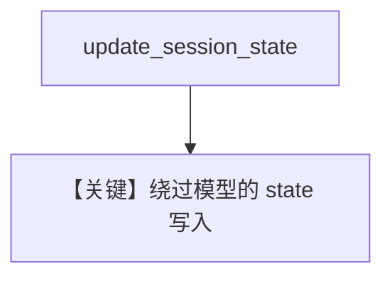

# session_state_manual_update.py — 实现原理分析

<!-- cookbook-py-source:start -->
## 完整源码

```python
"""
Session State Manual Update
=============================

Session State Manual Update.
"""

from agno.agent import Agent
from agno.db.sqlite import SqliteDb
from agno.models.openai import OpenAIResponses
from agno.run import RunContext


def add_item(run_context: RunContext, item: str) -> str:
    """Add an item to the shopping list."""
    if run_context.session_state is None:
        run_context.session_state = {}

    run_context.session_state["shopping_list"].append(item)  # type: ignore
    return f"The shopping list is now {run_context.session_state['shopping_list']}"  # type: ignore


# Create an Agent that maintains state
# ---------------------------------------------------------------------------
# Create Agent
# ---------------------------------------------------------------------------
agent = Agent(
    model=OpenAIResponses(id="gpt-5-mini"),
    # Initialize the session state with an empty shopping list (this is the default session state for all users)
    session_state={"shopping_list": []},
    db=SqliteDb(db_file="tmp/agents.db"),
    tools=[add_item],
    # You can use variables from the session state in the instructions
    instructions="Current state (shopping list) is: {shopping_list}",
    markdown=True,
)

# ---------------------------------------------------------------------------
# Run Agent
# ---------------------------------------------------------------------------
if __name__ == "__main__":
    # Example usage
    agent.print_response("Add milk, eggs, and bread to the shopping list", stream=True)

    current_session_state = agent.get_session_state()
    current_session_state["shopping_list"].append("chocolate")
    agent.update_session_state(current_session_state)

    agent.print_response("What's on my list?", stream=True, debug_mode=True)

    print(f"Final session state: {agent.get_session_state()}")
```

<!-- cookbook-py-source:end -->

> 源文件：`cookbook/02_agents/05_state_and_session/session_state_manual_update.py`

## 概述

在工具更新清单后，**代码侧** **`get_session_state()` → 修改 dict → `agent.update_session_state()`** 手动插入 **chocolate**，演示 **不经模型** 的 state 修正；第二次 **`print_response(..., debug_mode=True)`** 便于观察上下文。

**核心配置一览：** 与 basic 同构；多 **`update_session_state`** 调用。

## 架构分层

```
工具 run → 人工改 state → update_session_state → 下一 run 模型可见
```

## 核心组件解析

适用于 **外部系统** 回调写入会话态（支付成功、Webhook）。

### 运行机制与因果链

若与模型并发，注意 **竞态**。

## System Prompt 组装

```text
Current state (shopping list) is: {shopping_list}
```

## 完整 API 请求

**OpenAIResponses**。

## Mermaid 流程图


```mermaid
flowchart TD
    A["update_session_state"] --> B["【关键】绕过模型的 state 写入"]
```

## 关键源码文件索引

| 文件 | 关键函数/类 | 作用 |
|------|------------|------|
| `agno/agent/agent.py` | `update_session_state` | 手动更新 |
