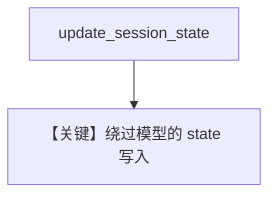

# session_state_manual_update.py — 实现原理分析

> 源文件：`cookbook/02_agents/05_state_and_session/session_state_manual_update.py`

## 概述

在工具更新清单后，**代码侧** **`get_session_state()` → 修改 dict → `agent.update_session_state()`** 手动插入 **chocolate**，演示 **不经模型** 的 state 修正；第二次 **`print_response(..., debug_mode=True)`** 便于观察上下文。

**核心配置一览：** 与 basic 同构；多 **`update_session_state`** 调用。

## 架构分层

```
工具 run → 人工改 state → update_session_state → 下一 run 模型可见
```

## 核心组件解析

适用于 **外部系统** 回调写入会话态（支付成功、Webhook）。

### 运行机制与因果链

若与模型并发，注意 **竞态**。

## System Prompt 组装

```text
Current state (shopping list) is: {shopping_list}
```

## 完整 API 请求

**OpenAIResponses**。

## Mermaid 流程图


```mermaid
flowchart TD
    A["update_session_state"] --> B["【关键】绕过模型的 state 写入"]
```

## 关键源码文件索引

| 文件 | 关键函数/类 | 作用 |
|------|------------|------|
| `agno/agent/agent.py` | `update_session_state` | 手动更新 |
