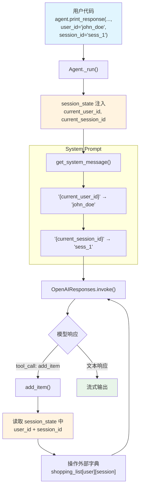

# session_state_multiple_users.py — 实现原理分析

> 源文件：`cookbook/02_agents/05_state_and_session/session_state_multiple_users.py`

## 概述

本示例展示 Agno 的 **多用户 `session_state`** 机制：通过在 `print_response()` 中传递 `user_id` 和 `session_id`，Agent 自动为每个用户/会话创建独立的状态上下文。结合外部数据结构（Python 字典），工具函数通过 `run_context.session_state` 中的 `current_user_id` 和 `current_session_id` 实现用户级隔离。

**核心配置一览：**

| 配置项 | 值 | 说明 |
|--------|------|------|
| `model` | `OpenAIResponses(id="gpt-5-mini")` | Responses API |
| `session_state` | 未显式设置（由 agno 自动注入 `current_user_id`/`current_session_id`） | 运行时状态 |
| `db` | `SqliteDb(db_file="tmp/data.db")` | SQLite 持久化 |
| `tools` | `[add_item, remove_item, get_shopping_list]` | 三个工具函数 |
| `instructions` | `["Current User ID: {current_user_id}", "Current Session ID: {current_session_id}"]` | 列表形式指令 |
| `markdown` | `True` | markdown 格式化 |

## 架构分层

```
用户代码层                          agno.agent 层
┌─────────────────────────┐       ┌──────────────────────────────────────┐
│ session_state_multiple  │       │ Agent._run()                         │
│   _users.py             │       │  ├ session_state 自动注入             │
│                         │       │  │  current_user_id = user_id         │
│ agent.print_response(   │       │  │  current_session_id = session_id   │
│   ...,                  │──────>│  │                                    │
│   user_id="john_doe",   │       │  ├ _messages.py                      │
│   session_id="sess_1"   │       │  │  {current_user_id} → "john_doe"   │
│ )                       │       │  │  {current_session_id} → "sess_1"  │
│                         │       │  │                                    │
│ 外部字典:               │       │  └ 工具函数读取 session_state 中的   │
│ shopping_list = {       │       │    user_id/session_id 操作对应列表    │
│   "john_doe": {...},    │       │                                      │
│   "mark_smith": {...}   │       │                                      │
│ }                       │       │                                      │
└─────────────────────────┘       └──────────────────────────────────────┘
                                          │
                                          ▼
                                  ┌──────────────────┐
                                  │ OpenAIResponses   │
                                  │ gpt-5-mini        │
                                  └──────────────────┘
```

## 核心组件解析

### user_id 和 session_id 的自动注入

当调用 `agent.print_response(..., user_id="john_doe", session_id="user_1_session_1")` 时，agno 在 `_run()` 中将 `user_id` 和 `session_id` 注入到 `RunContext` 和 `session_state` 中：

- `run_context.user_id` = `"john_doe"`
- `run_context.session_id` = `"user_1_session_1"`
- `session_state["current_user_id"]` = `"john_doe"`（自动注入）
- `session_state["current_session_id"]` = `"user_1_session_1"`（自动注入）

### 工具函数的用户隔离

每个工具函数通过 `run_context.session_state` 获取当前用户/会话标识，操作外部字典中对应的列表：

```python
# 模块级外部字典（用户 × 会话 → 购物清单）
shopping_list = {}

def add_item(run_context: RunContext, item: str) -> str:
    current_user_id = run_context.session_state["current_user_id"]
    current_session_id = run_context.session_state["current_session_id"]
    # 按 user_id + session_id 隔离
    shopping_list.setdefault(current_user_id, {}).setdefault(
        current_session_id, []
    ).append(item)
    return f"Item {item} added to the shopping list"
```

这种模式将状态管理外置到 Python 字典，`session_state` 仅承载用户/会话标识符。

### instructions 列表形式

`instructions` 使用列表而非字符串，每个元素独立一行：

```python
instructions=[
    "Current User ID: {current_user_id}",
    "Current Session ID: {current_session_id}",
]
```

在 `get_system_message()`（`_messages.py:246-248`）中，列表形式的 instructions 以 `- ` 前缀逐行拼接：

```python
if len(instructions) > 1:
    for _upi in instructions:
        system_message_content += f"- {_upi}\n"
```

### 多用户运行序列

示例为 3 个用户各自操作：
1. `john_doe` → 添加 milk, eggs, bread → 删除 milk
2. `mark_smith` → 添加 tacos → 添加 minced beef → 查询列表
3. `carmen_sandiago` → 添加 apples, grapes

最终打印 `shopping_list` 字典验证用户隔离。

## System Prompt 组装

| 序号 | 组成部分 | 本文件中的值/来源 | 是否生效 |
|------|---------|-----------------|---------|
| 1 | `system_message` | `None` | 否 |
| 3.1 | `instructions` | 列表形式，2 个模板变量 | 是 |
| 3.2.1 | `markdown` | `True` | 是 |
| 3.3.3 | instructions 拼接 | 列表模式（`- ` 前缀） | 是 |
| 3.3.4 | additional_information | `["Use markdown to format your answers."]` | 是 |

### 最终 System Prompt（john_doe 用户）

```text
- Current User ID: john_doe
- Current Session ID: user_1_session_1

<additional_information>
- Use markdown to format your answers.
</additional_information>
```

## 完整 API 请求

```python
client.responses.create(
    model="gpt-5-mini",
    input=[
        # 1. System Message
        {
            "role": "developer",
            "content": "- Current User ID: john_doe\n- Current Session ID: user_1_session_1\n\n<additional_information>\n- Use markdown to format your answers.\n</additional_information>"
        },
        # 2. 用户输入
        {
            "role": "user",
            "content": "Add milk, eggs, and bread to the shopping list"
        }
    ],
    tools=[
        {
            "type": "function",
            "function": {
                "name": "add_item",
                "description": "Add an item to the current user's shopping list.",
                "parameters": {
                    "type": "object",
                    "properties": {
                        "item": {"type": "string"}
                    },
                    "required": ["item"]
                }
            }
        },
        {
            "type": "function",
            "function": {
                "name": "remove_item",
                "description": "Remove an item from the current user's shopping list.",
                "parameters": {
                    "type": "object",
                    "properties": {
                        "item": {"type": "string"}
                    },
                    "required": ["item"]
                }
            }
        },
        {
            "type": "function",
            "function": {
                "name": "get_shopping_list",
                "description": "Get the current user's shopping list.",
                "parameters": {
                    "type": "object",
                    "properties": {},
                    "required": []
                }
            }
        }
    ],
    stream=True,
    stream_options={"include_usage": True}
)
```

## Mermaid 流程图



## 关键源码文件索引

| 文件 | 关键函数/类 | 作用 |
|------|------------|------|
| `agno/agent/agent.py` | `session_state` L84 | 状态字典定义 |
| `agno/agent/agent.py` | `user_id` L78 | 默认用户 ID |
| `agno/agent/agent.py` | `session_id` L82 | 默认会话 ID |
| `agno/run/base.py` | `RunContext` L16 | 包含 user_id, session_id, session_state |
| `agno/agent/_messages.py` | `format_message_with_state_variables()` L56 | 模板变量替换 |
| `agno/agent/_messages.py` | `get_system_message()` L236-248 | 列表 instructions 拼接 |
| `agno/agent/_tools.py` | `get_tools()` L105 | 解析工具函数 |
