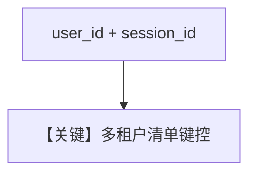

# session_state_multiple_users.py — 实现原理分析

<!-- cookbook-py-source:start -->
## 完整源码

```python
"""
Session State Multiple Users
=============================

This example demonstrates how to maintain state for each user in a multi-user environment.
"""

import json

from agno.agent import Agent
from agno.db.sqlite import SqliteDb
from agno.models.openai import OpenAIResponses
from agno.run import RunContext

# In-memory database to store user shopping lists
# Organized by user ID and session ID
shopping_list = {}


def add_item(run_context: RunContext, item: str) -> str:
    """Add an item to the current user's shopping list."""

    current_user_id = run_context.session_state["current_user_id"]
    current_session_id = run_context.session_state["current_session_id"]
    shopping_list.setdefault(current_user_id, {}).setdefault(
        current_session_id, []
    ).append(item)

    return f"Item {item} added to the shopping list"


def remove_item(run_context: RunContext, item: str) -> str:
    """Remove an item from the current user's shopping list."""

    current_user_id = run_context.session_state["current_user_id"]
    current_session_id = run_context.session_state["current_session_id"]

    if (
        current_user_id not in shopping_list
        or current_session_id not in shopping_list[current_user_id]
    ):
        return f"No shopping list found for user {current_user_id} and session {current_session_id}"

    if item not in shopping_list[current_user_id][current_session_id]:
        return f"Item '{item}' not found in the shopping list for user {current_user_id} and session {current_session_id}"

    shopping_list[current_user_id][current_session_id].remove(item)
    return f"Item {item} removed from the shopping list"


def get_shopping_list(run_context: RunContext) -> str:
    """Get the current user's shopping list."""

    if run_context.session_state is None:
        run_context.session_state = {}

    current_user_id = run_context.session_state["current_user_id"]
    current_session_id = run_context.session_state["current_session_id"]
    return f"Shopping list for user {current_user_id} and session {current_session_id}: \n{json.dumps(shopping_list[current_user_id][current_session_id], indent=2)}"


# Create an Agent that maintains state
# ---------------------------------------------------------------------------
# Create Agent
# ---------------------------------------------------------------------------
agent = Agent(
    model=OpenAIResponses(id="gpt-5-mini"),
    db=SqliteDb(db_file="tmp/data.db"),
    tools=[add_item, remove_item, get_shopping_list],
    # Reference the in-memory database
    instructions=[
        "Current User ID: {current_user_id}",
        "Current Session ID: {current_session_id}",
    ],
    markdown=True,
)

user_id_1 = "john_doe"
user_id_2 = "mark_smith"
user_id_3 = "carmen_sandiago"

# ---------------------------------------------------------------------------
# Run Agent
# ---------------------------------------------------------------------------
if __name__ == "__main__":
    # Example usage
    agent.print_response(
        "Add milk, eggs, and bread to the shopping list",
        stream=True,
        user_id=user_id_1,
        session_id="user_1_session_1",
    )
    agent.print_response(
        "Add tacos to the shopping list",
        stream=True,
        user_id=user_id_2,
        session_id="user_2_session_1",
    )
    agent.print_response(
        "Add apples and grapes to the shopping list",
        stream=True,
        user_id=user_id_3,
        session_id="user_3_session_1",
    )
    agent.print_response(
        "Remove milk from the shopping list",
        stream=True,
        user_id=user_id_1,
        session_id="user_1_session_1",
    )
    agent.print_response(
        "Add minced beef to the shopping list",
        stream=True,
        user_id=user_id_2,
        session_id="user_2_session_1",
    )

    # What is on Mark Smith's shopping list?
    agent.print_response(
        "What is on Mark Smith's shopping list?",
        stream=True,
        user_id=user_id_2,
        session_id="user_2_session_1",
    )

    # New session, so new shopping list
    agent.print_response(
        "Add chicken and soup to my list.",
        stream=True,
        user_id=user_id_2,
        session_id="user_3_session_2",
    )

    print(f"Final shopping lists: \n{json.dumps(shopping_list, indent=2)}")
```

<!-- cookbook-py-source:end -->

> 源文件：`cookbook/02_agents/05_state_and_session/session_state_multiple_users.py`

## 概述

**模块级 `shopping_list` 字典**按 **`user_id` → `session_id` → list** 存清单；工具从 **`run_context.session_state["current_user_id"]`** 等键读取当前用户/会话。**instructions** 展示 **`{current_user_id}` / `{current_session_id}`**。多 **`user_id`/`session_id`** 组合演示隔离与「新 session 新清单」。

**核心配置一览：**

| 配置项 | 值 |
|--------|-----|
| `tools` | `add_item`, `remove_item`, `get_shopping_list` |
| `instructions` | list，两行占位 |

## 架构分层

```
print_response(user_id, session_id) → session_state 注入当前用户键 → 工具操作全局 shopping_list 的正确槽位
```

## 核心组件解析

**全局 `shopping_list`** 非 DB；进程重启则丢数据，demo 级。

### 运行机制与因果链

**Mark** 换 **`session_id`** 后新列表（`session_state_multiple_users.py` L126-132）。

## System Prompt 组装

```text
Current User ID: <id>
Current Session ID: <id>
```

## 完整 API 请求

**OpenAIResponses**。

## Mermaid 流程图


```mermaid
flowchart TD
    A["user_id + session_id"] --> B["【关键】多租户清单键控"]
```

## 关键源码文件索引

| 文件 | 关键函数/类 | 作用 |
|------|------------|------|
| `session_state_multiple_users.py` | 模块级 `shopping_list` | 演示数据结构 |
