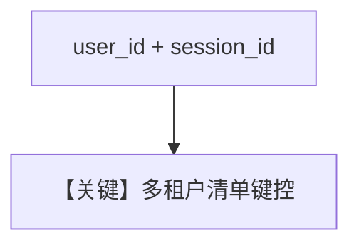

# session_state_multiple_users.py — 实现原理分析

> 源文件：`cookbook/02_agents/05_state_and_session/session_state_multiple_users.py`

## 概述

**模块级 `shopping_list` 字典**按 **`user_id` → `session_id` → list** 存清单；工具从 **`run_context.session_state["current_user_id"]`** 等键读取当前用户/会话。**instructions** 展示 **`{current_user_id}` / `{current_session_id}`**。多 **`user_id`/`session_id`** 组合演示隔离与「新 session 新清单」。

**核心配置一览：**

| 配置项 | 值 |
|--------|-----|
| `tools` | `add_item`, `remove_item`, `get_shopping_list` |
| `instructions` | list，两行占位 |

## 架构分层

```
print_response(user_id, session_id) → session_state 注入当前用户键 → 工具操作全局 shopping_list 的正确槽位
```

## 核心组件解析

**全局 `shopping_list`** 非 DB；进程重启则丢数据，demo 级。

### 运行机制与因果链

**Mark** 换 **`session_id`** 后新列表（`session_state_multiple_users.py` L126-132）。

## System Prompt 组装

```text
Current User ID: <id>
Current Session ID: <id>
```

## 完整 API 请求

**OpenAIResponses**。

## Mermaid 流程图


```mermaid
flowchart TD
    A["user_id + session_id"] --> B["【关键】多租户清单键控"]
```

## 关键源码文件索引

| 文件 | 关键函数/类 | 作用 |
|------|------------|------|
| `session_state_multiple_users.py` | 模块级 `shopping_list` | 演示数据结构 |
