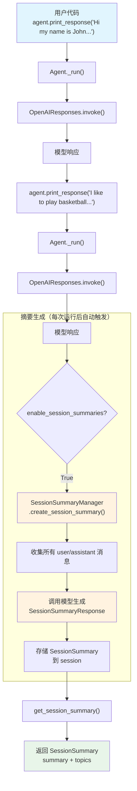

# session_summary.py — 实现原理分析

> 源文件：`cookbook/02_agents/05_state_and_session/session_summary.py`

## 概述

本示例展示 Agno 的 **`enable_session_summaries`（会话摘要）** 机制：启用后 Agent 在每次运行结束时自动调用 `SessionSummaryManager` 生成/更新对话摘要，提取关键信息和讨论主题。摘要可通过 `get_session_summary()` 获取，用于长对话的上下文压缩。

**核心配置一览：**

| 配置项 | 值 | 说明 |
|--------|------|------|
| `model` | `OpenAIResponses(id="gpt-5-mini")` | Responses API |
| `db` | `PostgresDb(db_url=..., session_table="sessions")` | PostgreSQL 持久化 |
| `enable_session_summaries` | `True` | 启用自动摘要 |
| `session_id` | `"session_123"` | 固定会话 ID |

## 架构分层

```
用户代码层                          agno.agent 层
┌─────────────────────────┐       ┌──────────────────────────────────────┐
│ session_summary.py      │       │ Agent._run()                         │
│                         │       │  ├ Model.response()                  │
│ enable_session_         │       │  │                                    │
│   summaries = True      │──────>│  ├ 运行结束后:                       │
│                         │       │  │  SessionSummaryManager             │
│ get_session_summary(    │       │  │    .create_session_summary()       │
│   session_id=           │       │  │    → 调用模型生成摘要              │
│   "session_123")        │       │  │    → 存入 session.summary          │
│                         │       │  │                                    │
│                         │       │  └ get_session_summary()             │
│                         │       │    → 返回 SessionSummary 对象       │
└─────────────────────────┘       └──────────────────────────────────────┘
                                          │
                                          ▼
                                  ┌──────────────────┐
                                  │ OpenAIResponses   │
                                  │ gpt-5-mini        │
                                  └──────────────────┘
```

## 核心组件解析

### enable_session_summaries 触发机制

当 `enable_session_summaries=True`（`agent.py:97`），`_run()` 在运行完成后触发摘要生成（`_run.py:589`）：

```python
# _run.py:589-594
if agent.session_summary_manager is not None and agent.enable_session_summaries:
    # 先保存当前运行结果
    agent_session.upsert_run(run=run_response)
    try:
        agent.session_summary_manager.create_session_summary(
            session=agent_session, run_metrics=run_response.metrics
        )
    ...
```

### SessionSummaryManager

`SessionSummaryManager`（`session/summary.py:62`）负责摘要的生成：

```python
@dataclass
class SessionSummaryManager:
    model: Optional[Model] = None           # 用于生成摘要的模型
    session_summary_prompt: Optional[str] = None  # 自定义摘要提示
    summary_request_message: str = "Provide the summary of the conversation."
```

当未显式提供 `SessionSummaryManager` 时（如本示例仅设 `enable_session_summaries=True`），agno 在初始化时自动创建一个，使用 Agent 自身的 model。

### 摘要生成流程

`SessionSummaryManager.create_session_summary()` 的核心逻辑：

1. 收集会话中所有 user/assistant 消息
2. 构建 system prompt（`session/summary.py:100-105`）：

```python
system_prompt = dedent("""\
    Analyze the following conversation between a user and an assistant, and extract:
    - Summary (str): Provide a concise summary of the session...
    - Topics (Optional[List[str]]): List the topics discussed...
""")
```

3. 将对话内容包裹在 `<conversation>` 标签中
4. 使用结构化输出（`SessionSummaryResponse`）获取标准格式响应
5. 将结果存储为 `SessionSummary` 对象

### SessionSummary 数据结构

```python
@dataclass
class SessionSummary:
    summary: str                      # 会话摘要文本
    topics: Optional[List[str]] = None  # 讨论主题列表
    updated_at: Optional[datetime] = None  # 更新时间
```

### 两种配置方式

示例展示了两种启用摘要的方式：

**方式 1（简单）：** 直接设置 `enable_session_summaries=True`
```python
agent = Agent(
    model=OpenAIResponses(id="gpt-5-mini"),
    db=db,
    enable_session_summaries=True,
    session_id="session_123",
)
```

**方式 2（自定义，注释中展示）：** 手动创建 `SessionSummaryManager`
```python
session_summary_manager = SessionSummaryManager(model=OpenAIResponses(id="gpt-5-mini"))
agent = Agent(
    model=...,
    db=db,
    session_summary_manager=session_summary_manager,
)
```

方式 2 允许使用不同的模型或自定义摘要提示。

## System Prompt 组装

| 序号 | 组成部分 | 本文件中的值/来源 | 是否生效 |
|------|---------|-----------------|---------|
| 1 | `system_message` | `None` | 否 |
| 3.1 | `instructions` | `None` | 否 |
| 3.3.11 | `add_session_summary_to_context` | `None`（默认） | 否 |

### 最终 System Prompt

无显式指令，system prompt 为空或仅含模型默认指令。

> 注意：`enable_session_summaries` 仅控制摘要的**生成和存储**，要将摘要注入到 system prompt 中需要额外设置 `add_session_summary_to_context=True`（见 `_messages.py:384-392`）。

## 完整 API 请求

**Agent 的正常请求：**

```python
client.responses.create(
    model="gpt-5-mini",
    input=[
        {"role": "user", "content": "Hi my name is John and I live in New York"}
    ],
    stream=True,
    stream_options={"include_usage": True}
)
```

**摘要生成请求（Agent 运行结束后自动触发）：**

```python
client.responses.create(
    model="gpt-5-mini",
    input=[
        # System Message（摘要指令）
        {
            "role": "developer",
            "content": "Analyze the following conversation between a user and an assistant...\n<conversation>\nUser: Hi my name is John and I live in New York\nAssistant: ...\nUser: I like to play basketball and hike in the mountains\nAssistant: ...\n</conversation>"
        },
        # 请求摘要
        {
            "role": "user",
            "content": "Provide the summary of the conversation."
        }
    ],
    response_format=SessionSummaryResponse,  # 结构化输出
    stream=True
)
```

## Mermaid 流程图



## 关键源码文件索引

| 文件 | 关键函数/类 | 作用 |
|------|------------|------|
| `agno/agent/agent.py` | `enable_session_summaries` L97 | 启用自动摘要 |
| `agno/agent/agent.py` | `session_summary_manager` L101 | 自定义摘要管理器 |
| `agno/agent/agent.py` | `add_session_summary_to_context` L99 | 摘要注入 system prompt |
| `agno/agent/agent.py` | `get_session_summary()` L1013 | 获取会话摘要 |
| `agno/session/summary.py` | `SessionSummary` L22 | 摘要数据结构 |
| `agno/session/summary.py` | `SessionSummaryResponse` L45 | 结构化输出模型 |
| `agno/session/summary.py` | `SessionSummaryManager` L62 | 摘要管理器 |
| `agno/agent/_run.py` | L589-594 | 运行后触发摘要生成 |
| `agno/agent/_messages.py` | L384-392 | 摘要注入 system prompt |
| `agno/db/postgres` | `PostgresDb` | PostgreSQL 持久化后端 |
