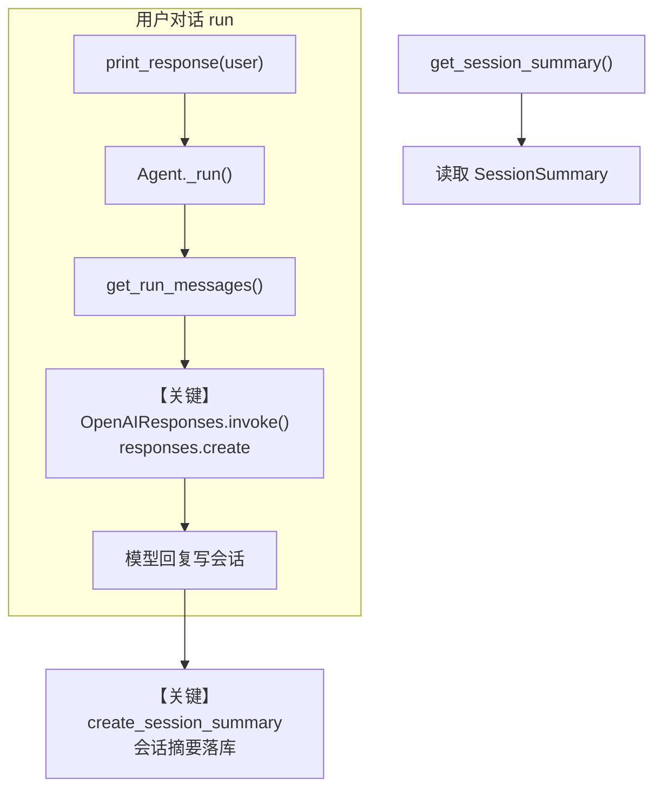

# session_summary.py — 实现原理分析

> 源文件：`cookbook/02_agents/05_state_and_session/session_summary.py`

## 概述

本示例展示 Agno 的 **会话摘要（Session Summary）** 机制：在带持久化会话的 Agent 上开启 `enable_session_summaries`，由框架在运行后异步生成会话摘要并写入数据库，便于 `get_session_summary` 读取；可选地通过 `SessionSummaryManager` 自定义摘要模型与策略。

**核心配置一览：**

| 配置项 | 值 | 说明 |
|--------|------|------|
| `model` | `OpenAIResponses(id="gpt-5-mini")` | OpenAI Responses API |
| `db` | `PostgresDb(db_url=..., session_table="sessions")` | 会话与会话摘要持久化 |
| `enable_session_summaries` | `True` | 启用摘要生成管线 |
| `session_id` | `"session_123"` | 固定会话标识 |
| `session_summary_manager` | `None` | 未设置（由 `_init.set_session_summary_manager` 按需创建默认管理器） |
| `markdown` | `False` | 未显式设置（默认） |
| `instructions` | `None` | 未设置 |
| `name` | `None` | 未设置 |

## 架构分层

```
用户代码层                agno.agent 层
┌──────────────────┐    ┌──────────────────────────────────┐
│ session_summary  │    │ Agent.print_response / _run()   │
│ enable_session_  │───>│ run 结束后若启用摘要：           │
│ summaries + db   │    │ session_summary_manager.        │
│                  │    │   create_session_summary(...)   │
│ get_session_     │    │ PostgresDb 持久化 session       │
│ summary()        │    └──────────────────────────────────┘
└──────────────────┘              │
                                    ▼
                            ┌──────────────┐
                            │ OpenAIResponses│
                            │ gpt-5-mini   │
                            └──────────────┘
```

## 核心组件解析

### `enable_session_summaries` 与 `SessionSummaryManager`

在 `agno/agent/_init.py` 的 `set_session_summary_manager()`（约 L159–169）中：若仅开启 `enable_session_summaries` 而未传入管理器，会构造默认 `SessionSummaryManager(model=agent.model)`。在 `agent.py` 构造中若传入 `session_summary_manager`，会强制将 `enable_session_summaries` 置为 `True`（约 L529–531）。

### 摘要写入时机

在 `agno/agent/_run.py` 中，单次 run 完成后在满足 `agent.session_summary_manager is not None and agent.enable_session_summaries` 时调用 `create_session_summary` / `acreate_session_summary`（多处分支，如同步路径约 L599+），将会话内容与指标交给管理器生成摘要并写入 `db`。

### `get_session_summary`

`Agent.get_session_summary(session_id=...)` 从数据库加载指定会话的摘要对象，供脚本末尾打印。

### 运行机制与因果链

1. **数据路径**：用户消息 → `print_response` → `_run` → `get_run_messages` + 模型 `invoke` → 响应落库；run 结束 → **摘要子流程**读会话 → 调用摘要模型 → 写回 session 记录。
2. **状态与副作用**：写入 **Postgres** 的会话表；重复 `print_response` 同一 `session_id` 会累积对话并可能多次触发摘要更新（依管理器实现）。本示例未改 `add_session_summary_to_context`（默认未把摘要注入下一轮 system，除非单独配置）。
3. **关键分支**：`enable_session_summaries=False` 则不跑摘要；仅注释中的「Method 2」展示手动传入 `session_summary_manager` 的替代配置。
4. **与相邻示例差异**：相对纯 state 示例，本文件聚焦 **跨轮会话的摘要存储与读取 API**，而非 session_state 键值。

## System Prompt 组装

| 序号 | 组成部分 | 本文件中的值/来源 | 是否生效 |
|------|---------|-----------------|---------|
| 1 | `description` | 未设置 | 否 |
| 2 | `role` | 未设置 | 否 |
| 3 | `instructions` | 未设置 | 否 |
| 4 | `markdown` | 默认 `False` | 否（无 markdown 附加段） |
| 5 | `add_session_summary_to_context` | 默认未启用 | 否（摘要不自动进入 system，除非为 True 且库中已有 summary） |
| 6 | 模型附加 | `OpenAIResponses.get_system_message_for_model` 等 | 视模型而定 |

### 拼装顺序与源码锚点

默认路径见 `get_system_message()`（`agno/agent/_messages.py`）：无自定义 `system_message` 且 `build_context=True` 时走 `# 3.1`–`# 3.3.x`。本示例无 `instructions`、无 `markdown` 附加，system 以框架默认段 + 模型段为主（`# 3.3.14`）。

### 还原后的完整 System 文本

本示例未设置 `instructions`、`description`、`role`、`markdown=True`，且 `Model` 默认 `system_prompt` / `instructions` 多为空。按 `get_system_message()`（`agno/agent/_messages.py`）在 `# 3.3` 各段累加后，若最终 `system_message_content.strip()` 为空字符串，则 **返回 `None`**（见该函数末尾对空内容的判断），即 **本轮无独立 system `Message`**。

**如何验证**：在 `get_system_message()` 返回前对 `system_message_content` 做临时 `print`，或对 `Agent.run` 打断点查看 `RunMessages` 中的消息列表是否仅含 user/developer 侧内容。

### 段落释义（模型视角）

- 无显式 system 时，模型行为几乎完全由 **用户多轮输入** 与 **Responses API 默认** 决定；本示例的重点不在 prompt 工程，而在 **会话持久化与摘要**。

### 与 User / Developer 消息的边界

`OpenAIResponses` 将 `system` 映射为 **`developer`** 角色（见 `responses.py` 中 `role_map`）。用户轮次为用户消息；摘要生成是 **run 后** 的独立调用链，不混入当次 user 消息。

## 完整 API 请求

```python
# OpenAIResponses → client.responses.create（非 chat.completions）
# 见 libs/agno/agno/models/openai/responses.py invoke L671–695

client.responses.create(
    model="gpt-5-mini",
    input=[...],  # 由 _format_messages 将 system→developer、user、assistant/tool 等展开
    # 另有 get_request_params 合并的 tools、reasoning、temperature 等
)
```

> 与第 5 节一致：主对话的「系统侧约束」在 Responses API 中通常以 **instructions** 或格式化后的 **input** 表达，具体以 `get_request_params` / `_format_messages` 为准。

## Mermaid 流程图


```mermaid
flowchart TD
    subgraph UserRun["用户对话 run"]
        A["print_response(user)"] --> B["Agent._run()"]
        B --> C["get_run_messages()"]
        C --> D["【关键】OpenAIResponses.invoke()<br/>responses.create"]
        D --> E["模型回复写会话"]
    end
    E --> F["【关键】create_session_summary<br/>会话摘要落库"]
    G["get_session_summary()"] --> H["读取 SessionSummary"]
```

- **【关键】`responses.create`**：主模型调用形态为本示例的 Chat/Completion 替代路径。
- **【关键】`create_session_summary`**：演示目标为会话结束后的摘要持久化。

## 关键源码文件索引

| 文件 | 关键函数/类 | 作用 |
|------|------------|------|
| `agno/agent/agent.py` | `enable_session_summaries` L99 附近；`get_session_summary` | Agent 配置与查询摘要 |
| `agno/agent/_init.py` | `set_session_summary_manager()` L159+ | 默认摘要管理器注入 |
| `agno/agent/_run.py` | `create_session_summary` 调用块 L599+ 等 | run 结束后触发摘要 |
| `agno/models/openai/responses.py` | `invoke()` L671+ | Responses API 调用 |
| `agno/agent/_messages.py` | `get_system_message()` L106+ | 默认 system 拼装；`# 3.3.11` 为摘要进上下文条件 |
