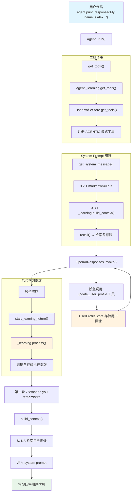

# learning_machine.py — 实现原理分析

> 源文件：`cookbook/02_agents/06_memory_and_learning/learning_machine.py`

## 概述

本示例展示 Agno 的 **`LearningMachine`（统一学习系统）** 机制：通过 `learning=LearningMachine(user_profile=UserProfileConfig(mode=LearningMode.AGENTIC))` 配置，Agent 获得统一的学习能力。LearningMachine 协调多个学习存储（user_profile、user_memory、session_context、entity_memory、learned_knowledge），并根据 `LearningMode` 决定学习方式——AGENTIC 模式下通过工具让模型主动决定何时提取和存储用户信息。

**核心配置一览：**

| 配置项 | 值 | 说明 |
|--------|------|------|
| `name` | `"Learning Agent"` | Agent 名称 |
| `model` | `OpenAIResponses(id="gpt-5.2")` | Responses API |
| `db` | `SqliteDb(db_file="tmp/agents.db")` | SQLite 持久化 |
| `learning` | `LearningMachine(user_profile=UserProfileConfig(mode=LearningMode.AGENTIC))` | 统一学习系统 |
| `markdown` | `True` | 启用 Markdown 格式化 |

## 架构分层

```
用户代码层                          agno.agent 层
┌─────────────────────────┐       ┌──────────────────────────────────────┐
│ learning_machine.py     │       │ Agent._run()                         │
│                         │       │  ├ _tools.py                         │
│ learning=               │       │  │  get_tools()                       │
│   LearningMachine(      │──────>│  │    → agent._learning.get_tools()  │
│     user_profile=       │       │  │    → 注册 AGENTIC 模式工具        │
│       UserProfileConfig(│       │  │                                    │
│         mode=AGENTIC))  │       │  ├ _messages.py                      │
│                         │       │  │  get_system_message()              │
│ user_id=                │       │  │    → _learning.build_context()    │
│   "learning-demo-user"  │       │  │    → 注入 learnings 上下文       │
│                         │       │  │                                    │
│ session_id=             │       │  └ _managers.py                      │
│   "learning_session_1"  │       │    start_learning_future()           │
│                         │       │    → _learning.process() 后台提取   │
└─────────────────────────┘       └──────────────────────────────────────┘
                                          │
                                          ▼
                                  ┌──────────────────┐
                                  │ OpenAIResponses   │
                                  │ gpt-5.2           │
                                  └──────────────────┘
```

## 核心组件解析

### LearningMachine 架构

`LearningMachine`（`learn/machine.py:53`）是统一学习系统的中心协调器，管理多个学习存储：

```python
@dataclass
class LearningMachine:
    db: Optional[Union["BaseDb", "AsyncBaseDb"]] = None
    model: Optional["Model"] = None

    # 存储配置（接受 bool、Config 或 Store 实例）
    user_profile: UserProfileInput = False    # 用户画像
    user_memory: UserMemoryInput = False      # 用户记忆
    session_context: SessionContextInput = False  # 会话上下文
    entity_memory: EntityMemoryInput = False  # 实体记忆
    learned_knowledge: LearnedKnowledgeInput = False  # 学到的知识
    decision_log: DecisionLogInput = False    # 决策日志

    namespace: str = "global"
    custom_stores: Optional[Dict[str, LearningStore]] = None
```

本示例仅启用 `user_profile`，其他存储保持关闭。

### LearningMode 枚举

`LearningMode`（`learn/config.py`）定义学习提取方式：

| 模式 | 说明 |
|------|------|
| `ALWAYS` | 每次运行后自动提取（后台线程） |
| `AGENTIC` | 通过工具让模型主动决定何时提取 |
| `PROPOSE` | 提取后提交用户审批 |
| `HITL` | 人类在环路中参与 |

本示例使用 `LearningMode.AGENTIC`，模型通过工具主动存储用户信息。

### UserProfileConfig

`UserProfileConfig`（`learn/config.py`）定义用户画像存储的配置：

```python
# 本示例的配置
UserProfileConfig(mode=LearningMode.AGENTIC)
```

当 `mode=AGENTIC` 时，LearningMachine 为该存储注册工具函数，模型可以在对话中主动调用工具来更新用户画像。

### 存储初始化（懒加载）

`LearningMachine._initialize_stores()`（`learn/machine.py:111`）在首次访问 `stores` 属性时触发：

```python
# learn/machine.py:116-120
if self.user_profile:
    self._stores["user_profile"] = self._resolve_store(
        input_value=self.user_profile,
        store_type="user_profile",
    )
```

`_resolve_store()` 根据输入类型（bool/Config/Store）创建具体的 `UserProfileStore` 实例。当传入 `UserProfileConfig` 时，自动继承 LearningMachine 的 `db` 和 `model`（`learn/machine.py:202-214`）：

```python
def _create_user_profile_store(self, config: Any) -> LearningStore:
    if isinstance(config, UserProfileConfig):
        if config.db is None:
            config.db = self.db  # 继承 LearningMachine 的 db
        if config.model is None:
            config.model = self.model  # 继承 LearningMachine 的 model
    return UserProfileStore(config=config, debug_mode=self.debug_mode)
```

### 工具注册

在 `get_tools()`（`_tools.py:154-160`）中，LearningMachine 的工具被注册到 Agent：

```python
# _tools.py:154-160
if agent._learning is not None:
    learning_tools = agent._learning.get_tools(
        user_id=user_id,
        session_id=session.session_id if session else None,
        agent_id=agent.id,
    )
    agent_tools.extend(learning_tools)
```

`LearningMachine.get_tools()`（`learn/machine.py:420-465`）遍历所有存储，收集 AGENTIC 模式的工具：

```python
def get_tools(self, user_id=None, session_id=None, ...) -> List[Callable]:
    tools = []
    context = {"user_id": user_id, "session_id": session_id, ...}
    for name, store in self.stores.items():
        store_tools = store.get_tools(**context)
        if store_tools:
            tools.extend(store_tools)
    return tools
```

### 上下文注入（build_context）

在 `get_system_message()` 的步骤 3.3.12（`_messages.py:395-402`），LearningMachine 的上下文被注入到 system prompt：

```python
# _messages.py:395-402
if agent._learning is not None and agent.add_learnings_to_context:
    learning_context = agent._learning.build_context(
        user_id=user_id,
        session_id=session.session_id if session else None,
        agent_id=agent.id,
    )
    if learning_context:
        system_message_content += learning_context + "\n"
```

`build_context()`（`learn/machine.py:350-391`）调用 `recall()` 从各存储检索数据，再通过 `_format_results()` 格式化为上下文字符串。

### 后台学习提取

每次运行结束后，`_managers.start_learning_future()`（`_managers.py:487-521`）在后台线程中启动学习提取：

```python
# _managers.py:487-521
def start_learning_future(agent, run_messages, session, user_id, existing_future=None):
    if agent._learning is not None:
        return agent.background_executor.submit(
            process_learnings, agent, run_messages=run_messages,
            session=session, user_id=user_id,
        )
```

`process_learnings()`（`_managers.py:398-413`）调用 `LearningMachine.process()`，遍历所有存储执行学习提取：

```python
# _managers.py:402-408
agent._learning.process(
    messages=messages,
    user_id=user_id,
    session_id=session.session_id if session else None,
    agent_id=agent.id,
)
```

### 跨会话记忆

示例使用两个不同的 `session_id`（`learning_session_1` 和 `learning_session_2`），但相同的 `user_id`（`learning-demo-user`）：

- **第一轮**（session_1）：用户说「My name is Alex, and I prefer concise responses.」→ AGENTIC 模式下模型通过工具存储用户画像
- **第二轮**（session_2）：用户问「What do you remember about me?」→ `build_context()` 从 DB 检索用户画像，注入到 system prompt

## System Prompt 组装

| 序号 | 组成部分 | 本文件中的值/来源 | 是否生效 |
|------|---------|-----------------|---------|
| 1 | `system_message` | `None` | 否 |
| 3.1 | `instructions` | `None` | 否 |
| 3.2.1 | `markdown` | `True` | 是 |
| 3.2.2 | `add_datetime_to_context` | `False`（默认） | 否 |
| 3.2.3 | `add_location_to_context` | `False`（默认） | 否 |
| 3.2.4 | `add_name_to_context` | `False`（默认） | 否 |
| 3.3.1 | `description` | `None` | 否 |
| 3.3.2 | `role` | `None` | 否 |
| 3.3.3 | instructions 拼接 | `None` | 否 |
| 3.3.5 | `_tool_instructions` | 工具使用说明 | 是 |
| 3.3.12 | learnings 上下文 | `_learning.build_context()` | 是（第二轮有数据时） |

### 最终 System Prompt

**第一轮（无历史学习数据）：**
```text
Use markdown to format your answers.

<tool_instructions>
...（工具使用说明，含 AGENTIC 模式工具）
</tool_instructions>
```

**第二轮（有用户画像数据）：**
```text
Use markdown to format your answers.

<user_profile>
Name: Alex
Preferences: concise responses
</user_profile>

<tool_instructions>
...
</tool_instructions>
```

## 完整 API 请求

**第一轮（用户自我介绍）：**

```python
client.responses.create(
    model="gpt-5.2",
    input=[
        # 1. System Message（markdown 指令 + 工具说明）
        {"role": "developer", "content": "Use markdown to format your answers.\n\n..."},
        # 2. 用户输入
        {"role": "user", "content": "My name is Alex, and I prefer concise responses."}
    ],
    tools=[
        # AGENTIC 模式的 user_profile 工具
        {
            "type": "function",
            "function": {
                "name": "update_user_profile",
                "description": "Update the user's profile with new information...",
                "parameters": {
                    "type": "object",
                    "properties": {
                        "updates": {"type": "string", "description": "..."}
                    },
                    "required": ["updates"]
                }
            }
        }
    ],
    stream=True,
    stream_options={"include_usage": True}
)
```

**第二轮（跨会话查询）：**

```python
client.responses.create(
    model="gpt-5.2",
    input=[
        # 1. System Message（含已学习的用户画像上下文）
        {"role": "developer", "content": "Use markdown to format your answers.\n\n<user_profile>\nName: Alex\nPreferences: concise responses\n</user_profile>\n\n..."},
        # 2. 用户输入
        {"role": "user", "content": "What do you remember about me?"}
    ],
    tools=[...],
    stream=True,
    stream_options={"include_usage": True}
)
```

> 第二轮使用不同的 `session_id`（`learning_session_2`），但由于 `user_id` 相同，`build_context()` 能检索到第一轮存储的用户画像。

## Mermaid 流程图



## 关键源码文件索引

| 文件 | 关键函数/类 | 作用 |
|------|------------|------|
| `agno/agent/agent.py` | `learning` L253 | LearningMachine 配置入口 |
| `agno/agent/agent.py` | `add_learnings_to_context` L255 | 学习上下文注入开关 |
| `agno/learn/machine.py` | `LearningMachine` L53 | 统一学习系统协调器 |
| `agno/learn/machine.py` | `build_context()` L350 | 构建学习上下文字符串 |
| `agno/learn/machine.py` | `get_tools()` L420 | 获取 AGENTIC 模式工具 |
| `agno/learn/machine.py` | `process()` L498 | 运行后学习提取 |
| `agno/learn/machine.py` | `recall()` L572 | 从各存储检索数据 |
| `agno/learn/config.py` | `LearningMode` | 学习模式枚举（ALWAYS/AGENTIC/PROPOSE/HITL） |
| `agno/learn/config.py` | `UserProfileConfig` | 用户画像配置 |
| `agno/agent/_tools.py` | `get_tools()` L154-160 | 注册 LearningMachine 工具 |
| `agno/agent/_messages.py` | L395-402 | 步骤 3.3.12 注入 learnings 上下文 |
| `agno/agent/_managers.py` | `start_learning_future()` L487 | 后台线程启动学习提取 |
| `agno/agent/_managers.py` | `process_learnings()` L398 | 学习提取执行函数 |
