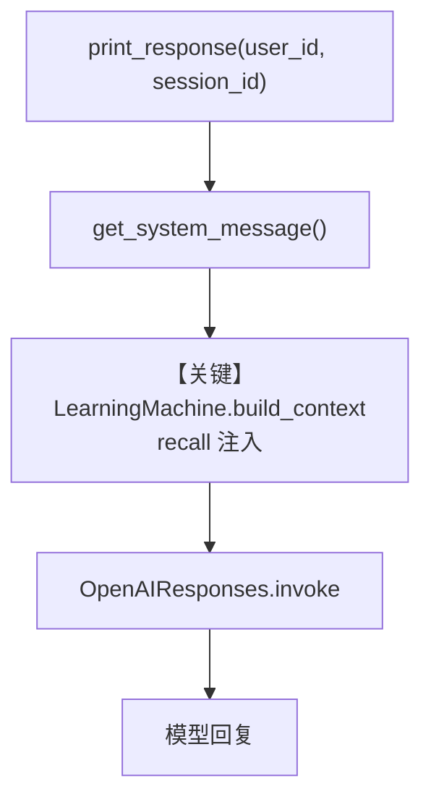

# learning_machine.py — 实现原理分析

<!-- cookbook-py-source:start -->
## 完整源码

```python
"""
Learning Machine
=============================

Learning Machine.
"""

from agno.agent import Agent
from agno.db.sqlite import SqliteDb
from agno.learn import LearningMachine, LearningMode, UserProfileConfig
from agno.models.openai import OpenAIResponses

# ---------------------------------------------------------------------------
# Setup
# ---------------------------------------------------------------------------
agent_db = SqliteDb(db_file="tmp/agents.db")

# ---------------------------------------------------------------------------
# Create Agent
# ---------------------------------------------------------------------------
agent = Agent(
    name="Learning Agent",
    model=OpenAIResponses(id="gpt-5.2"),
    db=agent_db,
    learning=LearningMachine(
        user_profile=UserProfileConfig(mode=LearningMode.AGENTIC),
    ),
    markdown=True,
)

# ---------------------------------------------------------------------------
# Run Agent
# ---------------------------------------------------------------------------
if __name__ == "__main__":
    user_id = "learning-demo-user"

    agent.print_response(
        "My name is Alex, and I prefer concise responses.",
        user_id=user_id,
        session_id="learning_session_1",
        stream=True,
    )

    agent.print_response(
        "What do you remember about me?",
        user_id=user_id,
        session_id="learning_session_2",
        stream=True,
    )
```

<!-- cookbook-py-source:end -->

> 源文件：`cookbook/02_agents/06_memory_and_learning/learning_machine.py`

## 概述

本示例展示 Agno 的 **LearningMachine（统一学习管线）** 机制：在 Agent 上配置 `learning=LearningMachine(...)`，结合 `UserProfileConfig` 与 `LearningMode.AGENTIC`，在多次 `print_response` 间通过数据库存储与召回，把用户画像与可学习信息注入 system 上下文（`# 3.3.12`）。

**核心配置一览：**

| 配置项 | 值 | 说明 |
|--------|------|------|
| `name` | `"Learning Agent"` | 供上下文展示（若 `add_name_to_context`） |
| `model` | `OpenAIResponses(id="gpt-5.2")` | OpenAI Responses API |
| `db` | `SqliteDb(db_file="tmp/agents.db")` | 学习数据与会话存储 |
| `learning` | `LearningMachine(user_profile=UserProfileConfig(mode=LearningMode.AGENTIC))` | 统一学习引擎 |
| `markdown` | `True` | 启用 markdown 附加说明段 |
| `instructions` | `None` | 未设置 |
| `session_id` / `user_id` | 在 `print_response` 调用时传入 | 第二段演示跨 session |

## 架构分层

```
用户代码层                agno.agent 层
┌──────────────────┐    ┌──────────────────────────────────┐
│ LearningMachine  │    │ get_system_message()             │
│ user_id/session  │───>│ # 3.3.12 _learning.build_context │
│                  │    │ recall → 注入学习/画像文本        │
└──────────────────┘    └──────────────────────────────────┘
                                │
                                ▼
                        ┌──────────────┐
                        │ OpenAIResponses│
                        └──────────────┘
```

## 核心组件解析

### `LearningMachine`

定义见 `agno/learn/machine.py`（类约 L53+）。`build_context()`（约 L367+）内部调用 `recall(...)`，按 `user_id`、`session_id` 等从各 store 拉取内容并格式化为可注入 system 的字符串。

### `_learning` 注入时机

`get_system_message()`（`agno/agent/_messages.py`）在 `# 3.3.12` 判断 `agent._learning is not None and agent.add_learnings_to_context`，再拼接 `learning_context`。

### 运行机制与因果链

1. **路径**：用户消息 → `print_response(..., user_id=..., session_id=...)` → `_run` → `get_system_message` 中 **LearningMachine.build_context** → 模型 `invoke`。
2. **副作用**：写入 **SQLite** `tmp/agents.db`（学习相关表项随框架与模式而定）；第二次 run 换 `session_id` 仍可共享 `user_id` 下的画像记忆（依 recall 策略）。
3. **分支**：`add_learnings_to_context=False` 则跳过 `# 3.3.12`；`learning=None` 则无 Learning 段。
4. **定位**：相对 `memory_manager.py`，本示例强调 **learn 包的一体化 LearningMachine + AGENTIC 用户画像**，而非仅 `MemoryManager` 工具型记忆。

## System Prompt 组装

| 序号 | 组成部分 | 本文件 | 是否生效 |
|------|---------|--------|---------|
| 1 | `description` / `role` | 未设置 | 否 |
| 2 | `instructions` | 未设置 | 否 |
| 3 | `markdown` | `True` | 是（`# 3.2.1` 附加「Use markdown...」） |
| 4 | `name` | `"Learning Agent"` | 默认 `add_name_to_context` 为 False 时通常不追加名称行；若未改默认则名称段可能不出现 |
| 5 | `# 3.3.12` Learning | `LearningMachine.build_context` 输出 | 是（内容依赖 DB 与 recall，**非固定字面量**） |

说明：`add_name_to_context` 默认见 `agent.py`；若示例未打开，则「Your name is」段可能不出现。

### 拼装顺序与源码锚点

默认顺序：`# 3.1` instructions（空）→ `# 3.2` 附加信息（含 markdown）→ `# 3.3.x` 主体 → … → `# 3.3.12` learnings → `# 3.3.14` model 段。

### 还原后的完整 System 文本

```text
<additional_information>
- Use markdown to format your answers.
</additional_information>

```

紧随其后的 **Learning 块**由运行时 `recall` 结果决定，无法在仅读 `.py` 时逐字还原。选取的参照用户句为示例中第一次调用：`My name is Alex, and I prefer concise responses.`

**如何验证**：在 `LearningMachine.build_context` 返回处打印，或在 `get_system_message` 合并前打印 `learning_context`。

### 段落释义（模型视角）

- Markdown 段约束输出为 Markdown。
- Learning 段提供 **跨轮用户偏好与可召回知识**，使第二轮「What do you remember about me?」能利用已存储信息。

### 与 User 消息边界

用户字面量仅出现在 user 消息；学习段属于 **system/developer 侧** 长期上下文。

## 完整 API 请求

```python
# 同 OpenAIResponses：client.responses.create(model="gpt-5.2", input=..., **request_params)
# stream=True 时走流式分支（invoke_stream / 异步对等）
```

## Mermaid 流程图


```mermaid
flowchart TD
    A["print_response(user_id, session_id)"] --> B["get_system_message()"]
    B --> C["【关键】LearningMachine.build_context<br/>recall 注入"]
    C --> D["OpenAIResponses.invoke"]
    D --> E["模型回复"]
```

- **【关键】build_context**：本示例核心是学习数据进入 system 的路径。

## 关键源码文件索引

| 文件 | 关键符号 | 作用 |
|------|---------|------|
| `agno/learn/machine.py` | `LearningMachine`；`build_context()` L367+ | 召回并格式化学习上下文 |
| `agno/agent/_messages.py` | `# 3.3.12` | 将 learning 拼入 system |
| `agno/agent/agent.py` | `learning`；`add_learnings_to_context` | Agent 配置 |
| `agno/models/openai/responses.py` | `invoke` | Responses API |
