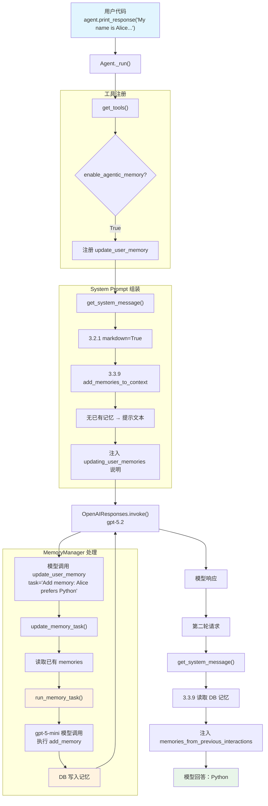

# memory_manager.py — 实现原理分析

> 源文件：`cookbook/02_agents/06_memory_and_learning/memory_manager.py`

## 概述

本示例展示 Agno 的 **`enable_agentic_memory`（代理式记忆）** 机制：通过 `enable_agentic_memory=True` 配合 `MemoryManager`，Agent 获得一个 `update_user_memory` 内置工具，模型可以在对话中主动决定何时存储、更新或删除用户记忆。MemoryManager 内部使用独立的模型调用来管理记忆的 CRUD 操作。

**核心配置一览：**

| 配置项 | 值 | 说明 |
|--------|------|------|
| `model` | `OpenAIResponses(id="gpt-5.2")` | Responses API |
| `db` | `SqliteDb(db_file="tmp/memory_demo.db")` | SQLite 持久化 |
| `enable_agentic_memory` | `True` | 启用代理式记忆工具 |
| `memory_manager` | `MemoryManager(db=db, model=OpenAIResponses(id="gpt-5-mini"))` | 记忆管理器（用更小的模型） |
| `markdown` | `True` | 启用 Markdown 格式化 |

## 架构分层

```
用户代码层                          agno.agent 层
┌─────────────────────────┐       ┌──────────────────────────────────────┐
│ memory_manager.py       │       │ Agent._run()                         │
│                         │       │  ├ _tools.py                         │
│ enable_agentic_memory   │       │  │  get_tools()                       │
│   = True                │──────>│  │    → 注册 update_user_memory 工具 │
│                         │       │  │                                    │
│ memory_manager=         │       │  ├ _messages.py                      │
│   MemoryManager(        │       │  │  get_system_message()              │
│     db=db,              │       │  │    → 3.3.9 注��已有 memories       │
│     model=gpt-5-mini)   │       │  │    → 注入 update 工具使用说明     │
│                         │       │  │                                    │
│                         │       │  └ 模型调用 update_user_memory()     │
│                         │       │    → MemoryManager.update_memory_task│
│                         │       │    → MemoryManager 内部模型调用      │
│                         │       │    → DB CRUD 操作                    │
└─────────────────────────┘       └──────────────────────────────────────┘
                                          │
                                          ▼
                                  ┌──────────────────┐    ┌──────────────────┐
                                  │ OpenAIResponses   │    │ OpenAIResponses   │
                                  │ gpt-5.2（主模型） │    │ gpt-5-mini（记忆）│
                                  └──────────────────┘    └──────────────────┘
```

## 核心组件解析

### enable_agentic_memory 工具注册

当 `enable_agentic_memory=True`（`agent.py:113`），`get_tools()`（`_tools.py:150-151`）自动注册 `update_user_memory` 工具：

```python
# _tools.py:150-151
if agent.enable_agentic_memory:
    agent_tools.append(_default_tools.get_update_user_memory_function(
        agent, user_id=user_id, async_mode=False
    ))
```

### update_user_memory 工具实现

工具函数在 `_default_tools.py:38-75` 中定义：

```python
def get_update_user_memory_function(agent, user_id=None, async_mode=False):
    def update_user_memory(task: str) -> str:
        """Use this function to submit a task to modify the Agent's memory.
        Describe the task in detail and be specific.
        The task can include adding, updating, deleting, or clearing memories.
        """
        agent.memory_manager = cast(MemoryManager, agent.memory_manager)
        response = agent.memory_manager.update_memory_task(
            task=task, user_id=user_id
        )
        return response
    return Function.from_callable(update_user_memory, name="update_user_memory")
```

### MemoryManager 架构

`MemoryManager`（`memory/manager.py:44`）是记忆管理的核心类：

```python
@dataclass
class MemoryManager:
    model: Optional[Model] = None          # 用于记忆管理的模型
    system_message: Optional[str] = None   # 自定义系统提示
    memory_capture_instructions: Optional[str] = None  # 记忆捕获指令
    additional_instructions: Optional[str] = None  # 额外指令
    db: Optional[Union[BaseDb, AsyncBaseDb]] = None  # 记忆存储数据库

    # CRUD 开关
    delete_memories: bool = True   # 允许删除
    clear_memories: bool = True    # 允许清空
    update_memories: bool = True   # 允许更新
    add_memories: bool = True      # 允许新增
```

本示例显式传入 `MemoryManager(db=db, model=OpenAIResponses(id="gpt-5-mini"))`，使用比主模型更小的模型处理记忆操作，降低成本。

### update_memory_task 流程

`MemoryManager.update_memory_task()`（`memory/manager.py:481-517`）是工具函数的实际入口：

```python
def update_memory_task(self, task: str, user_id: Optional[str] = None) -> str:
    # 1. 从 DB 读取已有记忆
    memories = self.read_from_db(user_id=user_id)
    existing_memories = [{"memory_id": m.memory_id, "memory": m.memory} for m in memories.get(user_id, [])]

    # 2. 调用内部模型执行记忆任务
    response = self.run_memory_task(
        task=task,
        existing_memories=existing_memories,
        user_id=user_id,
        db=self.db,
        delete_memories=self.delete_memories,
        update_memories=self.update_memories,
        add_memories=self.add_memories,
        clear_memories=self.clear_memories,
    )

    # 3. 刷新 DB 缓存
    self.read_from_db(user_id=user_id)
    return response
```

`run_memory_task()` 内部构建一个独立的模型调用，包含：
- system prompt：记忆管理器的角色定义 + 已有记忆列表 + 可用工具说明
- user message：模型传来的 `task` 描述
- tools：add_memory、update_memory、delete_memory、clear_all_memories

### MemoryManager 的 system prompt

`MemoryManager.get_system_message()`（`memory/manager.py:958-986`）生成记忆管理器的系统提示：

```python
system_prompt_lines = [
    "You are a Memory Manager that is responsible for managing information "
    "and preferences about the user.",
    "",
    "## When to add or update memories",
    "- Your first task is to decide if a memory needs to be added, updated, "
    "or deleted based on the user's message...",
]
```

### 记忆注入 system prompt（步骤 3.3.9）

在 Agent 的 `get_system_message()` 步骤 3.3.9（`_messages.py:282-320`），已有记忆被注入到 system prompt：

```python
# _messages.py:282-298
if agent.add_memories_to_context:
    user_memories = agent.memory_manager.get_user_memories(user_id=user_id)
    if user_memories and len(user_memories) > 0:
        system_message_content += (
            "You have access to user info and preferences from "
            "previous interactions...\n\n"
            "<memories_from_previous_interactions>"
        )
        for _memory in user_memories:
            system_message_content += f"\n- {_memory.memory}"
        system_message_content += "\n</memories_from_previous_interactions>\n\n"
```

当 `enable_agentic_memory=True` 时，还会追加工具使用说明（`_messages.py:310-320`）：

```python
# _messages.py:310-320
if agent.enable_agentic_memory:
    system_message_content += (
        "\n<updating_user_memories>\n"
        "- You have access to the `update_user_memory` tool...\n"
        "- If the user's message includes information that should be "
        "captured as a memory, use the `update_user_memory` tool...\n"
        "</updating_user_memories>\n\n"
    )
```

### 两轮对话的记忆流程

1. **第一轮**：用户说「My name is Alice and I prefer Python over JavaScript.」
   - Agent 识别到个人信息 → 调用 `update_user_memory(task="Add memory: user's name is Alice, prefers Python over JavaScript")`
   - MemoryManager 用 gpt-5-mini 独立处理 → 在 DB 中创建记忆条目

2. **第二轮**：用户问「What programming language do I prefer?」
   - `get_system_message()` 步骤 3.3.9 从 DB 读取记忆
   - system prompt 包含 `<memories_from_previous_interactions>` XML 块
   - 模型根据记忆回答「Python」

## System Prompt 组装

| 序号 | 组成部分 | 本文件中的值/来源 | 是否生效 |
|------|---------|-----------------|---------|
| 1 | `system_message` | `None` | 否 |
| 3.1 | `instructions` | `None` | 否 |
| 3.2.1 | `markdown` | `True` | 是 |
| 3.2.2 | `add_datetime_to_context` | `False`（默认） | 否 |
| 3.2.3 | `add_location_to_context` | `False`（默认） | 否 |
| 3.2.4 | `add_name_to_context` | `False`（默认） | 否 |
| 3.3.5 | `_tool_instructions` | 工具使用说明 | 是 |
| 3.3.9 | `add_memories_to_context` | `enable_agentic_memory=True` 隐式启用 | 是 |

### 最终 System Prompt

**第一轮（无已有记忆）：**
```text
Use markdown to format your answers.

You have the capability to retain memories from previous interactions with the user, but have not had any interactions with the user yet.

<updating_user_memories>
- You have access to the `update_user_memory` tool that you can use to add new memories, update existing memories, delete memories, or clear all memories.
- If the user's message includes information that should be captured as a memory, use the `update_user_memory` tool to update your memory database.
- Memories should include details that could personalize ongoing interactions with the user.
- Use this tool to add new memories or update existing memories that you identify in the conversation.
- Use this tool if the user asks to update their memory, delete a memory, or clear all memories.
- If you use the `update_user_memory` tool, remember to pass on the response to the user.
</updating_user_memories>
```

**第二轮（有记忆后）：**
```text
Use markdown to format your answers.

You have access to user info and preferences from previous interactions that you can use to personalize your response:

<memories_from_previous_interactions>
- User's name is Alice, prefers Python over JavaScript
</memories_from_previous_interactions>

Note: this information is from previous interactions and may be updated in this conversation. You should always prefer information from this conversation over the past memories.

<updating_user_memories>
...
</updating_user_memories>
```

## 完整 API 请求

**第一轮（用户自我介绍 + 工具调用）：**

```python
# 第一轮请求
client.responses.create(
    model="gpt-5.2",
    input=[
        # 1. System Message（markdown + 无记忆提示 + 工具使用说明）
        {"role": "developer", "content": "Use markdown to format your answers.\n\nYou have the capability to retain memories...\n\n<updating_user_memories>\n...\n</updating_user_memories>"},
        # 2. 用户输入
        {"role": "user", "content": "My name is Alice and I prefer Python over JavaScript."}
    ],
    tools=[
        {
            "type": "function",
            "function": {
                "name": "update_user_memory",
                "description": "Use this function to submit a task to modify the Agent's memory. Describe the task in detail and be specific. The task can include adding a memory, updating a memory, deleting a memory, or clearing all memories.",
                "parameters": {
                    "type": "object",
                    "properties": {
                        "task": {
                            "type": "string",
                            "description": "The task to update the memory. Be specific and describe the task in detail."
                        }
                    },
                    "required": ["task"]
                }
            }
        }
    ],
    stream=True,
    stream_options={"include_usage": True}
)
```

**工具调用后，MemoryManager 内部请求（gpt-5-mini）：**

```python
# MemoryManager 内部使用 gpt-5-mini 处理记忆任务
client.responses.create(
    model="gpt-5-mini",
    input=[
        # 1. 记忆管理器 system prompt
        {"role": "developer", "content": "You are a Memory Manager...\n\n<existing_memories>\n(empty)\n</existing_memories>\n\n## Available tools\n- add_memory\n- update_memory\n- delete_memory"},
        # 2. 任务描述
        {"role": "user", "content": "Add memory: user's name is Alice, prefers Python over JavaScript"}
    ],
    tools=[
        {"type": "function", "function": {"name": "add_memory", ...}},
        {"type": "function", "function": {"name": "update_memory", ...}},
        {"type": "function", "function": {"name": "delete_memory", ...}}
    ],
    stream=False
)
```

**第二轮请求（含记忆上下文）：**

```python
client.responses.create(
    model="gpt-5.2",
    input=[
        # 1. System Message（含已有记忆）
        {"role": "developer", "content": "Use markdown to format your answers.\n\nYou have access to user info...\n\n<memories_from_previous_interactions>\n- User's name is Alice, prefers Python over JavaScript\n</memories_from_previous_interactions>\n\n...\n\n<updating_user_memories>\n...\n</updating_user_memories>"},
        # 2. 用户输入
        {"role": "user", "content": "What programming language do I prefer?"}
    ],
    tools=[...],
    stream=True,
    stream_options={"include_usage": True}
)
```

> 注意：Agent 使用 `gpt-5.2` 处理主对话，而 MemoryManager 使用 `gpt-5-mini` 处理记忆操作，实现了主模型与记忆模型的分离，降低记忆管理的成本。

## Mermaid 流程图



## 关键源码文件索引

| 文件 | 关键函数/类 | 作用 |
|------|------------|------|
| `agno/agent/agent.py` | `memory_manager` L111 | MemoryManager 配置 |
| `agno/agent/agent.py` | `enable_agentic_memory` L113 | 启用代理式记忆 |
| `agno/agent/agent.py` | `add_memories_to_context` L119 | 记忆注入 system prompt |
| `agno/agent/_tools.py` | `get_tools()` L150-151 | 注册 update_user_memory 工具 |
| `agno/agent/_default_tools.py` | `get_update_user_memory_function()` L38-75 | 工具函数工厂 |
| `agno/memory/manager.py` | `MemoryManager` L44 | 记忆管理器 |
| `agno/memory/manager.py` | `update_memory_task()` L481 | 工具调用入口 |
| `agno/memory/manager.py` | `get_system_message()` L958 | 记忆管理器 system prompt |
| `agno/memory/manager.py` | `get_user_memories()` L165 | 获取用户记忆 |
| `agno/agent/_messages.py` | L282-320 | 步骤 3.3.9 记忆注入 + agentic 说明 |
