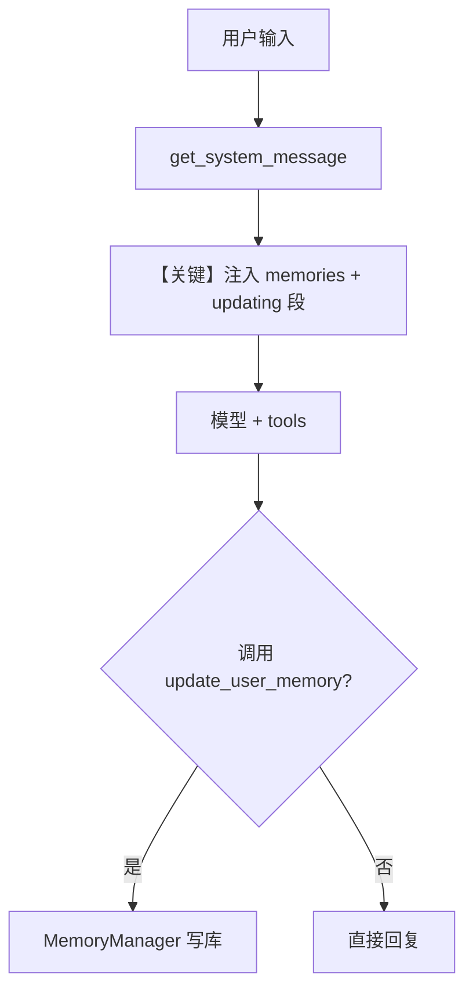

# memory_manager.py — 实现原理分析

<!-- cookbook-py-source:start -->
## 完整源码

```python
"""
Memory Manager
=============================

Use a MemoryManager to give agents persistent memory across sessions.
"""

from agno.agent import Agent
from agno.db.sqlite import SqliteDb
from agno.memory.manager import MemoryManager
from agno.models.openai import OpenAIResponses

# ---------------------------------------------------------------------------
# Create Agent
# ---------------------------------------------------------------------------
db = SqliteDb(db_file="tmp/memory_demo.db")

agent = Agent(
    model=OpenAIResponses(id="gpt-5.2"),
    db=db,
    # Enable agentic memory so the agent can store and retrieve memories
    enable_agentic_memory=True,
    # Provide a MemoryManager for structured memory operations
    memory_manager=MemoryManager(
        db=db,
        model=OpenAIResponses(id="gpt-5-mini"),
    ),
    markdown=True,
)

# ---------------------------------------------------------------------------
# Run Agent
# ---------------------------------------------------------------------------
if __name__ == "__main__":
    # First interaction: tell the agent something to remember
    agent.print_response(
        "My name is Alice and I prefer Python over JavaScript.",
        stream=True,
    )

    print("\n--- Second interaction ---\n")

    # Second interaction: the agent should recall the preference
    agent.print_response(
        "What programming language do I prefer?",
        stream=True,
    )
```

<!-- cookbook-py-source:end -->

> 源文件：`cookbook/02_agents/06_memory_and_learning/memory_manager.py`

## 概述

本示例展示 Agno 的 **Agentic Memory（工具化用户记忆）** 机制：开启 `enable_agentic_memory` 并注入 `MemoryManager`（可单独指定摘要/记忆用模型），在 system 中注入 **既有记忆列表** 与 **`update_user_memory` 工具说明**，使模型能跨轮读写结构化记忆。

**核心配置一览：**

| 配置项 | 值 | 说明 |
|--------|------|------|
| `model` | `OpenAIResponses(id="gpt-5.2")` | 主对话 Responses API |
| `db` | `SqliteDb(db_file="tmp/memory_demo.db")` | 记忆与会话持久化 |
| `enable_agentic_memory` | `True` | 启用记忆工具与说明段 |
| `memory_manager` | `MemoryManager(db=db, model=OpenAIResponses(id="gpt-5-mini"))` | 记忆 CRUD 与检索 |
| `markdown` | `True` | markdown 附加段 |
| `add_memories_to_context` | 默认 `True`（类属性） | 将历史记忆注入 system |

## 架构分层

```
用户代码层                agno.agent 层
┌──────────────────┐    ┌──────────────────────────────────┐
│ enable_agentic_  │    │ get_system_message()             │
│ memory + MM      │───>│ # 3.3.9 记忆列表 +               │
│                  │    │ <updating_user_memories> 工具说明 │
│ print_response   │    │ get_tools() 注册 update_user_memory│
└──────────────────┘    └──────────────────────────────────┘
```

## 核心组件解析

### `MemoryManager`

位于 `agno/memory/manager.py`，向 Agent 提供 `get_user_memories` / 更新接口；构造时传入的 `model` 可用于记忆相关的内部推理（依实现）。

### System 中的记忆段

`get_system_message()`（`agno/agent/_messages.py`）`# 3.3.9`：当 `add_memories_to_context` 为真时拉取 `user_memories` 并包装在 `<memories_from_previous_interactions>`；若 `enable_agentic_memory`，追加 `<updating_user_memories>` 说明块（约 L315–325）。

### 运行机制与因果链

1. **路径**：用户陈述偏好 → 模型可能调用 **`update_user_memory` 工具** → MemoryManager 写库 → 下一轮 `get_system_message` 读出记忆注入 system。
2. **副作用**：**SQLite** 文件 `tmp/memory_demo.db` 持续累积；重复运行脚本可能复用或覆盖数据，取决于 user_id 策略（本示例未显式传 `user_id`，框架可能使用默认值）。
3. **分支**：`enable_agentic_memory=False` 时仍可有只读记忆列表，但无更新说明段；`add_memories_to_context=False` 则跳过记忆列表。
4. **与 learning_machine 差异**：本示例走 **MemoryManager + 显式工具**，learning 示例走 **LearningMachine 统一学习**。

## System Prompt 组装

| 序号 | 组成部分 | 本文件 | 是否生效 |
|------|---------|--------|---------|
| 1 | `markdown` 附加 | 是 | 是 |
| 2 | `# 3.3.9` 记忆列表 | 依赖库中是否已有记忆 | 第二次交互起通常有内容 |
| 3 | `<updating_user_memories>` | `enable_agentic_memory=True` | 是 |

### 还原后的完整 System 文本

框架固定段落（启用 agentic memory 时）包含如下结构（摘自 `_messages.py` 模板大意，标点以源码为准）：

```text
You have access to the `update_user_memory` tool that you can use to add new memories, update existing memories, delete memories, or clear all memories.
...
```

此外含 **动态记忆列表**（若有）与 markdown 附加段；无法在未运行前还原第一条 run 后的完整正文。

参照用户句（第一轮）：`My name is Alice and I prefer Python over JavaScript.`

### 段落释义（模型视角）

- 记忆列表：提供 **事实性用户偏好**。
- updating_user_memories：约束在合适时机 **调用工具** 持久化新信息。

## 完整 API 请求

主对话：`OpenAIResponses` → `responses.create`；`MemoryManager` 内嵌的 `gpt-5-mini` 可能在记忆整理等内部步骤中单独调用（以 `MemoryManager` 实现为准）。

## Mermaid 流程图


```mermaid
flowchart TD
    A["用户输入"] --> B["get_system_message"]
    B --> C["【关键】注入 memories + updating 段"]
    C --> D["模型 + tools"]
    D --> E{"调用 update_user_memory?"}
    E -->|是| F["MemoryManager 写库"]
    E -->|否| G["直接回复"]
```

## 关键源码文件索引

| 文件 | 关键符号 | 作用 |
|------|---------|------|
| `agno/agent/_messages.py` | `# 3.3.9`；`enable_agentic_memory` 分支 L315+ | 记忆 system 块 |
| `agno/memory/manager.py` | `MemoryManager` | 记忆存取 |
| `agno/agent/agent.py` | `enable_agentic_memory`；`memory_manager` | Agent 配置 |
