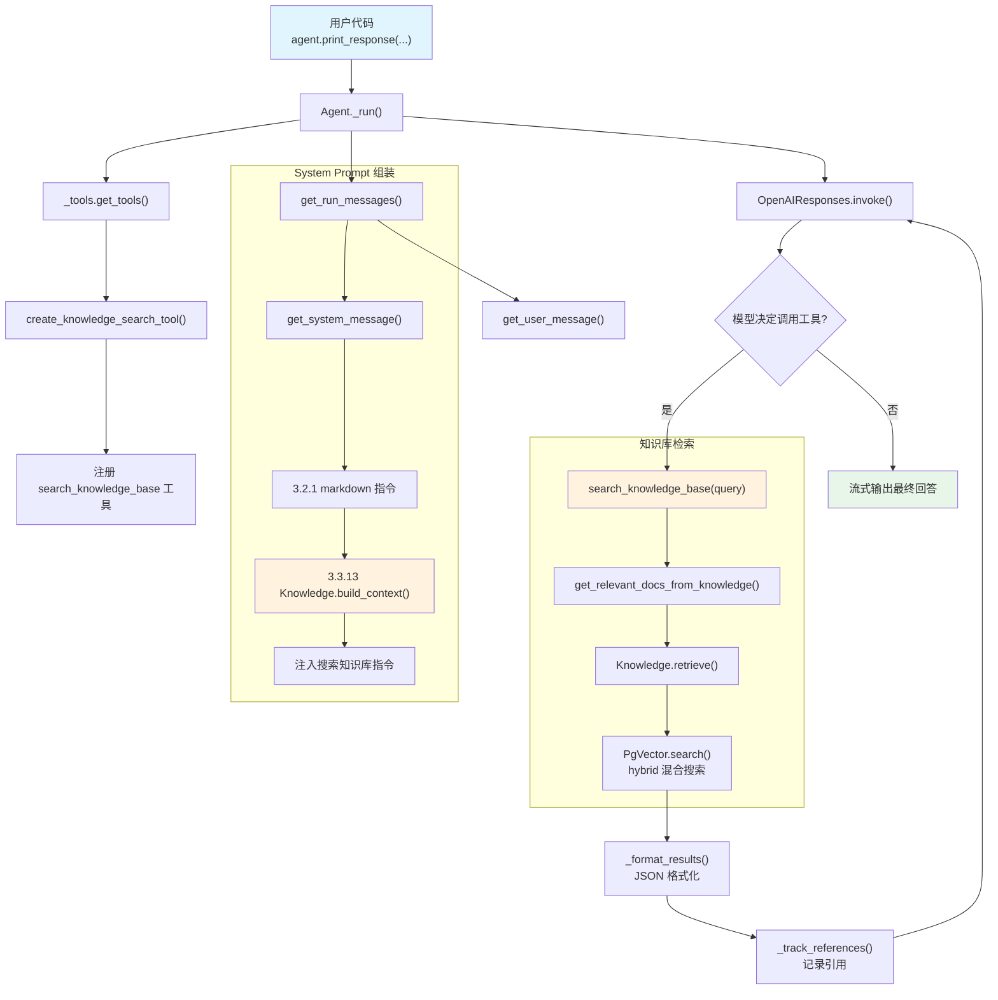

# agentic_rag.py — 实现原理分析

> 源文件：`cookbook/02_agents/07_knowledge/agentic_rag.py`

## 概述

本示例展示 Agno 的 **Agentic RAG** 机制：通过 `search_knowledge=True` 将知识库搜索注册为工具（`search_knowledge_base`），让模型在需要时**主动调用**工具检索相关文档，而非在用户消息中预注入上下文。搭配 **PgVector** 混合搜索（向量 + 全文）和 **OpenAIEmbedder** 嵌入模型。

**核心配置一览：**

| 配置项 | 值 | 说明 |
|--------|------|------|
| `name` | `None` | 未设置 |
| `model` | `OpenAIResponses(id="gpt-5.2")` | Responses API |
| `knowledge` | `Knowledge(vector_db=PgVector(...))` | PgVector 混合搜索知识库 |
| `search_knowledge` | `True` | 启用 Agentic RAG（注册搜索工具） |
| `add_knowledge_to_context` | `False`（默认） | 不预注入上下文（区别于 Traditional RAG） |
| `markdown` | `True` | 输出 Markdown 格式 |
| `instructions` | `None` | 未设置 |
| `tools` | `None` | 无额外工具 |
| `references_format` | `"json"`（默认） | 搜索结果 JSON 格式 |

## 架构分层

```
用户代码层                      agno.agent 层
┌──────────────────────┐      ┌──────────────────────────────────────────┐
│ agentic_rag.py       │      │ Agent._run()                             │
│                      │      │  ├ _tools.get_tools()                    │
│ knowledge=Knowledge  │      │  │  ├ resolve_callable_knowledge()       │
│   vector_db=PgVector │─────>│  │  └ create_knowledge_search_tool()     │
│   search_type=hybrid │      │  │       → search_knowledge_base 工具     │
│   embedder=OpenAI    │      │  │                                        │
│ search_knowledge=True│      │  ├ _messages.get_run_messages()           │
│                      │      │  │  ├ get_system_message()                │
│                      │      │  │  │  └ 3.3.13 search_knowledge 指令    │
│                      │      │  │  └ get_user_message()                  │
│                      │      │  │                                        │
│                      │      │  └ Model.response() → 工具调用循环        │
│                      │      │     └ search_knowledge_base(query)        │
│                      │      │        → get_relevant_docs_from_knowledge │
│                      │      │           → Knowledge.retrieve()          │
│                      │      │              → PgVector.search()          │
└──────────────────────┘      └──────────────────────────────────────────┘
                                        │
                                        ▼
                              ┌──────────────────┐
                              │ OpenAIResponses   │
                              │ gpt-5.2           │
                              └──────────────────┘
```

## 核心组件解析

### Knowledge 与 PgVector

`Knowledge` 是知识库的核心抽象（`knowledge/knowledge.py:41`），封装了向量数据库的插入、搜索和上下文构建逻辑：

```python
# knowledge/knowledge.py L41-55
@dataclass
class Knowledge(RemoteKnowledge):
    name: Optional[str] = None
    vector_db: Optional[Any] = None       # 向量数据库实例
    max_results: int = 10                  # 默认返回文档数
    isolate_vector_search: bool = False    # 多 Knowledge 共享表时隔离搜索
```

本示例使用 `PgVector` 作为向量数据库，配置了 `SearchType.hybrid`（向量 + 全文混合搜索）和 `OpenAIEmbedder`（`text-embedding-3-small`）生成嵌入向量。

### search_knowledge 工具注册

当 `search_knowledge=True`（默认值）且 `knowledge` 不为 `None` 时，`_tools.get_tools()`（`agent/_tools.py:176`）会注册一个 `search_knowledge_base` 工具：

```python
# agent/_tools.py L176-186
if (resolved_knowledge is not None or agent.knowledge_retriever is not None) and agent.search_knowledge:
    agent_tools.append(
        _default_tools.create_knowledge_search_tool(
            agent,
            run_response=run_response,
            run_context=run_context,
            knowledge_filters=run_context.knowledge_filters,
            enable_agentic_filters=agent.enable_agentic_knowledge_filters,
            async_mode=False,
        )
    )
```

### search_knowledge_base 工具实现

`create_knowledge_search_tool()`（`agent/_default_tools.py:103`）创建工具函数。由于本示例未启用 `enable_agentic_knowledge_filters`，使用无过滤器版本：

```python
# agent/_default_tools.py L224-250
def search_knowledge_base(query: str) -> str:
    """Use this function to search the knowledge base for information about a query."""
    retrieval_timer = Timer()
    retrieval_timer.start()
    docs = _messages.get_relevant_docs_from_knowledge(
        agent, query=query, filters=knowledge_filters, run_context=run_context,
    )
    _track_references(docs, query, retrieval_timer.elapsed)  # 记录引用到 run_response
    return _format_results(docs)  # 按 references_format（默认 json）格式化
```

### 文档检索链路

`get_relevant_docs_from_knowledge()`（`_messages.py:1665`）执行检索：

1. 检查 `knowledge_retriever`（自定义检索器），如存在则优先调用
2. 否则调用 `Knowledge.retrieve()`（`knowledge.py:3303`）
3. `retrieve()` 代理到 `Knowledge.search()`（`knowledge.py:507`）
4. `search()` 调用 `PgVector.search()` 执行向量/混合搜索

### Knowledge.build_context() — System Prompt 指令

`build_context()`（`knowledge.py:2908`）在步骤 3.3.13 中被调用，向 system prompt 注入搜索指令：

```python
# knowledge/knowledge.py L2879-2883
_SEARCH_KNOWLEDGE_INSTRUCTIONS = (
    "You have a knowledge base you can search using the search_knowledge_base tool. "
    "Search before answering questions—don't assume you know the answer. "
    "For ambiguous questions, search first rather than asking for clarification."
)
```

## System Prompt 组装

| 序号 | 组成部分 | 本文件中的值/来源 | 是否生效 |
|------|---------|-----------------|---------|
| 1 | `system_message`（自定义） | `None` | 否 |
| 3.1 | `instructions` | `None` | 否 |
| 3.1.1 | 模型指令（`get_instructions_for_model`） | OpenAIResponses 默认 | 视模型 |
| 3.2.1 | `markdown` | `True` | 是 |
| 3.2.2 | `add_datetime_to_context` | `False` | 否 |
| 3.2.3 | `add_location_to_context` | `False` | 否 |
| 3.2.4 | `add_name_to_context` | `False` | 否 |
| 3.3.1 | `description` | `None` | 否 |
| 3.3.2 | `role` | `None` | 否 |
| 3.3.3 | instructions 拼接 | 无 | 否 |
| 3.3.4 | additional_information | `markdown` 指令 | 是 |
| 3.3.5 | `_tool_instructions` | 无 | 否 |
| fmt | `resolve_in_context` 变量替换 | `True`（默认） | 是（无模板变量） |
| 3.3.7 | `expected_output` | `None` | 否 |
| 3.3.8 | `additional_context` | `None` | 否 |
| 3.3.9 | `add_memories_to_context` | `None` | 否 |
| 3.3.10 | `add_culture_to_context` | `None` | 否 |
| 3.3.11 | `add_session_summary_to_context` | `None` | 否 |
| 3.3.12 | `add_learnings_to_context` | `True`（默认），但无 `_learning` | 否 |
| 3.3.13 | `search_knowledge` instructions | Knowledge.build_context() | **是** |
| 3.3.14 | 模型 system message | 视模型 | 视模型 |
| 3.3.15 | JSON output prompt | 无 `output_schema` | 否 |
| 3.3.16 | response model format prompt | 无 `parser_model` | 否 |
| 3.3.17 | `add_session_state_to_context` | `False` | 否 |

### 最终 System Prompt

```text
<additional_information>
- Use markdown to format your answers.
</additional_information>

<knowledge_base>
You have a knowledge base you can search using the search_knowledge_base tool. Search before answering questions—don't assume you know the answer. For ambiguous questions, search first rather than asking for clarification.
</knowledge_base>
```

## 完整 API 请求

**第一轮：模型决定搜索知识库**

```python
client.responses.create(
    model="gpt-5.2",
    input=[
        # 1. System Message（role_map: system → developer）
        {"role": "developer", "content": "<additional_information>\n- Use markdown to format your answers.\n</additional_information>\n\n<knowledge_base>\nYou have a knowledge base you can search using the search_knowledge_base tool. Search before answering questions—don't assume you know the answer. For ambiguous questions, search first rather than asking for clarification.\n</knowledge_base>"},
        # 2. 用户消息
        {"role": "user", "content": "How do I make chicken and galangal in coconut milk soup"}
    ],
    tools=[
        {
            "type": "function",
            "function": {
                "name": "search_knowledge_base",
                "description": "Use this function to search the knowledge base for information about a query.",
                "parameters": {
                    "type": "object",
                    "properties": {
                        "query": {"type": "string", "description": "The query to search for."}
                    },
                    "required": ["query"]
                }
            }
        }
    ],
    stream=True,
    stream_options={"include_usage": True}
)
```

**第二轮：工具调用结果返回后继续生成**

```python
client.responses.create(
    model="gpt-5.2",
    input=[
        {"role": "developer", "content": "...（同上）"},
        {"role": "user", "content": "How do I make chicken and galangal in coconut milk soup"},
        # 模型的工具调用
        {"type": "function_call", "name": "search_knowledge_base", "arguments": "{\"query\": \"chicken galangal coconut milk soup recipe\"}"},
        # 工具调用结果（JSON 格式的检索文档）
        {"type": "function_call_output", "output": "[{\"content\": \"...\", \"meta_data\": {...}}, ...]"}
    ],
    tools=[...],  # 同上
    stream=True,
    stream_options={"include_usage": True}
)
```

> 模型根据搜索结果生成最终回答。`_track_references()` 会将检索到的文档记录到 `run_response.references` 中。

## Mermaid 流程图



## 关键源码文件索引

| 文件 | 关键函数/类 | 作用 |
|------|------------|------|
| `agno/agent/agent.py` | `knowledge` L136 | Knowledge 实例属性 |
| `agno/agent/agent.py` | `search_knowledge` L195 | 启用搜索工具开关（默认 `True`） |
| `agno/agent/agent.py` | `add_knowledge_to_context` L142 | Traditional RAG 开关（默认 `False`） |
| `agno/agent/agent.py` | `references_format` L149 | 引用格式（`"json"` / `"yaml"`） |
| `agno/agent/_tools.py` | `get_tools()` L105 | 工具注册入口 |
| `agno/agent/_tools.py` | 知识搜索工具注册 L176-186 | 条件注册 search_knowledge_base |
| `agno/agent/_default_tools.py` | `create_knowledge_search_tool()` L103 | 创建搜索工具函数 |
| `agno/agent/_default_tools.py` | `search_knowledge_base()` L224 | 无过滤器搜索实现 |
| `agno/agent/_messages.py` | `get_system_message()` L106 | System Prompt 组装 |
| `agno/agent/_messages.py` | 步骤 3.3.13 L404-413 | 注入 Knowledge 搜索指令 |
| `agno/agent/_messages.py` | `get_relevant_docs_from_knowledge()` L1665 | 文档检索核心函数 |
| `agno/knowledge/knowledge.py` | `Knowledge` L41 | 知识库类定义 |
| `agno/knowledge/knowledge.py` | `search()` L507 | 向量搜索入口 |
| `agno/knowledge/knowledge.py` | `retrieve()` L3303 | 检索接口（代理到 search） |
| `agno/knowledge/knowledge.py` | `build_context()` L2908 | 构建 system prompt 搜索指令 |
| `agno/knowledge/knowledge.py` | `_SEARCH_KNOWLEDGE_INSTRUCTIONS` L2879 | 搜索指令模板 |
