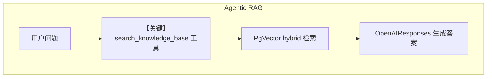

# agentic_rag.py — 实现原理分析

<!-- cookbook-py-source:start -->
## 完整源码

```python
"""
Agentic Rag
=============================

1. Run: `./cookbook/run_pgvector.sh` to start a postgres container with pgvector.
"""

from agno.agent import Agent
from agno.knowledge.embedder.openai import OpenAIEmbedder
from agno.knowledge.knowledge import Knowledge
from agno.models.openai import OpenAIResponses
from agno.vectordb.pgvector import PgVector, SearchType

db_url = "postgresql+psycopg://ai:ai@localhost:5532/ai"
knowledge = Knowledge(
    # Use PgVector as the vector database and store embeddings in the `ai.recipes` table
    vector_db=PgVector(
        table_name="recipes",
        db_url=db_url,
        search_type=SearchType.hybrid,
        embedder=OpenAIEmbedder(id="text-embedding-3-small"),
    ),
)

# ---------------------------------------------------------------------------
# Create Agent
# ---------------------------------------------------------------------------
agent = Agent(
    model=OpenAIResponses(id="gpt-5.2"),
    knowledge=knowledge,
    # Add a tool to search the knowledge base which enables agentic RAG.
    # This is enabled by default when `knowledge` is provided to the Agent.
    search_knowledge=True,
    markdown=True,
)

# ---------------------------------------------------------------------------
# Run Agent
# ---------------------------------------------------------------------------
if __name__ == "__main__":
    knowledge.insert(url="https://agno-public.s3.amazonaws.com/recipes/ThaiRecipes.pdf")
    agent.print_response(
        "How do I make chicken and galangal in coconut milk soup", stream=True
    )
    # agent.print_response(
    #     "Hi, i want to make a 3 course meal. Can you recommend some recipes. "
    #     "I'd like to start with a soup, then im thinking a thai curry for the main course and finish with a dessert",
    #     stream=True,
    # )
```

<!-- cookbook-py-source:end -->

> 源文件：`cookbook/02_agents/07_knowledge/agentic_rag.py`

## 概述

本示例展示 Agno 的 **Agentic RAG（按需检索 + 工具驱动）** 机制：`Knowledge` 绑定 `PgVector` 混合检索与 OpenAI 嵌入；Agent 设 `knowledge` 且 **`search_knowledge=True`**（默认），由 `Knowledge.build_context` 注入检索指令，并注册 **`search_knowledge_base`** 工具，模型先检索再回答。

**核心配置一览：**

| 配置项 | 值 | 说明 |
|--------|------|------|
| `model` | `OpenAIResponses(id="gpt-5.2")` | Responses API |
| `knowledge` | `Knowledge(vector_db=PgVector(..., SearchType.hybrid, OpenAIEmbedder(...)))` | PG + 混合检索 |
| `search_knowledge` | `True` | 显式开启（与默认一致） |
| `markdown` | `True` | 启用 markdown 段 |
| `add_search_knowledge_instructions` | 默认 `True` | 注入 `Knowledge.build_context` |

## 架构分层

```
用户代码层                agno.agent 层
┌──────────────────┐    ┌──────────────────────────────────┐
│ Knowledge +      │    │ get_system_message #3.3.13       │
│ PgVector         │───>│ build_context → <knowledge_base> │
│ knowledge.insert │    │ get_tools → search_knowledge_base│
└──────────────────┘    └──────────────────────────────────┘
```

## 核心组件解析

### `Knowledge.build_context`

`agno/knowledge/knowledge.py` 中 `_SEARCH_KNOWLEDGE_INSTRUCTIONS`（约 L2879–2883）与 `build_context()`（约 L2908+）生成：

```text
<knowledge_base>
You have a knowledge base you can search using the search_knowledge_base tool. ...
</knowledge_base>
```

### 检索工具

`Knowledge.get_tools` 返回配置好的搜索工具，由 Agent 工具循环调用向量库。

### 运行机制与因果链

1. **路径**：`knowledge.insert(url=...)` 入库 → 用户提问 → 模型 **`search_knowledge_base`** → `PgVector` hybrid 检索 → 结果注入对话 → 模型生成答案。
2. **副作用**：写入 **Postgres/pgvector**；需本地 `./cookbook/run_pgvector.sh` 环境。
3. **分支**：`search_knowledge=False` 则仍可有 `knowledge` 对象但不注入指令与工具（依实现），本示例不演示。
4. **定位**：相对 `traditional_rag.py`，本示例强调 **智能体主动选工具检索**。

## System Prompt 组装

| 组成部分 | 本文件 | 是否生效 |
|---------|--------|---------|
| `markdown` | True | 是 |
| `# 3.3.13` `<knowledge_base>` | 是 | 是 |

### 还原后的完整 System 文本（静态可确定部分）

```text
<additional_information>
- Use markdown to format your answers.
</additional_information>

<knowledge_base>
You have a knowledge base you can search using the search_knowledge_base tool. Search before answering questions—don't assume you know the answer. For ambiguous questions, search first rather than asking for clarification.
</knowledge_base>
```

另含 `get_system_message_for_model` 若返回的模型级片段（默认多为空）。参照用户句：`How do I make chicken and galangal in coconut milk soup`

## 完整 API 请求

主模型：`responses.create`；嵌入：`OpenAIEmbedder` 走 OpenAI Embeddings API（插入阶段）。

## Mermaid 流程图


```mermaid
flowchart TD
    subgraph RAG["Agentic RAG"]
        A["用户问题"] --> B["【关键】search_knowledge_base 工具"]
        B --> C["PgVector hybrid 检索"]
        C --> D["OpenAIResponses 生成答案"]
    end
```

## 关键源码文件索引

| 文件 | 关键符号 | 作用 |
|------|---------|------|
| `agno/knowledge/knowledge.py` | `build_context`；`_SEARCH_KNOWLEDGE_INSTRUCTIONS` L2879+ | system 中知识段 |
| `agno/agent/_messages.py` | `# 3.3.13` L409+ | 挂载 knowledge 上下文 |
| `agno/vectordb/pgvector` | `PgVector` | 向量检索后端 |
