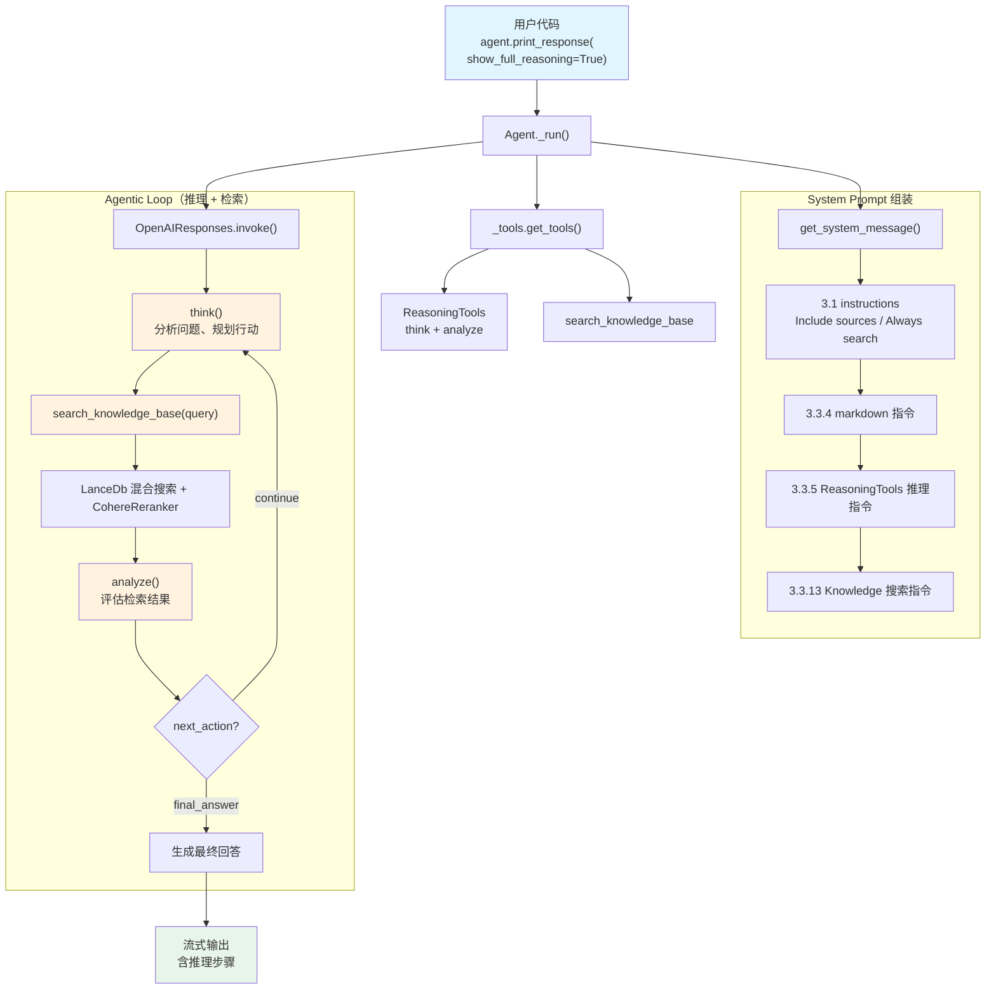

# agentic_rag_with_reasoning.py — 实现原理分析

> 源文件：`cookbook/02_agents/07_knowledge/agentic_rag_with_reasoning.py`

## 概述

本示例展示 Agno 的 **Agentic RAG + ReasoningTools** 组合：在知识库搜索的基础上，通过 `ReasoningTools` 为模型提供 `think` 和 `analyze` 工具，使其在检索和回答过程中能够**显式地逐步推理**。搭配 **LanceDb** 混合搜索、**CohereEmbedder** 嵌入和 **CohereReranker** 重排序，并使用 `asyncio` 异步插入文档。

**核心配置一览：**

| 配置项 | 值 | 说明 |
|--------|------|------|
| `name` | `None` | 未设置 |
| `model` | `OpenAIResponses(id="gpt-5.2")` | Responses API |
| `knowledge` | `Knowledge(vector_db=LanceDb(...))` | LanceDb 混合搜索 + Reranking |
| `search_knowledge` | `True` | 启用 Agentic RAG |
| `tools` | `[ReasoningTools(add_instructions=True)]` | 推理工具（think + analyze） |
| `instructions` | `["Include sources...", "Always search..."]` | 自定义指令 |
| `markdown` | `True` | 输出 Markdown 格式 |

**LanceDb 向量数据库配置：**

| 配置项 | 值 | 说明 |
|--------|------|------|
| `uri` | `"tmp/lancedb"` | 本地文件存储 |
| `table_name` | `"agno_docs"` | 表名 |
| `search_type` | `SearchType.hybrid` | 混合搜索 |
| `embedder` | `CohereEmbedder(id="embed-v4.0")` | Cohere 嵌入模型 |
| `reranker` | `CohereReranker(model="rerank-v3.5")` | Cohere 重排序 |

## 架构分层

```
用户代码层                      agno.agent 层
┌──────────────────────┐      ┌──────────────────────────────────────────────┐
│ agentic_rag_with_    │      │ Agent._run()                                 │
│   reasoning.py       │      │  ├ _tools.get_tools()                        │
│                      │      │  │  ├ ReasoningTools（think + analyze）       │
│ knowledge=Knowledge  │      │  │  └ create_knowledge_search_tool()         │
│   vector_db=LanceDb  │─────>│  │       → search_knowledge_base 工具         │
│     embedder=Cohere  │      │  │                                            │
│     reranker=Cohere  │      │  ├ get_system_message()                       │
│                      │      │  │  ├ 3.1 instructions                       │
│ tools=[Reasoning     │      │  │  ├ 3.3.5 ReasoningTools 指令              │
│   Tools]             │      │  │  └ 3.3.13 搜索指令                        │
│ instructions=[...]   │      │  │                                            │
│                      │      │  └ Model.response() → Agentic Loop           │
│ show_full_reasoning  │      │     ├ think(title, thought, action, ...)      │
│   =True              │      │     ├ search_knowledge_base(query)            │
│                      │      │     ├ analyze(title, result, analysis, ...)   │
│                      │      │     └ 生成最终回答                             │
└──────────────────────┘      └──────────────────────────────────────────────┘
                                        │
                                        ▼
                              ┌──────────────────┐
                              │ OpenAIResponses   │
                              │ gpt-5.2           │
                              └──────────────────┘
```

## 核心组件解析

### ReasoningTools

`ReasoningTools`（`tools/reasoning.py:10`）是 `Toolkit` 子类，提供两个推理工具：

```python
# tools/reasoning.py L10-49
class ReasoningTools(Toolkit):
    def __init__(self, enable_think=True, enable_analyze=True, add_instructions=False, ...):
        tools = []
        if enable_think:
            tools.append(self.think)      # 思考工具（推理过程记录）
        if enable_analyze:
            tools.append(self.analyze)    # 分析工具（结果评估）
        super().__init__(
            name="reasoning_tools",
            instructions=self.instructions,  # 推理指令（含 DEFAULT_INSTRUCTIONS）
            add_instructions=add_instructions,  # 是否注入 system prompt
            tools=tools,
        )
```

**`think` 工具**（`reasoning.py:51`）：用作推理草稿纸，记录思考步骤。通过 `run_context.session_state["reasoning_steps"]` 存储推理历史。

**`analyze` 工具**（`reasoning.py:117`）：评估推理结果，决定下一步行动（`continue`/`validate`/`final_answer`）。

本示例设置 `add_instructions=True`，使 ReasoningTools 的详细推理指令注入 system prompt（通过步骤 3.3.5 `_tool_instructions`）。

### 推理步骤的存储

每次调用 `think` 或 `analyze`，推理步骤都存入 `run_context.session_state`：

```python
# tools/reasoning.py L87-93
if run_context.session_state is None:
    run_context.session_state = {}
if "reasoning_steps" not in run_context.session_state:
    run_context.session_state["reasoning_steps"] = {}
if current_run_id not in run_context.session_state["reasoning_steps"]:
    run_context.session_state["reasoning_steps"][current_run_id] = []
run_context.session_state["reasoning_steps"][current_run_id].append(reasoning_step.model_dump_json())
```

### show_full_reasoning

`agent.print_response(..., show_full_reasoning=True)` 在流式输出中展示完整的推理步骤（think/analyze 的内容），而非仅展示最终回答。

### 异步文档插入

```python
asyncio.run(
    knowledge.ainsert_many(urls=["https://docs.agno.com/agents/overview.md"])
)
```

使用 `asyncio.run()` 执行异步插入，`ainsert_many()` 是 `Knowledge` 的异步批量插入方法。

## System Prompt 组装

| 序号 | 组成部分 | 本文件中的值/来源 | 是否生效 |
|------|---------|-----------------|---------|
| 1 | `system_message`（自定义） | `None` | 否 |
| 3.1 | `instructions` | `["Include sources...", "Always search..."]` | **是** |
| 3.1.1 | 模型指令 | OpenAIResponses 默认 | 视模型 |
| 3.2.1 | `markdown` | `True` | 是 |
| 3.2.2 | `add_datetime_to_context` | `False` | 否 |
| 3.2.3 | `add_location_to_context` | `False` | 否 |
| 3.2.4 | `add_name_to_context` | `False` | 否 |
| 3.3.1 | `description` | `None` | 否 |
| 3.3.2 | `role` | `None` | 否 |
| 3.3.3 | instructions 拼接 | 两条指令拼接 | **是** |
| 3.3.4 | additional_information | `markdown` 指令 | 是 |
| 3.3.5 | `_tool_instructions` | ReasoningTools 推理指令 | **是**（`add_instructions=True`） |
| fmt | `resolve_in_context` | `True`（默认） | 是（无模板变量） |
| 3.3.7 | `expected_output` | `None` | 否 |
| 3.3.8 | `additional_context` | `None` | 否 |
| 3.3.9 | `add_memories_to_context` | `None` | 否 |
| 3.3.10 | `add_culture_to_context` | `None` | 否 |
| 3.3.11 | `add_session_summary_to_context` | `None` | 否 |
| 3.3.12 | `add_learnings_to_context` | 无 `_learning` | 否 |
| 3.3.13 | `search_knowledge` instructions | Knowledge.build_context() | **是** |
| 3.3.14 | 模型 system message | 视模型 | 视模型 |
| 3.3.15 | JSON output prompt | 无 | 否 |
| 3.3.16 | response model format prompt | 无 | 否 |
| 3.3.17 | `add_session_state_to_context` | `False` | 否 |

### 最终 System Prompt

```text
- Include sources in your response.
- Always search your knowledge before answering the question.

<additional_information>
- Use markdown to format your answers.
</additional_information>

<reasoning_instructions>
You have access to the `think` and `analyze` tools to work through problems step-by-step...

1. **Think** (scratchpad):
    - Purpose: Use the `think` tool as a scratchpad to break down complex problems...
    - Usage: Call `think` before making tool calls or generating a response...

2. **Analyze** (evaluation):
    - Purpose: Evaluate the result of a think step or a set of tool calls...
    - Usage: Call `analyze` after a set of tool calls...

## IMPORTANT GUIDELINES
- **Always Think First:** You MUST use the `think` tool before making tool calls...
...
</reasoning_instructions>

<knowledge_base>
You have a knowledge base you can search using the search_knowledge_base tool. Search before answering questions—don't assume you know the answer. For ambiguous questions, search first rather than asking for clarification.
</knowledge_base>
```

## 完整 API 请求

**第一轮：模型先 think 再搜索**

```python
client.responses.create(
    model="gpt-5.2",
    input=[
        {"role": "developer", "content": "- Include sources in your response.\n- Always search your knowledge before answering the question.\n\n<additional_information>\n- Use markdown to format your answers.\n</additional_information>\n\n<reasoning_instructions>\n...\n</reasoning_instructions>\n\n<knowledge_base>\n...\n</knowledge_base>"},
        {"role": "user", "content": "What are Agents?"}
    ],
    tools=[
        {
            "type": "function",
            "function": {
                "name": "think",
                "description": "Use this tool as a scratchpad to reason about the question...",
                "parameters": {
                    "type": "object",
                    "properties": {
                        "title": {"type": "string"},
                        "thought": {"type": "string"},
                        "action": {"type": "string"},
                        "confidence": {"type": "number"}
                    },
                    "required": ["title", "thought"]
                }
            }
        },
        {
            "type": "function",
            "function": {
                "name": "analyze",
                "description": "Use this tool to analyze results from a reasoning step...",
                "parameters": {
                    "type": "object",
                    "properties": {
                        "title": {"type": "string"},
                        "result": {"type": "string"},
                        "analysis": {"type": "string"},
                        "next_action": {"type": "string"},
                        "confidence": {"type": "number"}
                    },
                    "required": ["title", "result", "analysis"]
                }
            }
        },
        {
            "type": "function",
            "function": {
                "name": "search_knowledge_base",
                "description": "Use this function to search the knowledge base...",
                "parameters": {
                    "type": "object",
                    "properties": {
                        "query": {"type": "string"}
                    },
                    "required": ["query"]
                }
            }
        }
    ],
    stream=True,
    stream_options={"include_usage": True}
)
```

**典型的多轮 Agentic Loop：**

1. 模型调用 `think(title="Understand the question", thought="User wants to know about Agents...", action="Search knowledge base")`
2. 模型调用 `search_knowledge_base(query="What are Agents")`
3. 模型调用 `analyze(title="Evaluate search results", result="Found relevant docs about Agents...", analysis="Results are comprehensive", next_action="final_answer")`
4. 模型生成最终回答（包含来源引用）

## Mermaid 流程图



## 关键源码文件索引

| 文件 | 关键函数/类 | 作用 |
|------|------------|------|
| `agno/agent/agent.py` | `knowledge` L136 | Knowledge 实例 |
| `agno/agent/agent.py` | `search_knowledge` L195 | Agentic RAG 开关 |
| `agno/agent/agent.py` | `tools` L159 | 工具列表（含 ReasoningTools） |
| `agno/tools/reasoning.py` | `ReasoningTools` L10 | 推理工具 Toolkit |
| `agno/tools/reasoning.py` | `think()` L51 | 思考工具 |
| `agno/tools/reasoning.py` | `analyze()` L117 | 分析工具 |
| `agno/tools/reasoning.py` | `DEFAULT_INSTRUCTIONS` L193 | 推理指令模板 |
| `agno/reasoning/step.py` | `ReasoningStep` | 推理步骤数据模型 |
| `agno/agent/_tools.py` | `get_tools()` L105 | 工具注册入口 |
| `agno/agent/_default_tools.py` | `create_knowledge_search_tool()` L103 | 搜索工具 |
| `agno/agent/_messages.py` | `get_system_message()` L106 | System Prompt 组装 |
| `agno/agent/_messages.py` | 步骤 3.3.5 L258-260 | 工具指令注入 |
| `agno/agent/_messages.py` | 步骤 3.3.13 L404-413 | 搜索指令注入 |
| `agno/knowledge/knowledge.py` | `Knowledge` L41 | 知识库类 |
| `agno/knowledge/knowledge.py` | `build_context()` L2908 | 搜索指令构建 |
| `agno/knowledge/embedder/cohere.py` | `CohereEmbedder` | Cohere 嵌入模型 |
| `agno/knowledge/reranker/cohere.py` | `CohereReranker` | Cohere 重排序器 |
