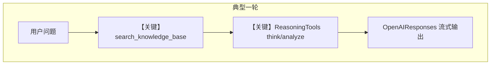

# agentic_rag_with_reasoning.py — 实现原理分析

> 源文件：`cookbook/02_agents/07_knowledge/agentic_rag_with_reasoning.py`

## 概述

本示例展示 **Agentic RAG + ReasoningTools + 重排序嵌入管线** 的组合：`LanceDb` + `CohereEmbedder` + `CohereReranker` 负责检索质量；`ReasoningTools(add_instructions=True)` 注入 **Think/Analyze** 工具说明；`instructions` 要求先检索并引用来源；`show_full_reasoning=True` 用于展示推理过程。

**核心配置一览：**

| 配置项 | 值 | 说明 |
|--------|------|------|
| `model` | `OpenAIResponses(id="gpt-5.2")` | Responses API |
| `knowledge` | `Knowledge(LanceDb(..., hybrid, CohereEmbedder, CohereReranker))` | 异步插入与混合检索+重排 |
| `search_knowledge` | `True` | 默认显式 |
| `tools` | `[ReasoningTools(add_instructions=True)]` | 推理工具组 |
| `instructions` | 两条字符串（见下） | 业务约束 |
| `markdown` | `True` | 是 |

## 架构分层

```
Knowledge(Lance+Cohere)     Agent
        │                    ├ search_knowledge_base
        │                    ├ think / analyze（ReasoningTools）
        └ hybrid+rerank ────>└ OpenAIResponses + 流式推理展示
```

## 核心组件解析

### ReasoningTools

`agno/tools/reasoning.py`：`add_instructions=True` 时 Toolkit 将 `instructions` 交给 Agent，最终进入 `_tool_instructions` 或等价路径，在 `get_system_message` 的 `# 3.3.5`（工具说明段）展开。

### LanceDB + Reranker

检索阶段：向量初检 → **Cohere rerank** 重排 → 再交给模型；具体调用在 `LanceDb`/知识搜索实现中。

### 运行机制与因果链

1. **路径**：`knowledge.ainsert_many` 异步灌库 → 用户问「What are Agents?」→ 模型可交替调用 **`search_knowledge_base` 与 `think`/`analyze`** → 流式输出（`show_full_reasoning=True`）。
2. **副作用**：本地 `tmp/lancedb`；外链拉取 docs。
3. **分支**：无 reranker 时退化为纯向量分数排序（与本 cookbook 对照 `agentic_rag_with_reranking`）。
4. **定位**：在基础 agentic RAG 上叠加 **显式推理工具** 与 **Cohere 全家桶嵌入/重排**。

## System Prompt 组装

### 用户显式 `instructions`（须原样）

```text
Include sources in your response.
Always search your knowledge before answering the question.
```

### 其它段

- `markdown` 附加（`# 3.2.1`）。
- `<knowledge_base>`（`Knowledge.build_context`，`# 3.3.13`）。
- Reasoning 工具说明（`<reasoning_instructions>...</reasoning_instructions>` 等，来自 `ReasoningTools` 默认文案 + `add_instructions`）。

完整拼接顺序见 `get_system_message()` 注释编号；工具说明在 `# 3.3.5`。

### 还原后的完整 System 文本

将下列 **确定字面量** 与框架段组合（工具与 knowledge 段较长，此处列用户与 knowledge 核心固定句；Reasoning 默认全文以 `reasoning.py` 中 `DEFAULT_INSTRUCTIONS` 为准，若需逐字请 Read 该文件或运行时打印）。

```text
Include sources in your response.
Always search your knowledge before answering the question.
```

并包含：

```text
<knowledge_base>
You have a knowledge base you can search using the search_knowledge_base tool. Search before answering questions—don't assume you know the answer. For ambiguous questions, search first rather than asking for clarification.
</knowledge_base>
```

（若 `build_context` 未启用 agentic filters，则无 filter 追加段。）

参照用户句：`What are Agents?`

## 完整 API 请求

主对话：`OpenAIResponses` → `responses.create`；Cohere：嵌入与 rerank 独立 API（由对应 Embedder/Reranker 调用）。

## Mermaid 流程图


```mermaid
flowchart TD
    subgraph Loop["典型一轮"]
        U["用户问题"] --> S["【关键】search_knowledge_base"]
        S --> R["【关键】ReasoningTools think/analyze"]
        R --> O["OpenAIResponses 流式输出"]
    end
```

## 关键源码文件索引

| 文件 | 关键符号 | 作用 |
|------|---------|------|
| `agno/tools/reasoning.py` | `ReasoningTools` | Think/Analyze 与说明 |
| `agno/knowledge/knowledge.py` | `build_context` | knowledge system 段 |
| `agno/agent/_messages.py` | `# 3.3.5`；`# 3.3.13` | 工具与 knowledge 注入顺序 |
