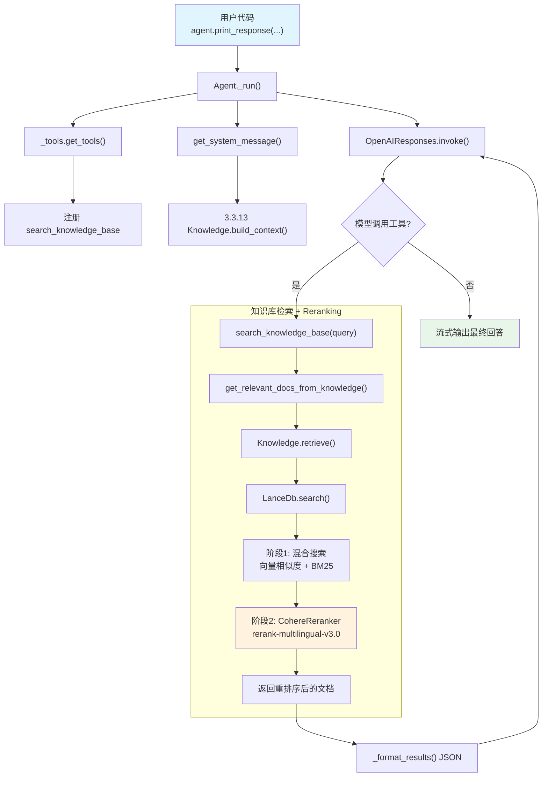

# agentic_rag_with_reranking.py — 实现原理分析

> 源文件：`cookbook/02_agents/07_knowledge/agentic_rag_with_reranking.py`

## 概述

本示例展示 Agno 的 **Agentic RAG + Reranking** 机制：在混合搜索（向量 + 全文）基础上，使用 **CohereReranker** 对初始检索结果进行二次排序，提升检索精度。搭配 **LanceDb** 向量数据库和 **OpenAIEmbedder** 嵌入模型。Reranker 在向量数据库层面配置，对 Agent 层透明。

**核心配置一览：**

| 配置项 | 值 | 说明 |
|--------|------|------|
| `name` | `None` | 未设置 |
| `model` | `OpenAIResponses(id="gpt-5.2")` | Responses API |
| `knowledge` | `Knowledge(vector_db=LanceDb(...))` | LanceDb 混合搜索 + Reranking |
| `search_knowledge` | `True`（默认） | 启用 Agentic RAG |
| `markdown` | `True` | 输出 Markdown 格式 |
| `instructions` | `None` | 未设置 |
| `tools` | `None` | 无额外工具 |

**LanceDb 向量数据库配置：**

| 配置项 | 值 | 说明 |
|--------|------|------|
| `uri` | `"tmp/lancedb"` | 本地文件存储 |
| `table_name` | `"agno_docs"` | 表名 |
| `search_type` | `SearchType.hybrid` | 混合搜索（向量 + 全文） |
| `embedder` | `OpenAIEmbedder(id="text-embedding-3-small")` | OpenAI 嵌入模型 |
| `reranker` | `CohereReranker(model="rerank-multilingual-v3.0")` | Cohere 多语言重排序 |

## 架构分层

```
用户代码层                      agno.agent 层
┌──────────────────────┐      ┌──────────────────────────────────────────┐
│ agentic_rag_with_    │      │ Agent._run()                             │
│   reranking.py       │      │  ├ _tools.get_tools()                    │
│                      │      │  │  └ create_knowledge_search_tool()     │
│ knowledge=Knowledge  │      │  │       → search_knowledge_base 工具     │
│   vector_db=LanceDb  │─────>│  │                                        │
│     search_type=     │      │  ├ get_system_message()                   │
│       hybrid         │      │  │  └ 3.3.13 搜索指令                    │
│     embedder=OpenAI  │      │  │                                        │
│     reranker=Cohere  │      │  └ Model.response() → 工具调用           │
│                      │      │     └ search_knowledge_base(query)        │
│                      │      │        → Knowledge.retrieve()             │
│                      │      │           → LanceDb.search()              │
│                      │      │              ├ 1. 向量 + 全文混合检索     │
│                      │      │              └ 2. CohereReranker 重排序   │
└──────────────────────┘      └──────────────────────────────────────────┘
                                        │
                                        ▼
                              ┌──────────────────┐
                              │ OpenAIResponses   │
                              │ gpt-5.2           │
                              └──────────────────┘
```

## 核心组件解析

### Reranker 工作原理

Reranker 在向量数据库的 `search()` 方法内部被调用。检索流程分两阶段：

1. **初始检索**：LanceDb 使用 `SearchType.hybrid`（向量相似度 + BM25 全文搜索）获取候选文档
2. **重排序**：`CohereReranker` 使用 Cohere 的 `rerank-multilingual-v3.0` 模型对候选文档按与查询的相关性重新排序

```python
# 用户配置（向量数据库层面）
LanceDb(
    search_type=SearchType.hybrid,
    embedder=OpenAIEmbedder(id="text-embedding-3-small"),  # 嵌入阶段
    reranker=CohereReranker(model="rerank-multilingual-v3.0"),  # 重排序阶段
)
```

Reranker 对 Agent 层完全透明——Agent 的 `search_knowledge_base` 工具和 `Knowledge.retrieve()` 调用链不感知 reranker 的存在。

### LanceDb vs PgVector

| 维度 | LanceDb | PgVector |
|------|---------|----------|
| 存储 | 本地文件（`uri="tmp/lancedb"`） | PostgreSQL 数据库 |
| 部署 | 无需额外服务 | 需要 PostgreSQL + pgvector 扩展 |
| 混合搜索 | 内置 BM25 支持（需 `tantivy`） | 内置全文搜索 |
| Reranker | 支持 `reranker` 参数 | 支持 `reranker` 参数 |

### 数据插入

```python
knowledge.insert(name="Agno Docs", url="https://docs.agno.com/introduction.md")
```

`Knowledge.insert()`（`knowledge.py:90`）自动处理 URL 内容的读取、分块、嵌入生成和向量存储。`name` 参数为内容命名，可用于后续管理。

## System Prompt 组装

| 序号 | 组成部分 | 本文件中的值/来源 | 是否生效 |
|------|---------|-----------------|---------|
| 1 | `system_message`（自定义） | `None` | 否 |
| 3.1 | `instructions` | `None` | 否 |
| 3.1.1 | 模型指令 | OpenAIResponses 默认 | 视模型 |
| 3.2.1 | `markdown` | `True` | 是 |
| 3.2.2 | `add_datetime_to_context` | `False` | 否 |
| 3.2.3 | `add_location_to_context` | `False` | 否 |
| 3.2.4 | `add_name_to_context` | `False` | 否 |
| 3.3.1 | `description` | `None` | 否 |
| 3.3.2 | `role` | `None` | 否 |
| 3.3.3 | instructions 拼接 | 无 | 否 |
| 3.3.4 | additional_information | `markdown` 指令 | 是 |
| 3.3.5 | `_tool_instructions` | 无 | 否 |
| fmt | `resolve_in_context` | `True`（默认） | 是（无模板变量） |
| 3.3.7 | `expected_output` | `None` | 否 |
| 3.3.8 | `additional_context` | `None` | 否 |
| 3.3.9 | `add_memories_to_context` | `None` | 否 |
| 3.3.10 | `add_culture_to_context` | `None` | 否 |
| 3.3.11 | `add_session_summary_to_context` | `None` | 否 |
| 3.3.12 | `add_learnings_to_context` | 无 `_learning` | 否 |
| 3.3.13 | `search_knowledge` instructions | Knowledge.build_context() | **是** |
| 3.3.14 | 模型 system message | 视模型 | 视模型 |
| 3.3.15 | JSON output prompt | 无 | 否 |
| 3.3.16 | response model format prompt | 无 | 否 |
| 3.3.17 | `add_session_state_to_context` | `False` | 否 |

### 最终 System Prompt

```text
<additional_information>
- Use markdown to format your answers.
</additional_information>

<knowledge_base>
You have a knowledge base you can search using the search_knowledge_base tool. Search before answering questions—don't assume you know the answer. For ambiguous questions, search first rather than asking for clarification.
</knowledge_base>
```

## 完整 API 请求

```python
# 第一轮
client.responses.create(
    model="gpt-5.2",
    input=[
        {"role": "developer", "content": "...（markdown + knowledge_base 指令）"},
        {"role": "user", "content": "What are Agno's key features?"}
    ],
    tools=[
        {
            "type": "function",
            "function": {
                "name": "search_knowledge_base",
                "description": "Use this function to search the knowledge base for information about a query.",
                "parameters": {
                    "type": "object",
                    "properties": {
                        "query": {"type": "string"}
                    },
                    "required": ["query"]
                }
            }
        }
    ],
    stream=True,
    stream_options={"include_usage": True}
)

# 第二轮（工具调用结果经 reranker 重排序后返回）
client.responses.create(
    model="gpt-5.2",
    input=[
        {"role": "developer", "content": "..."},
        {"role": "user", "content": "What are Agno's key features?"},
        {"type": "function_call", "name": "search_knowledge_base",
         "arguments": "{\"query\": \"Agno key features\"}"},
        {"type": "function_call_output", "output": "[{\"content\": \"...\", \"meta_data\": {...}}, ...]"}
    ],
    tools=[...],
    stream=True,
    stream_options={"include_usage": True}
)
```

> Reranker 在 `LanceDb.search()` 内部执行，对 API 请求结构无影响。文档已按 Cohere 重排序后的相关性排列。

## Mermaid 流程图



## 关键源码文件索引

| 文件 | 关键函数/类 | 作用 |
|------|------------|------|
| `agno/agent/agent.py` | `knowledge` L136 | Knowledge 实例属性 |
| `agno/agent/agent.py` | `search_knowledge` L195 | Agentic RAG 开关 |
| `agno/agent/_tools.py` | `get_tools()` L176-186 | 注册搜索工具 |
| `agno/agent/_default_tools.py` | `create_knowledge_search_tool()` L103 | 创建搜索工具 |
| `agno/agent/_messages.py` | `get_relevant_docs_from_knowledge()` L1665 | 文档检索 |
| `agno/knowledge/knowledge.py` | `Knowledge` L41 | 知识库类 |
| `agno/knowledge/knowledge.py` | `search()` L507 | 搜索入口（代理到 vector_db.search） |
| `agno/knowledge/knowledge.py` | `retrieve()` L3303 | 检索接口 |
| `agno/knowledge/knowledge.py` | `build_context()` L2908 | System Prompt 搜索指令 |
| `agno/vectordb/lancedb/` | `LanceDb` | LanceDb 向量数据库实现 |
| `agno/knowledge/reranker/cohere.py` | `CohereReranker` | Cohere 重排序器 |
