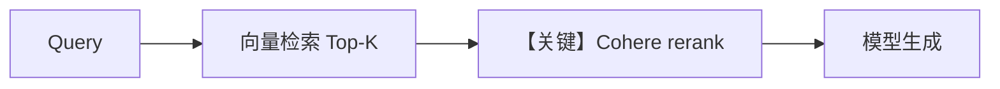

# agentic_rag_with_reranking.py — 实现原理分析

> 源文件：`cookbook/02_agents/07_knowledge/agentic_rag_with_reranking.py`

## 概述

本示例展示 **Agentic RAG + 跨模型重排序**：`LanceDb` 使用 **OpenAI 嵌入** 与 **Cohere `rerank-multilingual-v3.0`**，在检索阶段对候选文档重排以提升相关性；未显式写 `search_knowledge`，默认为 **`True`**。

**核心配置一览：**

| 配置项 | 值 | 说明 |
|--------|------|------|
| `model` | `OpenAIResponses(id="gpt-5.2")` | 主模型 |
| `knowledge` | `Knowledge(LanceDb(embedder=OpenAIEmbedder(...), reranker=CohereReranker(...)))` | 嵌入+重排 |
| `markdown` | `True` | 是 |
| `search_knowledge` | 未显式（默认 `True`） | Agentic 检索 |
| `instructions` | `None` | 未设置 |

## 核心组件解析

### Reranker 在链路中的位置

向量检索返回 Top-K 后，**Reranker** 对文档与 query 重新打分排序，再供模型阅读或注入上下文（具体见 `LanceDb` 与 `Knowledge` 搜索实现）。

### 运行机制与因果链

1. **路径**：`knowledge.insert` → 用户提问 → `search_knowledge_base` → **hybrid + rerank** → 回答。
2. **副作用**：本地 Lance 目录；Cohere/OpenAI 外部 API 调用产生费用。
3. **与 `agentic_rag_with_reasoning` 差异**：本文件 **无 ReasoningTools**，专注 **重排质量**。

## System Prompt 组装

可静态还原的固定段包括 **markdown 附加** 与 **`<knowledge_base>` 标准指令**（同 `agentic_rag.md`）。无用户自定义 `instructions`。

参照用户句：`What are Agno's key features?`

## 完整 API 请求

`OpenAIResponses.invoke` → `responses.create`；重排调用在检索路径中由 Cohere 客户端发起。

## Mermaid 流程图

```mermaid
flowchart LR
    Q["Query"] --> V["向量检索 Top-K"]
    V --> RR["【关键】Cohere rerank"]
    RR --> M["模型生成"]
```

## 关键源码文件索引

| 文件 | 作用 |
|------|------|
| `agno/knowledge/reranker/cohere.py` | Cohere 重排 |
| `agno/knowledge/knowledge.py` | `build_context`；工具 |
| `agno/vectordb/lancedb` | Lance 后端 |
