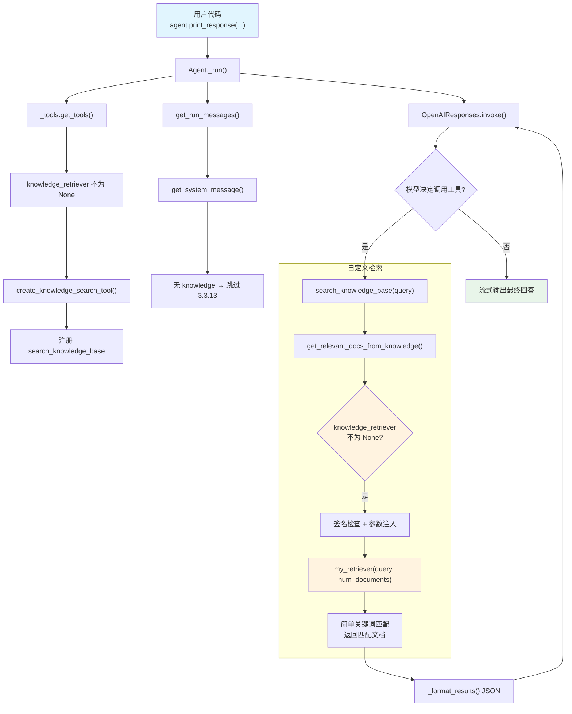

# custom_retriever.py — 实现原理分析

> 源文件：`cookbook/02_agents/07_knowledge/custom_retriever.py`

## 概述

本示例展示 Agno 的 **`knowledge_retriever`** 机制：通过自定义检索函数替代默认的 `Knowledge.search()`，让 Agent 使用用户提供的任意检索逻辑（内存搜索、外部 API、自定义数据库等）作为 `search_knowledge_base` 工具的后端。`knowledge_retriever` 优先级高于 `knowledge`，两者可以共存但 retriever 优先。

**核心配置一览：**

| 配置项 | 值 | 说明 |
|--------|------|------|
| `name` | `None` | 未设置 |
| `model` | `OpenAIResponses(id="gpt-5.2")` | Responses API |
| `knowledge` | `None` | 未使用 Knowledge 实例 |
| `knowledge_retriever` | `my_retriever` | 自定义检索函数 |
| `search_knowledge` | `True`（默认） | 启用搜索工具（自动生效） |
| `markdown` | `True` | 输出 Markdown 格式 |
| `instructions` | `None` | 未设置 |
| `tools` | `None` | 无额外工具 |
| `references_format` | `"json"`（默认） | 搜索结果 JSON 格式 |

## 架构分层

```
用户代码层                      agno.agent 层
┌──────────────────────┐      ┌──────────────────────────────────────────┐
│ custom_retriever.py  │      │ Agent._run()                             │
│                      │      │  ├ _tools.get_tools()                    │
│ knowledge_retriever= │      │  │  └ create_knowledge_search_tool()     │
│   my_retriever       │─────>│  │       → search_knowledge_base 工具     │
│                      │      │  │                                        │
│ 无 Knowledge 实例    │      │  ├ _messages.get_run_messages()           │
│                      │      │  │  ├ get_system_message()                │
│ DOCUMENTS = [...]    │      │  │  │  └ 3.3.13 跳过（无 knowledge）     │
│                      │      │  │  └ get_user_message()                  │
│ def my_retriever():  │      │  │                                        │
│   简单关键词匹配     │      │  └ Model.response() → 工具调用循环        │
│                      │      │     └ search_knowledge_base(query)        │
│                      │      │        → get_relevant_docs_from_knowledge │
│                      │      │           → my_retriever(query, ...)      │
└──────────────────────┘      └──────────────────────────────────────────┘
                                        │
                                        ▼
                              ┌──────────────────┐
                              │ OpenAIResponses   │
                              │ gpt-5.2           │
                              └──────────────────┘
```

## 核心组件解析

### knowledge_retriever 自定义检索函数

用户提供的检索函数签名灵活，支持自动参数注入：

```python
# custom_retriever.py L37-49
def my_retriever(
    query: str, num_documents: Optional[int] = None, **kwargs
) -> Optional[List[dict]]:
    """Search documents by simple keyword matching."""
    query_lower = query.lower()
    results = [
        doc for doc in DOCUMENTS
        if query_lower in doc["content"].lower() or query_lower in doc["title"].lower()
    ]
    if num_documents:
        results = results[:num_documents]
    return results if results else None
```

### knowledge_retriever 的调用路径

`get_relevant_docs_from_knowledge()`（`_messages.py:1716`）中，`knowledge_retriever` 优先于 `knowledge.retrieve()`：

```python
# agent/_messages.py L1716-1732
if agent.knowledge_retriever is not None and callable(agent.knowledge_retriever):
    sig = signature(agent.knowledge_retriever)
    knowledge_retriever_kwargs: Dict[str, Any] = {}
    # 自动参数注入：检查签名中是否有 agent/filters/run_context/dependencies
    if "agent" in sig.parameters:
        knowledge_retriever_kwargs = {"agent": agent}
    if "filters" in sig.parameters:
        knowledge_retriever_kwargs["filters"] = filters
    if "run_context" in sig.parameters:
        knowledge_retriever_kwargs["run_context"] = run_context
    elif "dependencies" in sig.parameters:
        knowledge_retriever_kwargs["dependencies"] = dependencies
    knowledge_retriever_kwargs.update({"query": query, "num_documents": num_documents, **kwargs})
    return agent.knowledge_retriever(**knowledge_retriever_kwargs)
```

**参数注入映射：**

| 检索函数参数名 | 注入内容 | 说明 |
|---------------|---------|------|
| `query` | 搜索查询字符串 | 必需 |
| `num_documents` | 文档数量限制 | 可选 |
| `agent` | Agent 实例 | 按签名注入 |
| `filters` | 知识过滤器 | 按签名注入 |
| `run_context` | RunContext 对象 | 按签名注入 |
| `dependencies` | 依赖字典（向后兼容） | 当无 `run_context` 时 |

### 工具注册条件

`_tools.py:176` 的注册条件为 `resolved_knowledge is not None or agent.knowledge_retriever is not None`，因此即使没有 `Knowledge` 实例，仅设置 `knowledge_retriever` 也会注册 `search_knowledge_base` 工具。

### 无 Knowledge 时 system prompt 的变化

由于 `knowledge=None`，步骤 3.3.13 中 `_get_resolved_knowledge()` 返回 `None`，不会注入搜索指令。但工具仍然可用，模型会通过工具的 docstring 了解如何使用它。

## System Prompt 组装

| 序号 | 组成部分 | 本文件中的值/来源 | 是否生效 |
|------|---------|-----------------|---------|
| 1 | `system_message`（自定义） | `None` | 否 |
| 3.1 | `instructions` | `None` | 否 |
| 3.1.1 | 模型指令 | OpenAIResponses 默认 | 视模型 |
| 3.2.1 | `markdown` | `True` | 是 |
| 3.2.2 | `add_datetime_to_context` | `False` | 否 |
| 3.2.3 | `add_location_to_context` | `False` | 否 |
| 3.2.4 | `add_name_to_context` | `False` | 否 |
| 3.3.1 | `description` | `None` | 否 |
| 3.3.2 | `role` | `None` | 否 |
| 3.3.3 | instructions 拼接 | 无 | 否 |
| 3.3.4 | additional_information | `markdown` 指令 | 是 |
| 3.3.5 | `_tool_instructions` | 无 | 否 |
| fmt | `resolve_in_context` 变量替换 | `True`（默认） | 是（无模板变量） |
| 3.3.7 | `expected_output` | `None` | 否 |
| 3.3.8 | `additional_context` | `None` | 否 |
| 3.3.9 | `add_memories_to_context` | `None` | 否 |
| 3.3.10 | `add_culture_to_context` | `None` | 否 |
| 3.3.11 | `add_session_summary_to_context` | `None` | 否 |
| 3.3.12 | `add_learnings_to_context` | `True`（默认），但无 `_learning` | 否 |
| 3.3.13 | `search_knowledge` instructions | `knowledge=None` → 跳过 | **否** |
| 3.3.14 | 模型 system message | 视模型 | 视模型 |
| 3.3.15 | JSON output prompt | 无 | 否 |
| 3.3.16 | response model format prompt | 无 | 否 |
| 3.3.17 | `add_session_state_to_context` | `False` | 否 |

### 最终 System Prompt

```text
<additional_information>
- Use markdown to format your answers.
</additional_information>
```

## 完整 API 请求

**第一轮：模型决定搜索**

```python
client.responses.create(
    model="gpt-5.2",
    input=[
        {"role": "developer", "content": "<additional_information>\n- Use markdown to format your answers.\n</additional_information>"},
        {"role": "user", "content": "Tell me about Python."}
    ],
    tools=[
        {
            "type": "function",
            "function": {
                "name": "search_knowledge_base",
                "description": "Use this function to search the knowledge base for information about a query.",
                "parameters": {
                    "type": "object",
                    "properties": {
                        "query": {"type": "string", "description": "The query to search for."}
                    },
                    "required": ["query"]
                }
            }
        }
    ],
    stream=True,
    stream_options={"include_usage": True}
)
```

**第二轮：自定义检索结果返回**

```python
client.responses.create(
    model="gpt-5.2",
    input=[
        {"role": "developer", "content": "..."},
        {"role": "user", "content": "Tell me about Python."},
        {"type": "function_call", "name": "search_knowledge_base", "arguments": "{\"query\": \"Python\"}"},
        # my_retriever 返回的结果（JSON 格式化）
        {"type": "function_call_output", "output": "[{\"title\": \"Python Basics\", \"content\": \"Python is a high-level programming language known for its readability.\"}]"}
    ],
    tools=[...],
    stream=True,
    stream_options={"include_usage": True}
)
```

## Mermaid 流程图



## 关键源码文件索引

| 文件 | 关键函数/类 | 作用 |
|------|------------|------|
| `agno/agent/agent.py` | `knowledge_retriever` L148 | 自定义检索函数属性 |
| `agno/agent/agent.py` | `search_knowledge` L195 | 搜索工具开关 |
| `agno/agent/_tools.py` | 知识搜索工具注册 L176 | `knowledge_retriever is not None` 条件 |
| `agno/agent/_default_tools.py` | `create_knowledge_search_tool()` L103 | 创建搜索工具 |
| `agno/agent/_messages.py` | `get_relevant_docs_from_knowledge()` L1665 | 检索入口 |
| `agno/agent/_messages.py` | knowledge_retriever 优先路径 L1716-1732 | 签名检查 + 参数注入调用自定义检索器 |
