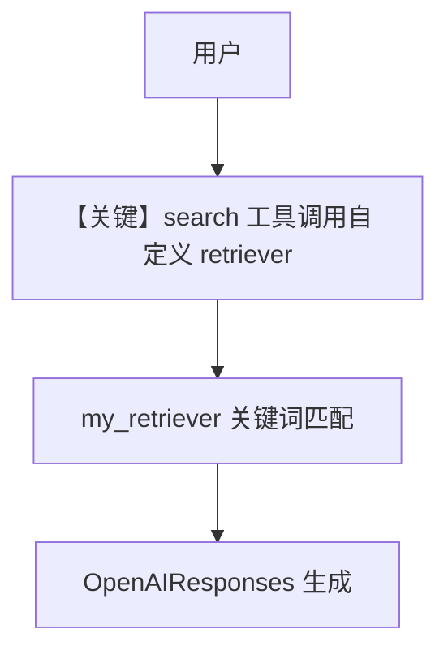

# custom_retriever.py — 实现原理分析

> 源文件：`cookbook/02_agents/07_knowledge/custom_retriever.py`

## 概述

本示例展示 **`knowledge_retriever` 可调用对象** 机制：不传 `Knowledge` 实例，而传入自定义函数 `my_retriever(query, num_documents, **kwargs)`，框架将其包装为与内置知识库等价的 **检索工具路径**，仍配合 `search_knowledge` 默认 **`True`** 注入检索说明（若框架对纯 retriever 的 `build_context` 行为与 `Knowledge` 一致，则见协议实现）。

**核心配置一览：**

| 配置项 | 值 | 说明 |
|--------|------|------|
| `model` | `OpenAIResponses(id="gpt-5.2")` | Responses API |
| `knowledge_retriever` | `my_retriever` | 自定义同步检索 |
| `knowledge` | `None` | 未使用 |
| `markdown` | `True` | 是 |
| `search_knowledge` | 默认（对 retriever 为 True） | 与注释一致 |

## 核心组件解析

### 自定义 Retriever 协议

`agent.py` 注释（约 L146–150）说明签名：返回 `Optional[list[dict]]` 等。内存示例用关键词过滤 `DOCUMENTS`。

### 与 `Knowledge` 对比

无向量库、无 `insert`；数据在进程内静态列表，适合演示 **任意后端** 接插件。

### 运行机制与因果链

1. **路径**：用户问「Tell me about Python.」→ 模型调用 **`search_knowledge_base`**（或等价名）→ 调用 `my_retriever` → 返回 dict 列表 → 模型总结。
2. **无副作用持久化**（除非自行扩展 retriever 写外部库）。
3. **定位**：相对 `agentic_rag.py`，本文件演示 **完全自定义检索逻辑**，不绑定 `PgVector`/`LanceDb`。

## System Prompt 组装

含 `markdown` 段；知识段若由 **RemoteKnowledge 协议** 的 `build_context` 提供，需查 `agno/knowledge/protocol.py` 对纯 callable 的包装。若静态路径仍注入标准「search_knowledge_base」说明，则与 `Knowledge._SEARCH_KNOWLEDGE_INSTRUCTIONS` 语义类似。

参照用户句：`Tell me about Python.`

## 完整 API 请求

主对话仍为 `responses.create`。

## Mermaid 流程图

```mermaid
flowchart TD
    U["用户"] --> T["【关键】search 工具调用自定义 retriever"]
    T --> R["my_retriever 关键词匹配"]
    R --> L["OpenAIResponses 生成"]
```

## 关键源码文件索引

| 文件 | 作用 |
|------|------|
| `agno/agent/agent.py` | `knowledge_retriever` 属性 |
| `agno/agent/_tools.py` | 检索工具装配（若存在） |
| `agno/knowledge/protocol.py` | 可插拔知识协议 |
