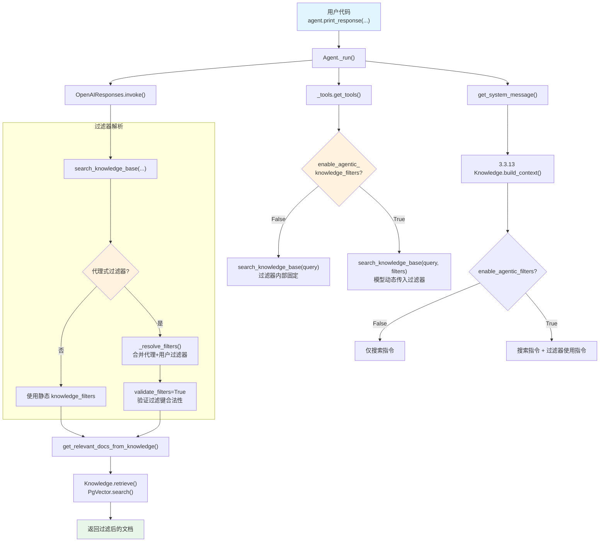

# knowledge_filters.py — 实现原理分析

> 源文件：`cookbook/02_agents/07_knowledge/knowledge_filters.py`

## 概述

本示例展示 Agno 的 **知识库过滤器** 机制，通过两种方式控制知识库搜索范围：**静态过滤器**（`knowledge_filters`）在 Agent 创建时固定，对所有搜索生效；**代理式过滤器**（`enable_agentic_knowledge_filters`）让模型在运行时动态选择过滤条件。搭配 `FilterExpr`（如 `EQ`）提供类型安全的过滤表达式。

**核心配置一览：**

| 配置项 | agent_static | agent_agentic |
|--------|-------------|---------------|
| `model` | `OpenAIResponses(id="gpt-5.2")` | `OpenAIResponses(id="gpt-5.2")` |
| `knowledge` | `Knowledge(PgVector)` | `Knowledge(PgVector)` |
| `search_knowledge` | `True` | `True` |
| `knowledge_filters` | `[EQ("cuisine", "thai")]` | `None` |
| `enable_agentic_knowledge_filters` | `False`（默认） | `True` |
| `markdown` | `True` | `True` |

## 架构分层

```
用户代码层                          agno.agent 层
┌──────────────────────────┐      ┌──────────────────────────────────────────────┐
│ knowledge_filters.py     │      │ Agent._run()                                 │
│                          │      │  ├ _tools.get_tools()                        │
│ ┌─ agent_static ────┐   │      │  │  └ create_knowledge_search_tool(           │
│ │ knowledge_filters= │   │      │  │      knowledge_filters=...,               │
│ │  [EQ("cuisine",   │──>│      │  │      enable_agentic_filters=...)           │
│ │    "thai")]        │   │      │  │                                            │
│ └────────────────────┘   │      │  │  静态: search_knowledge_base(query)        │
│                          │      │  │  代理: search_knowledge_base(query,filters)│
│ ┌─ agent_agentic ───┐   │      │  │                                            │
│ │ enable_agentic_    │──>│      │  ├ _messages.get_system_message()             │
│ │ knowledge_filters= │   │      │  │  └ 3.3.13 build_context(                  │
│ │   True             │   │      │  │      enable_agentic_filters=True)          │
│ └────────────────────┘   │      │  │     → 注入过滤器使用指令                   │
│                          │      │  │                                            │
│ EQ("cuisine","thai")     │      │  └ Model.response() → 工具调用               │
│   → FilterExpr 类型安全   │      │     └ search_knowledge_base(query, filters?) │
└──────────────────────────┘      └──────────────────────────────────────────────┘
                                            │
                                            ▼
                                  ┌──────────────────┐
                                  │ OpenAIResponses   │
                                  │ gpt-5.2           │
                                  └──────────────────┘
```

## 核心组件解析

### FilterExpr 过滤表达式

`EQ` 是 `FilterExpr` 的子类（`filters.py:86`），提供类型安全的等值过滤：

```python
# agno/filters.py L86-106
class EQ(FilterExpr):
    """Equality filter - matches documents where a field equals a specific value."""
    def __init__(self, key: str, value: Any):
        self.key = key
        self.value = value

    def to_dict(self) -> dict:
        return {"op": "EQ", "key": self.key, "value": self.value}
```

`FilterExpr` 还支持逻辑组合：`AND`、`OR`、`NOT`，以及运算符重载（`|`、`&`、`~`）。

### 静态过滤器路径

当 `enable_agentic_knowledge_filters=False`（默认）时，`create_knowledge_search_tool()`（`_default_tools.py:222`）生成无 `filters` 参数的工具函数：

```python
# agent/_default_tools.py L224-250
def search_knowledge_base(query: str) -> str:
    docs = _messages.get_relevant_docs_from_knowledge(
        agent, query=query,
        filters=knowledge_filters,  # 固定使用 Agent 初始化时的过滤器
        run_context=run_context,
    )
    return _format_results(docs)
```

`knowledge_filters` 在 `_tools.get_tools()` 中从 `run_context.knowledge_filters` 传入（`_tools.py:182`），该值来源于 Agent 的 `knowledge_filters` 属性。

### 代理式过滤器路径

当 `enable_agentic_knowledge_filters=True` 时，工具函数签名增加 `filters` 参数（`_default_tools.py:156`）：

```python
# agent/_default_tools.py L156-184
def search_knowledge_base_with_filters(
    query: str, filters: Optional[List[KnowledgeFilter]] = None
) -> str:
    """Use this function to search the knowledge base for information about a query.
    Args:
        query: The query to search for.
        filters (optional): The filters to apply to the search.
    """
    docs = _messages.get_relevant_docs_from_knowledge(
        agent, query=query,
        filters=_resolve_filters(filters),  # 合并代理选择的过滤器
        validate_filters=True,              # 验证过滤键合法性
        run_context=run_context,
    )
    return _format_results(docs)
```

`_resolve_filters()`（`_default_tools.py:141`）合并代理过滤器和用户过滤器：

```python
# agent/_default_tools.py L141-152
def _resolve_filters(agentic_filters=None):
    if agentic_filters:
        filters_dict = {}
        for filt in agentic_filters:
            if isinstance(filt, dict):
                filters_dict.update(filt)
            elif hasattr(filt, "key") and hasattr(filt, "value"):
                filters_dict[filt.key] = filt.value
        return get_agentic_or_user_search_filters(filters_dict, knowledge_filters)
    return knowledge_filters  # 无代理过滤器时回退到用户过滤器
```

### System Prompt 中的过滤器指令

当 `enable_agentic_knowledge_filters=True` 时，`Knowledge.build_context()`（`knowledge.py:2908`）会额外注入过滤器使用指令：

```python
# knowledge/knowledge.py L2928-2931
if enable_agentic_filters:
    valid_filters = self.get_valid_filters()  # 从向量数据库获取合法过滤键
    if valid_filters:
        context_parts.append(self._get_agentic_filter_instructions(valid_filters))
```

过滤器指令模板（`knowledge.py:2885-2901`）包含示例和规则，教模型如何使用过滤器参数。

### 过滤器优先级

`get_agentic_or_user_search_filters()`（`utils/knowledge.py:7`）处理优先级：

| 代理过滤器 | 用户过滤器 | 最终使用 |
|-----------|-----------|---------|
| 有 | 无 | 代理过滤器 |
| 有 | 有 | **用户过滤器**（用户优先） |
| 无 | 有 | 用户过滤器 |
| 无 | 无 | 空（无过滤） |

## System Prompt 组装

### agent_static（静态过滤器）

| 序号 | 组成部分 | 值 | 是否生效 |
|------|---------|---|---------|
| 3.2.1 | `markdown` | `True` | 是 |
| 3.3.13 | `search_knowledge` instructions | `build_context(enable_agentic_filters=False)` | **是** |
| 其他 | — | — | 否 |

```text
<additional_information>
- Use markdown to format your answers.
</additional_information>

<knowledge_base>
You have a knowledge base you can search using the search_knowledge_base tool. Search before answering questions—don't assume you know the answer. For ambiguous questions, search first rather than asking for clarification.
</knowledge_base>
```

### agent_agentic（代理式过滤器）

| 序号 | 组成部分 | 值 | 是否生效 |
|------|---------|---|---------|
| 3.2.1 | `markdown` | `True` | 是 |
| 3.3.13 | `search_knowledge` instructions | `build_context(enable_agentic_filters=True)` | **是（含过滤器指令）** |
| 其他 | — | — | 否 |

```text
<additional_information>
- Use markdown to format your answers.
</additional_information>

<knowledge_base>
You have a knowledge base you can search using the search_knowledge_base tool. Search before answering questions—don't assume you know the answer. For ambiguous questions, search first rather than asking for clarification.

The knowledge base contains documents with these metadata filters: cuisine, source, ...
Always use filters when the user query indicates specific metadata.

Examples:
1. If the user asks about a specific person like "Jordan Mitchell", you MUST use the search_knowledge_base tool with the filters parameter...
...
</knowledge_base>
```

## 完整 API 请求

### agent_static — 静态过滤器

```python
client.responses.create(
    model="gpt-5.2",
    input=[
        {"role": "developer", "content": "...（含 markdown + knowledge_base 指令）"},
        {"role": "user", "content": "What soup recipes do you have?"}
    ],
    tools=[
        {
            "type": "function",
            "function": {
                "name": "search_knowledge_base",
                "description": "Use this function to search the knowledge base for information about a query.",
                "parameters": {
                    "type": "object",
                    "properties": {
                        "query": {"type": "string"}
                    },
                    "required": ["query"]
                }
            }
        }
    ],
    stream=True,
    stream_options={"include_usage": True}
)
```

> 注意：工具签名无 `filters` 参数。过滤器 `EQ("cuisine", "thai")` 在工具内部硬编码。

### agent_agentic — 代理式过滤器

```python
client.responses.create(
    model="gpt-5.2",
    input=[
        {"role": "developer", "content": "...（含 markdown + knowledge_base + 过滤器指令）"},
        {"role": "user", "content": "Find me a Thai dessert recipe."}
    ],
    tools=[
        {
            "type": "function",
            "function": {
                "name": "search_knowledge_base",
                "description": "Use this function to search the knowledge base for information about a query.",
                "parameters": {
                    "type": "object",
                    "properties": {
                        "query": {"type": "string"},
                        "filters": {
                            "type": "array",
                            "items": {
                                "type": "object",
                                "properties": {
                                    "key": {"type": "string"},
                                    "value": {"type": "string"}
                                }
                            },
                            "description": "The filters to apply to the search."
                        }
                    },
                    "required": ["query"]
                }
            }
        }
    ],
    stream=True,
    stream_options={"include_usage": True}
)
```

> 模型可能调用 `search_knowledge_base(query="Thai dessert", filters=[{"key": "cuisine", "value": "thai"}])`。

## Mermaid 流程图



## 关键源码文件索引

| 文件 | 关键函数/类 | 作用 |
|------|------------|------|
| `agno/agent/agent.py` | `knowledge_filters` L139 | 静态过滤器属性 |
| `agno/agent/agent.py` | `enable_agentic_knowledge_filters` L141 | 代理式过滤器开关 |
| `agno/filters.py` | `FilterExpr` L46 | 过滤表达式基类 |
| `agno/filters.py` | `EQ` L86 | 等值过滤器 |
| `agno/agent/_tools.py` | 知识搜索工具注册 L176-186 | 传递过滤器参数 |
| `agno/agent/_default_tools.py` | `create_knowledge_search_tool()` L103 | 根据 enable_agentic_filters 选择工具签名 |
| `agno/agent/_default_tools.py` | `search_knowledge_base_with_filters()` L156 | 带过滤器的搜索工具 |
| `agno/agent/_default_tools.py` | `_resolve_filters()` L141 | 合并代理/用户过滤器 |
| `agno/utils/knowledge.py` | `get_agentic_or_user_search_filters()` L7 | 过滤器优先级逻辑 |
| `agno/knowledge/knowledge.py` | `build_context()` L2908 | 构建含过滤器指令的 system prompt |
| `agno/knowledge/knowledge.py` | `_get_agentic_filter_instructions()` L2903 | 生成过滤器使用指令 |
| `agno/knowledge/knowledge.py` | `_AGENTIC_FILTER_INSTRUCTION_TEMPLATE` L2885 | 过滤器指令模板 |
