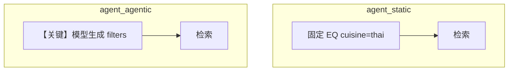

# knowledge_filters.py — 实现原理分析

<!-- cookbook-py-source:start -->
## 完整源码

```python
"""
Knowledge Filters
=============================

Filter knowledge base searches using static filters or agentic filters.

Static filters are set at agent creation time and apply to every search.
Agentic filters let the agent dynamically choose filter values at runtime.
"""

from agno.agent import Agent
from agno.filters import EQ
from agno.knowledge.embedder.openai import OpenAIEmbedder
from agno.knowledge.knowledge import Knowledge
from agno.models.openai import OpenAIResponses
from agno.vectordb.pgvector import PgVector, SearchType

db_url = "postgresql+psycopg://ai:ai@localhost:5532/ai"
knowledge = Knowledge(
    vector_db=PgVector(
        table_name="recipes_filters_demo",
        db_url=db_url,
        search_type=SearchType.hybrid,
        embedder=OpenAIEmbedder(id="text-embedding-3-small"),
    ),
)

# ---------------------------------------------------------------------------
# Create Agent With Static Filters
# ---------------------------------------------------------------------------
# Static filters: only retrieve documents matching these criteria
agent_static = Agent(
    model=OpenAIResponses(id="gpt-5.2"),
    knowledge=knowledge,
    search_knowledge=True,
    # Use FilterExpr objects for type-safe filtering
    knowledge_filters=[EQ("cuisine", "thai")],
    markdown=True,
)

# ---------------------------------------------------------------------------
# Create Agent With Agentic Filters
# ---------------------------------------------------------------------------
# Agentic filters: the agent decides filter values dynamically
agent_agentic = Agent(
    model=OpenAIResponses(id="gpt-5.2"),
    knowledge=knowledge,
    search_knowledge=True,
    # Let the agent choose filter values based on the user's query
    enable_agentic_knowledge_filters=True,
    markdown=True,
)

# ---------------------------------------------------------------------------
# Run Agent
# ---------------------------------------------------------------------------
if __name__ == "__main__":
    knowledge.insert(url="https://agno-public.s3.amazonaws.com/recipes/ThaiRecipes.pdf")

    print("--- Static filters (cuisine=thai) ---")
    agent_static.print_response(
        "What soup recipes do you have?",
        stream=True,
    )

    print("\n--- Agentic filters ---")
    agent_agentic.print_response(
        "Find me a Thai dessert recipe.",
        stream=True,
    )
```

<!-- cookbook-py-source:end -->

> 源文件：`cookbook/02_agents/07_knowledge/knowledge_filters.py`

## 概述

本示例展示 **静态过滤与 Agentic 过滤** 两种知识检索约束：`knowledge_filters=[EQ("cuisine", "thai")]` 在每次检索强制元数据等于 Thai；`enable_agentic_knowledge_filters=True` 让模型在调用 `search_knowledge_base` 时 **动态传入 filters**（配合 `Knowledge.build_context` 中的 agentic 说明段）。

**核心配置一览（两个 Agent）：**

| Agent | `knowledge_filters` | `enable_agentic_knowledge_filters` |
|--------|---------------------|-------------------------------------|
| `agent_static` | `[EQ("cuisine", "thai")]` | 默认 `False` |
| `agent_agentic` | `None` | `True` |

共用：`OpenAIResponses(id="gpt-5.2")`、`knowledge`（`PgVector` 表 `recipes_filters_demo`）、`search_knowledge=True`、`markdown=True`。

## 核心组件解析

### 静态过滤器

在 `get_tools` / 搜索调用路径中合并 **固定 FilterExpr**，用户无法改变 cuisine。

### Agentic 过滤器

`Knowledge.build_context(enable_agentic_filters=True)` 追加 `_AGENTIC_FILTER_INSTRUCTION_TEMPLATE`（`knowledge.py` 约 L2885+），列出合法 metadata 键并约束工具参数结构。

### 运行机制与因果链

1. **路径**：同一 PDF 入库 → `agent_static` 问汤品 → 检索始终带 `cuisine=thai`；`agent_agentic` 问甜品 → 模型自选 filters。
2. **副作用**：Postgres/pgvector 数据；表名 `recipes_filters_demo`。
3. **对照**：静态 = **配置时锁定**；Agentic = **运行时由模型填 filters**。

## System Prompt 组装

- 二者均含标准 `<knowledge_base>` 段。
- **仅 `agent_agentic`** 额外包含长段 **agentic filter 指导**（模板见 `knowledge.py`）。

静态 Agent 用户句：`What soup recipes do you have?`  
Agentic 用户句：`Find me a Thai dessert recipe.`

## 完整 API 请求

`OpenAIResponses` → `responses.create`；过滤不改 API 形态，只改工具参数或 ORM 查询。

## Mermaid 流程图


```mermaid
flowchart TD
    subgraph Static["agent_static"]
        A1["固定 EQ cuisine=thai"] --> S1["检索"]
    end
    subgraph Agentic["agent_agentic"]
        A2["【关键】模型生成 filters"] --> S2["检索"]
    end
```

## 关键源码文件索引

| 文件 | 作用 |
|------|------|
| `agno/knowledge/knowledge.py` | `build_context`；agentic 模板 |
| `agno/filters` | `EQ` 等表达式 |
| `agno/agent/agent.py` | `knowledge_filters`；`enable_agentic_knowledge_filters` |
