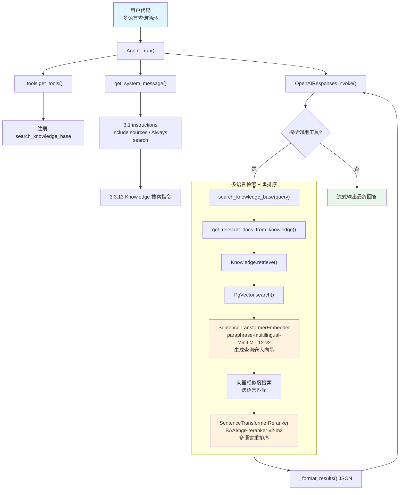

# rag_custom_embeddings.py — 实现原理分析

> 源文件：`cookbook/02_agents/07_knowledge/rag_custom_embeddings.py`

## 概述

本示例展示 Agno 的 **自定义嵌入 + 重排序** 机制：使用 **SentenceTransformerEmbedder**（开源多语言嵌入模型）和 **SentenceTransformerReranker**（开源重排序模型）替代商业 API，实现完全本地化的多语言 Agentic RAG。搭配 **PgVector** 向量数据库，支持英语、德语、西班牙语、中文、日文等多语言文档检索。

**核心配置一览：**

| 配置项 | 值 | 说明 |
|--------|------|------|
| `name` | `None` | 未设置 |
| `model` | `OpenAIResponses(id="gpt-5.2")` | Responses API |
| `knowledge` | `Knowledge(vector_db=PgVector(...))` | PgVector + 自定义嵌入/重排序 |
| `search_knowledge` | `True` | 启用 Agentic RAG |
| `instructions` | `["Include sources...", "Always search..."]` | 自定义指令 |
| `markdown` | `True` | 输出 Markdown 格式 |

**PgVector 向量数据库配置：**

| 配置项 | 值 | 说明 |
|--------|------|------|
| `table_name` | `"sentence_transformer_rerank_docs"` | 表名 |
| `db_url` | `"postgresql+psycopg://ai:ai@localhost:5532/ai"` | PostgreSQL 连接 |
| `embedder` | `SentenceTransformerEmbedder(id="...paraphrase-multilingual-MiniLM-L12-v2")` | 开源多语言嵌入 |
| `reranker` | `SentenceTransformerReranker(model="BAAI/bge-reranker-v2-m3")` | 开源多语言重排序 |

## 架构分层

```
用户代码层                        agno.agent 层
┌────────────────────────┐      ┌────────────────────────────────────────────┐
│ rag_custom_embeddings  │      │ Agent._run()                               │
│   .py                  │      │  ├ _tools.get_tools()                      │
│                        │      │  │  └ search_knowledge_base 工具            │
│ knowledge=Knowledge    │      │  │                                          │
│   vector_db=PgVector   │─────>│  ├ get_system_message()                     │
│     embedder=          │      │  │  ├ 3.1 instructions                     │
│       SentenceTransf.  │      │  │  ├ 3.3.4 markdown 指令                  │
│     reranker=          │      │  │  └ 3.3.13 搜索指令                      │
│       SentenceTransf.  │      │  │                                          │
│                        │      │  └ Model.response() → Agentic Loop         │
│ search_results = [     │      │     └ search_knowledge_base(query)          │
│   英/德/西/中/日文档   │      │        → Knowledge.retrieve()               │
│ ]                      │      │           → PgVector.search()               │
│                        │      │              ├ SentenceTransformer 嵌入     │
│ for result in ...:     │      │              └ BGE-Reranker 重排序          │
│   knowledge.insert()   │      │                                              │
└────────────────────────┘      └────────────────────────────────────────────┘
                                          │
                                          ▼
                                ┌──────────────────┐
                                │ OpenAIResponses   │
                                │ gpt-5.2           │
                                └──────────────────┘
```

## 核心组件解析

### SentenceTransformerEmbedder

使用 HuggingFace 的 `sentence-transformers/paraphrase-multilingual-MiniLM-L12-v2` 模型在本地生成嵌入向量。与 OpenAIEmbedder 的对比：

| 维度 | SentenceTransformerEmbedder | OpenAIEmbedder |
|------|---------------------------|----------------|
| 运行位置 | 本地（CPU/GPU） | OpenAI API |
| 费用 | 免费 | 按 token 计费 |
| 多语言 | 原生多语言支持（50+ 语言） | 支持但非原生 |
| 模型大小 | ~471MB | N/A（API 调用） |
| 维度 | 384 | 1536（text-embedding-3-small） |

### SentenceTransformerReranker

使用 `BAAI/bge-reranker-v2-m3` 模型在本地执行重排序。与 CohereReranker 的对比：

| 维度 | SentenceTransformerReranker | CohereReranker |
|------|---------------------------|----------------|
| 运行位置 | 本地 | Cohere API |
| 费用 | 免费 | 按请求计费 |
| 多语言 | 原生多语言 | 取决于模型版本 |
| 模型 | BAAI/bge-reranker-v2-m3 | rerank-v3.5 |

### 多语言文档插入

本示例通过循环逐条插入多语言文档（含 metadata）：

```python
# rag_custom_embeddings.py L39-45
for result in search_results:
    knowledge.insert(
        text_content=result,         # 直接文本内容
        metadata={"source": "search_results"},  # 元数据
    )
```

`Knowledge.insert(text_content=...)` 路径：创建 `FileData(content=text_content, type="Text")`，然后分块、嵌入、存储到 PgVector。

### 多次查询演示

```python
test_queries = [
    "What organic skincare products are good for sensitive skin?",  # 英语
    "Tell me about makeup trends in different languages",           # 跨语言
    "Compare skincare and makeup information across languages",     # 跨语言比较
]
for query in test_queries:
    agent.print_response(query, stream=True, show_full_reasoning=True)
```

多语言嵌入模型能在统一向量空间中匹配不同语言的相似内容。

## System Prompt 组装

| 序号 | 组成部分 | 本文件中的值/来源 | 是否生效 |
|------|---------|-----------------|---------|
| 1 | `system_message`（自定义） | `None` | 否 |
| 3.1 | `instructions` | `["Include sources...", "Always search..."]` | **是** |
| 3.1.1 | 模型指令 | OpenAIResponses 默认 | 视模型 |
| 3.2.1 | `markdown` | `True` | 是 |
| 3.2.2 | `add_datetime_to_context` | `False` | 否 |
| 3.2.3 | `add_location_to_context` | `False` | 否 |
| 3.2.4 | `add_name_to_context` | `False` | 否 |
| 3.3.1 | `description` | `None` | 否 |
| 3.3.2 | `role` | `None` | 否 |
| 3.3.3 | instructions 拼接 | 两条指令 | **是** |
| 3.3.4 | additional_information | `markdown` 指令 | 是 |
| 3.3.5 | `_tool_instructions` | 无（无 Toolkit 设置 add_instructions） | 否 |
| fmt | `resolve_in_context` | `True`（默认） | 是（无模板变量） |
| 3.3.7 | `expected_output` | `None` | 否 |
| 3.3.8 | `additional_context` | `None` | 否 |
| 3.3.9 | `add_memories_to_context` | `None` | 否 |
| 3.3.10 | `add_culture_to_context` | `None` | 否 |
| 3.3.11 | `add_session_summary_to_context` | `None` | 否 |
| 3.3.12 | `add_learnings_to_context` | 无 `_learning` | 否 |
| 3.3.13 | `search_knowledge` instructions | Knowledge.build_context() | **是** |
| 3.3.14 | 模型 system message | 视模型 | 视模型 |
| 3.3.15 | JSON output prompt | 无 | 否 |
| 3.3.16 | response model format prompt | 无 | 否 |
| 3.3.17 | `add_session_state_to_context` | `False` | 否 |

### 最终 System Prompt

```text
- Include sources in your response.
- Always search your knowledge before answering the question.

<additional_information>
- Use markdown to format your answers.
</additional_information>

<knowledge_base>
You have a knowledge base you can search using the search_knowledge_base tool. Search before answering questions—don't assume you know the answer. For ambiguous questions, search first rather than asking for clarification.
</knowledge_base>
```

## 完整 API 请求

```python
# 第一轮
client.responses.create(
    model="gpt-5.2",
    input=[
        {"role": "developer", "content": "- Include sources in your response.\n- Always search your knowledge before answering the question.\n\n<additional_information>\n- Use markdown to format your answers.\n</additional_information>\n\n<knowledge_base>\n...\n</knowledge_base>"},
        {"role": "user", "content": "What organic skincare products are good for sensitive skin?"}
    ],
    tools=[
        {
            "type": "function",
            "function": {
                "name": "search_knowledge_base",
                "description": "Use this function to search the knowledge base for information about a query.",
                "parameters": {
                    "type": "object",
                    "properties": {
                        "query": {"type": "string"}
                    },
                    "required": ["query"]
                }
            }
        }
    ],
    stream=True,
    stream_options={"include_usage": True}
)

# 第二轮（工具调用结果，SentenceTransformer 嵌入 + BGE 重排序后的文档）
client.responses.create(
    model="gpt-5.2",
    input=[
        {"role": "developer", "content": "..."},
        {"role": "user", "content": "What organic skincare products are good for sensitive skin?"},
        {"type": "function_call", "name": "search_knowledge_base",
         "arguments": "{\"query\": \"organic skincare sensitive skin\"}"},
        # 多语言文档（英/德/中/日/西）按 BGE-reranker 相关性排序
        {"type": "function_call_output", "output": "[{\"content\": \"Organic skincare for sensitive skin with aloe vera and chamomile.\", \"meta_data\": {\"source\": \"search_results\"}}, {\"content\": \"针对敏感肌专门设计的天然有机护肤产品\", \"meta_data\": {\"source\": \"search_results\"}}, ...]"}
    ],
    tools=[...],
    stream=True,
    stream_options={"include_usage": True}
)
```

> 多语言嵌入模型使英文查询能匹配到德语/中文/日语等不同语言的相关文档。

## Mermaid 流程图



## 关键源码文件索引

| 文件 | 关键函数/类 | 作用 |
|------|------------|------|
| `agno/agent/agent.py` | `knowledge` L136 | Knowledge 实例 |
| `agno/agent/agent.py` | `search_knowledge` L195 | Agentic RAG 开关 |
| `agno/agent/_tools.py` | `get_tools()` L176-186 | 注册搜索工具 |
| `agno/agent/_default_tools.py` | `create_knowledge_search_tool()` L103 | 创建搜索工具 |
| `agno/agent/_messages.py` | `get_relevant_docs_from_knowledge()` L1665 | 文档检索 |
| `agno/knowledge/knowledge.py` | `Knowledge` L41 | 知识库类 |
| `agno/knowledge/knowledge.py` | `search()` L507 | 向量搜索 |
| `agno/knowledge/knowledge.py` | `insert()` L90 | 文档插入（text_content 路径） |
| `agno/knowledge/knowledge.py` | `build_context()` L2908 | 搜索指令构建 |
| `agno/knowledge/embedder/sentence_transformer.py` | `SentenceTransformerEmbedder` | 本地多语言嵌入 |
| `agno/knowledge/reranker/sentence_transformer.py` | `SentenceTransformerReranker` | 本地多语言重排序 |
