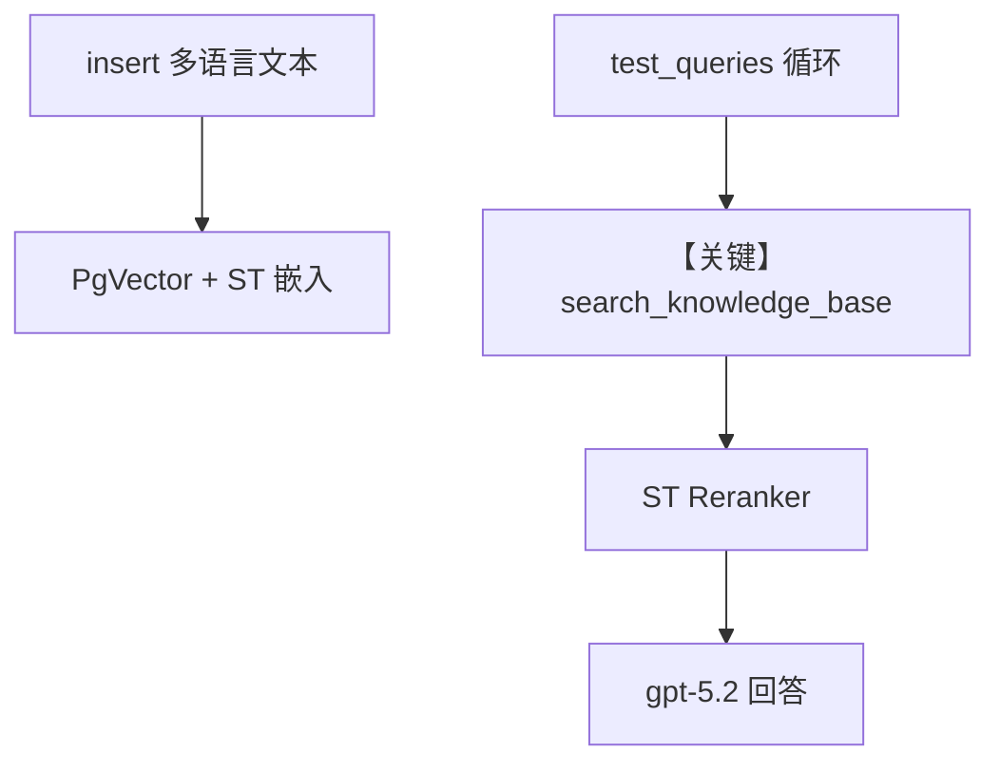

# rag_custom_embeddings.py — 实现原理分析

<!-- cookbook-py-source:start -->
## 完整源码

```python
"""
Rag Custom Embeddings
=============================

This cookbook is an implementation of Agentic RAG using Sentence Transformer Reranker with multilingual data.
"""

from agno.agent import Agent
from agno.knowledge.embedder.sentence_transformer import SentenceTransformerEmbedder
from agno.knowledge.knowledge import Knowledge
from agno.knowledge.reranker.sentence_transformer import SentenceTransformerReranker
from agno.models.openai import OpenAIResponses
from agno.vectordb.pgvector import PgVector

search_results = [
    "Organic skincare for sensitive skin with aloe vera and chamomile.",
    "New makeup trends focus on bold colors and innovative techniques",
    "Bio-Hautpflege für empfindliche Haut mit Aloe Vera und Kamille",
    "Neue Make-up-Trends setzen auf kräftige Farben und innovative Techniken",
    "Cuidado de la piel orgánico para piel sensible con aloe vera y manzanilla",
    "Las nuevas tendencias de maquillaje se centran en colores vivos y técnicas innovadoras",
    "针对敏感肌专门设计的天然有机护肤产品",
    "新的化妆趋势注重鲜艳的颜色和创新的技巧",
    "敏感肌のために特別に設計された天然有機スキンケア製品",
    "新しいメイクのトレンドは鮮やかな色と革新的な技術に焦点を当てています",
]

knowledge = Knowledge(
    vector_db=PgVector(
        db_url="postgresql+psycopg://ai:ai@localhost:5532/ai",
        table_name="sentence_transformer_rerank_docs",
        embedder=SentenceTransformerEmbedder(
            id="sentence-transformers/paraphrase-multilingual-MiniLM-L12-v2"
        ),
        reranker=SentenceTransformerReranker(model="BAAI/bge-reranker-v2-m3"),
    ),
)

for result in search_results:
    knowledge.insert(
        text_content=result,
        metadata={
            "source": "search_results",
        },
    )


# ---------------------------------------------------------------------------
# Create Agent
# ---------------------------------------------------------------------------
agent = Agent(
    model=OpenAIResponses(id="gpt-5.2"),
    knowledge=knowledge,
    search_knowledge=True,
    instructions=[
        "Include sources in your response.",
        "Always search your knowledge before answering the question.",
    ],
    markdown=True,
)


# ---------------------------------------------------------------------------
# Run Agent
# ---------------------------------------------------------------------------
if __name__ == "__main__":
    test_queries = [
        "What organic skincare products are good for sensitive skin?",
        "Tell me about makeup trends in different languages",
        "Compare skincare and makeup information across languages",
    ]

    for query in test_queries:
        agent.print_response(
            query,
            stream=True,
            show_full_reasoning=True,
        )
```

<!-- cookbook-py-source:end -->

> 源文件：`cookbook/02_agents/07_knowledge/rag_custom_embeddings.py`

## 概述

本示例展示 **Sentence-Transformers 嵌入 + 本地重排序** 与 **多语言文本** 的 Agentic RAG：`SentenceTransformerEmbedder` 与 `SentenceTransformerReranker` 接入 `PgVector`，预置多语言 `search_results` 写入元数据；Agent 带显式检索指令并循环多条测试查询。

**核心配置一览：**

| 配置项 | 值 | 说明 |
|--------|------|------|
| `model` | `OpenAIResponses(id="gpt-5.2")` | 主模型 Responses API |
| `knowledge` | `Knowledge(PgVector(..., SentenceTransformerEmbedder, SentenceTransformerReranker))` | PG 向量库 + ST 管线 |
| `search_knowledge` | `True` | Agentic 检索 |
| `instructions` | 两条（与 reasoning RAG 示例相同） | 见下 |
| `markdown` | `True` | 是 |

字面量 `instructions`：

```text
Include sources in your response.
Always search your knowledge before answering the question.
```

## 核心组件解析

### 本地嵌入与重排

不依赖 OpenAI/Cohere 嵌入时，使用 HuggingFace 兼容模型 ID；重排器 `BAAI/bge-reranker-v2-m3` 在检索后精排。

### 运行机制与因果链

1. 脚本顶部循环 `knowledge.insert(text_content=..., metadata=...)` 灌库。
2. `for query in test_queries` 三次 `print_response`，每次可走 **`search_knowledge_base`**。
3. **定位**：强调 **开源嵌入生态** 与 **多语言评测查询**。

## System Prompt 组装

含 `markdown`、用户 `instructions`、`<knowledge_base>` 标准段（同前述 RAG 示例）。

## 完整 API 请求

主对话：`responses.create`；嵌入/重排在插入与检索时由 SentenceTransformer 栈本地或远程加载模型执行。

## Mermaid 流程图


```mermaid
flowchart TD
    I["insert 多语言文本"] --> K["PgVector + ST 嵌入"]
    Q["test_queries 循环"] --> T["【关键】search_knowledge_base"]
    T --> R["ST Reranker"]
    R --> M["gpt-5.2 回答"]
```

## 关键源码文件索引

| 文件 | 作用 |
|------|------|
| `agno/knowledge/embedder/sentence_transformer.py` | ST 嵌入 |
| `agno/knowledge/reranker/sentence_transformer.py` | ST 重排 |
| `agno/knowledge/knowledge.py` | `build_context` / 工具 |
