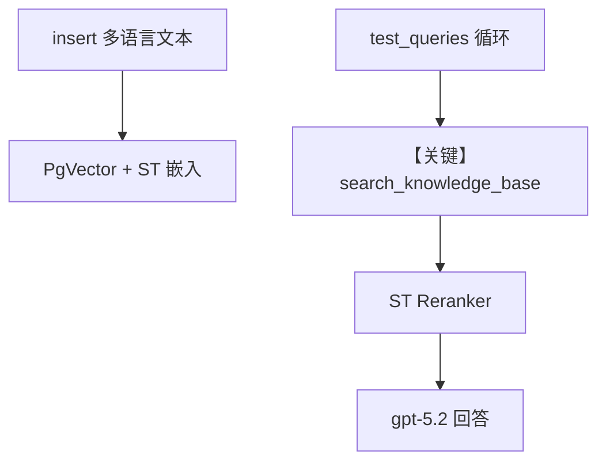

# rag_custom_embeddings.py — 实现原理分析

> 源文件：`cookbook/02_agents/07_knowledge/rag_custom_embeddings.py`

## 概述

本示例展示 **Sentence-Transformers 嵌入 + 本地重排序** 与 **多语言文本** 的 Agentic RAG：`SentenceTransformerEmbedder` 与 `SentenceTransformerReranker` 接入 `PgVector`，预置多语言 `search_results` 写入元数据；Agent 带显式检索指令并循环多条测试查询。

**核心配置一览：**

| 配置项 | 值 | 说明 |
|--------|------|------|
| `model` | `OpenAIResponses(id="gpt-5.2")` | 主模型 Responses API |
| `knowledge` | `Knowledge(PgVector(..., SentenceTransformerEmbedder, SentenceTransformerReranker))` | PG 向量库 + ST 管线 |
| `search_knowledge` | `True` | Agentic 检索 |
| `instructions` | 两条（与 reasoning RAG 示例相同） | 见下 |
| `markdown` | `True` | 是 |

字面量 `instructions`：

```text
Include sources in your response.
Always search your knowledge before answering the question.
```

## 核心组件解析

### 本地嵌入与重排

不依赖 OpenAI/Cohere 嵌入时，使用 HuggingFace 兼容模型 ID；重排器 `BAAI/bge-reranker-v2-m3` 在检索后精排。

### 运行机制与因果链

1. 脚本顶部循环 `knowledge.insert(text_content=..., metadata=...)` 灌库。
2. `for query in test_queries` 三次 `print_response`，每次可走 **`search_knowledge_base`**。
3. **定位**：强调 **开源嵌入生态** 与 **多语言评测查询**。

## System Prompt 组装

含 `markdown`、用户 `instructions`、`<knowledge_base>` 标准段（同前述 RAG 示例）。

## 完整 API 请求

主对话：`responses.create`；嵌入/重排在插入与检索时由 SentenceTransformer 栈本地或远程加载模型执行。

## Mermaid 流程图


```mermaid
flowchart TD
    I["insert 多语言文本"] --> K["PgVector + ST 嵌入"]
    Q["test_queries 循环"] --> T["【关键】search_knowledge_base"]
    T --> R["ST Reranker"]
    R --> M["gpt-5.2 回答"]
```

## 关键源码文件索引

| 文件 | 作用 |
|------|------|
| `agno/knowledge/embedder/sentence_transformer.py` | ST 嵌入 |
| `agno/knowledge/reranker/sentence_transformer.py` | ST 重排 |
| `agno/knowledge/knowledge.py` | `build_context` / 工具 |
