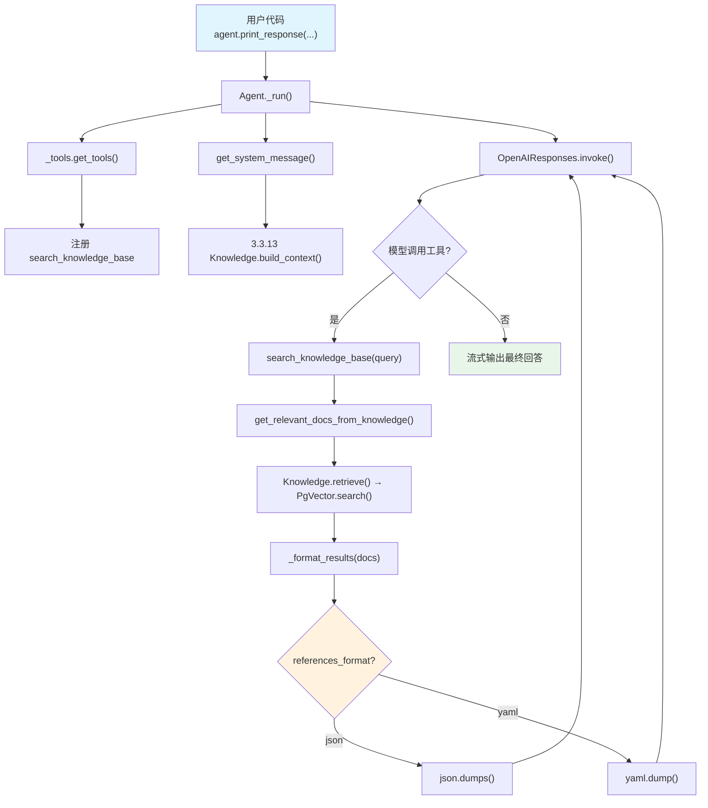

# references_format.py — 实现原理分析

> 源文件：`cookbook/02_agents/07_knowledge/references_format.py`

## 概述

本示例展示 Agno 的 **`references_format`** 配置：控制知识库搜索结果返回给模型的格式。默认为 `"json"`，本示例设置为 `"yaml"`，使搜索结果以 YAML 格式传递给模型，可能在某些场景下提升模型对结构化数据的理解。

**核心配置一览：**

| 配置项 | 值 | 说明 |
|--------|------|------|
| `name` | `None` | 未设置 |
| `model` | `OpenAIResponses(id="gpt-5.2")` | Responses API |
| `knowledge` | `Knowledge(vector_db=PgVector(...))` | PgVector 混合搜索 |
| `search_knowledge` | `True` | 启用 Agentic RAG |
| `references_format` | `"yaml"` | **搜索结果 YAML 格式**（默认 `"json"`） |
| `markdown` | `True` | 输出 Markdown 格式 |
| `instructions` | `None` | 未设置 |
| `tools` | `None` | 无额外工具 |

## 架构分层

```
用户代码层                      agno.agent 层
┌──────────────────────┐      ┌──────────────────────────────────────────┐
│ references_format.py │      │ Agent._run()                             │
│                      │      │  ├ _tools.get_tools()                    │
│ knowledge=Knowledge  │      │  │  └ create_knowledge_search_tool()     │
│   vector_db=PgVector │─────>│  │       → search_knowledge_base 工具     │
│   search_type=hybrid │      │  │                                        │
│                      │      │  ├ get_system_message()                   │
│ references_format=   │      │  │  └ 3.3.13 搜索指令                    │
│   "yaml"             │      │  │                                        │
│                      │      │  └ Model.response() → 工具调用           │
│                      │      │     └ search_knowledge_base(query)        │
│                      │      │        → _format_results(docs)            │
│                      │      │           → yaml.dump()  ← 关键差异      │
└──────────────────────┘      └──────────────────────────────────────────┘
                                        │
                                        ▼
                              ┌──────────────────┐
                              │ OpenAIResponses   │
                              │ gpt-5.2           │
                              └──────────────────┘
```

## 核心组件解析

### references_format 格式化逻辑

`_format_results()`（`_default_tools.py:118`）根据 `agent.references_format` 选择序列化方式：

```python
# agent/_default_tools.py L118-128
def _format_results(docs: Optional[List[Union[Dict[str, Any], str]]]) -> str:
    if not docs:
        return "No documents found"
    if agent.references_format == "json":
        import json
        return json.dumps(docs, indent=2, default=str)
    else:  # yaml
        import yaml
        return yaml.dump(docs, default_flow_style=False)
```

### JSON vs YAML 格式对比

| 格式 | 示例输出 | 特点 |
|------|---------|------|
| `"json"` | `[{"content": "...", "meta_data": {...}}]` | 紧凑，广泛支持 |
| `"yaml"` | `- content: "..."\n  meta_data:\n    source: "..."` | 可读性更好，缩进层次清晰 |

### references_format 属性定义

```python
# agent/agent.py L149
references_format: Literal["json", "yaml"] = "json"
```

`Literal` 类型限制只能使用 `"json"` 或 `"yaml"` 两个值。

## System Prompt 组装

| 序号 | 组成部分 | 本文件中的值/来源 | 是否生效 |
|------|---------|-----------------|---------|
| 1 | `system_message`（自定义） | `None` | 否 |
| 3.1 | `instructions` | `None` | 否 |
| 3.1.1 | 模型指令 | OpenAIResponses 默认 | 视模型 |
| 3.2.1 | `markdown` | `True` | 是 |
| 3.2.2 | `add_datetime_to_context` | `False` | 否 |
| 3.2.3 | `add_location_to_context` | `False` | 否 |
| 3.2.4 | `add_name_to_context` | `False` | 否 |
| 3.3.1 | `description` | `None` | 否 |
| 3.3.2 | `role` | `None` | 否 |
| 3.3.3 | instructions 拼接 | 无 | 否 |
| 3.3.4 | additional_information | `markdown` 指令 | 是 |
| 3.3.5 | `_tool_instructions` | 无 | 否 |
| fmt | `resolve_in_context` 变量替换 | `True`（默认） | 是（无模板变量） |
| 3.3.7 | `expected_output` | `None` | 否 |
| 3.3.8 | `additional_context` | `None` | 否 |
| 3.3.9 | `add_memories_to_context` | `None` | 否 |
| 3.3.10 | `add_culture_to_context` | `None` | 否 |
| 3.3.11 | `add_session_summary_to_context` | `None` | 否 |
| 3.3.12 | `add_learnings_to_context` | 无 `_learning` | 否 |
| 3.3.13 | `search_knowledge` instructions | Knowledge.build_context() | **是** |
| 3.3.14 | 模型 system message | 视模型 | 视模型 |
| 3.3.15 | JSON output prompt | 无 | 否 |
| 3.3.16 | response model format prompt | 无 | 否 |
| 3.3.17 | `add_session_state_to_context` | `False` | 否 |

### 最终 System Prompt

```text
<additional_information>
- Use markdown to format your answers.
</additional_information>

<knowledge_base>
You have a knowledge base you can search using the search_knowledge_base tool. Search before answering questions—don't assume you know the answer. For ambiguous questions, search first rather than asking for clarification.
</knowledge_base>
```

## 完整 API 请求

**第一轮：模型调用搜索工具**

```python
client.responses.create(
    model="gpt-5.2",
    input=[
        {"role": "developer", "content": "...（markdown + knowledge_base 指令）"},
        {"role": "user", "content": "How do I make chicken and galangal in coconut milk soup?"}
    ],
    tools=[
        {
            "type": "function",
            "function": {
                "name": "search_knowledge_base",
                "description": "Use this function to search the knowledge base for information about a query.",
                "parameters": {
                    "type": "object",
                    "properties": {
                        "query": {"type": "string"}
                    },
                    "required": ["query"]
                }
            }
        }
    ],
    stream=True,
    stream_options={"include_usage": True}
)
```

**第二轮：YAML 格式的工具调用结果**

```python
client.responses.create(
    model="gpt-5.2",
    input=[
        {"role": "developer", "content": "..."},
        {"role": "user", "content": "How do I make chicken and galangal in coconut milk soup?"},
        {"type": "function_call", "name": "search_knowledge_base",
         "arguments": "{\"query\": \"chicken galangal coconut milk soup\"}"},
        # YAML 格式的工具调用结果（references_format="yaml"）
        {"type": "function_call_output", "output": "- content: \"Chicken and Galangal in Coconut Milk Soup...\\n\"\n  meta_data:\n    source: ThaiRecipes.pdf\n    page: 12\n"}
    ],
    tools=[...],
    stream=True,
    stream_options={"include_usage": True}
)
```

> 与默认 JSON 格式的区别仅在 `function_call_output` 的内容格式。

## Mermaid 流程图



## 关键源码文件索引

| 文件 | 关键函数/类 | 作用 |
|------|------------|------|
| `agno/agent/agent.py` | `references_format` L149 | 引用格式属性（`Literal["json", "yaml"]`） |
| `agno/agent/_default_tools.py` | `_format_results()` L118 | 根据 references_format 序列化文档 |
| `agno/agent/_default_tools.py` | `create_knowledge_search_tool()` L103 | 创建搜索工具 |
| `agno/knowledge/knowledge.py` | `search()` L507 | 向量搜索 |
| `agno/knowledge/knowledge.py` | `retrieve()` L3303 | 检索接口 |
