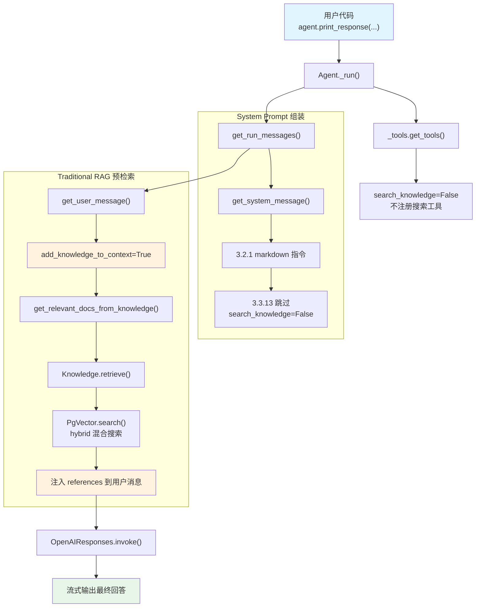

# traditional_rag.py — 实现原理分析

> 源文件：`cookbook/02_agents/07_knowledge/traditional_rag.py`

## 概述

本示例展示 Agno 的 **Traditional RAG**（传统检索增强生成）机制：通过 `add_knowledge_to_context=True` 在构建用户消息时**自动检索**知识库文档，将检索结果以 `<references>` 标签注入用户消息中，而非注册为工具让模型按需调用。与 Agentic RAG 的核心区别是**检索时机**——Traditional RAG 在消息构建阶段预检索，Agentic RAG 在模型推理过程中按需检索。

**核心配置一览：**

| 配置项 | 值 | 说明 |
|--------|------|------|
| `name` | `None` | 未设置 |
| `model` | `OpenAIResponses(id="gpt-5.2")` | Responses API |
| `knowledge` | `Knowledge(vector_db=PgVector(...))` | PgVector 混合搜索知识库 |
| `add_knowledge_to_context` | `True` | **启用 Traditional RAG**（预注入上下文） |
| `search_knowledge` | `False` | **禁用 Agentic RAG**（不注册搜索工具） |
| `markdown` | `True` | 输出 Markdown 格式 |
| `instructions` | `None` | 未设置 |
| `tools` | `None` | 无工具 |
| `references_format` | `"json"`（默认） | 引用格式 |

## 架构分层

```
用户代码层                      agno.agent 层
┌──────────────────────┐      ┌──────────────────────────────────────────┐
│ traditional_rag.py   │      │ Agent._run()                             │
│                      │      │  ├ _tools.get_tools()                    │
│ knowledge=Knowledge  │      │  │  └ search_knowledge=False → 无搜索工具│
│   vector_db=PgVector │─────>│  │                                        │
│   search_type=hybrid │      │  ├ _messages.get_run_messages()           │
│                      │      │  │  ├ get_system_message()                │
│ add_knowledge_to_    │      │  │  │  └ 无 3.3.13（search_knowledge=F） │
│   context=True       │      │  │  └ get_user_message()                  │
│ search_knowledge=    │      │  │     └ add_knowledge_to_context=True    │
│   False              │      │  │        ├ get_relevant_docs()           │
│                      │      │  │        │  └ Knowledge.retrieve()       │
│                      │      │  │        │     └ PgVector.search()       │
│                      │      │  │        └ 注入 <references> 到用户消息  │
│                      │      │  │                                        │
│                      │      │  └ Model.response()（无工具，直接生成）    │
└──────────────────────┘      └──────────────────────────────────────────┘
                                        │
                                        ▼
                              ┌──────────────────┐
                              │ OpenAIResponses   │
                              │ gpt-5.2           │
                              └──────────────────┘
```

## 核心组件解析

### Traditional RAG 检索注入

当 `add_knowledge_to_context=True` 时，`get_user_message()`（`_messages.py:905`）在构建用户消息时自动检索并注入：

```python
# agent/_messages.py L905-954
if agent.add_knowledge_to_context:
    # 检索相关文档
    docs_from_knowledge = get_relevant_docs_from_knowledge(
        agent, query=user_msg_content, filters=knowledge_filters, run_context=run_context,
    )
    if docs_from_knowledge is not None:
        references = MessageReferences(query=user_msg_content, references=docs_from_knowledge, ...)
        run_response.references.append(references)

# 注入到用户消息末尾
if agent.add_knowledge_to_context and references is not None:
    user_msg_content_str += "\n\nUse the following references from the knowledge base if it helps:\n"
    user_msg_content_str += "<references>\n"
    user_msg_content_str += convert_documents_to_string(agent, references.references) + "\n"
    user_msg_content_str += "</references>"
```

### Agentic RAG vs Traditional RAG 对比

| 维度 | Traditional RAG | Agentic RAG |
|------|----------------|-------------|
| 触发开关 | `add_knowledge_to_context=True` | `search_knowledge=True` |
| 检索时机 | 消息构建时（预检索） | 模型推理时（按需工具调用） |
| 注入位置 | 用户消息末尾 `<references>` | 工具调用结果（assistant → tool） |
| 模型是否感知工具 | 否（无搜索工具） | 是（注册 `search_knowledge_base`） |
| 多次检索 | 不支持（固定一次） | 支持（模型可多次调用） |
| System Prompt | 无搜索指令 | 包含 3.3.13 搜索指令 |

### search_knowledge=False 的效果

本示例显式设置 `search_knowledge=False`，禁止注册搜索工具。由于 Agent 默认 `search_knowledge=True`，不设置此项会导致同时启用两种 RAG 模式。

## System Prompt 组装

| 序号 | 组成部分 | 本文件中的值/来源 | 是否生效 |
|------|---------|-----------------|---------|
| 1 | `system_message`（自定义） | `None` | 否 |
| 3.1 | `instructions` | `None` | 否 |
| 3.1.1 | 模型指令 | OpenAIResponses 默认 | 视模型 |
| 3.2.1 | `markdown` | `True` | 是 |
| 3.2.2 | `add_datetime_to_context` | `False` | 否 |
| 3.2.3 | `add_location_to_context` | `False` | 否 |
| 3.2.4 | `add_name_to_context` | `False` | 否 |
| 3.3.1 | `description` | `None` | 否 |
| 3.3.2 | `role` | `None` | 否 |
| 3.3.3 | instructions 拼接 | 无 | 否 |
| 3.3.4 | additional_information | `markdown` 指令 | 是 |
| 3.3.5 | `_tool_instructions` | 无 | 否 |
| fmt | `resolve_in_context` 变量替换 | `True`（默认） | 是（无模板变量） |
| 3.3.7 | `expected_output` | `None` | 否 |
| 3.3.8 | `additional_context` | `None` | 否 |
| 3.3.9 | `add_memories_to_context` | `None` | 否 |
| 3.3.10 | `add_culture_to_context` | `None` | 否 |
| 3.3.11 | `add_session_summary_to_context` | `None` | 否 |
| 3.3.12 | `add_learnings_to_context` | `True`（默认），但无 `_learning` | 否 |
| 3.3.13 | `search_knowledge` instructions | `search_knowledge=False` | **否** |
| 3.3.14 | 模型 system message | 视模型 | 视模型 |
| 3.3.15 | JSON output prompt | 无 | 否 |
| 3.3.16 | response model format prompt | 无 | 否 |
| 3.3.17 | `add_session_state_to_context` | `False` | 否 |

### 最终 System Prompt

```text
<additional_information>
- Use markdown to format your answers.
</additional_information>
```

> 注意：由于 `search_knowledge=False`，步骤 3.3.13 不会注入 Knowledge 搜索指令。

## 完整 API 请求

**单轮请求（无工具调用）**

```python
client.responses.create(
    model="gpt-5.2",
    input=[
        # 1. System Message（role_map: system → developer）
        {"role": "developer", "content": "<additional_information>\n- Use markdown to format your answers.\n</additional_information>"},
        # 2. 用户消息（已注入检索结果）
        {"role": "user", "content": "How do I make chicken and galangal in coconut milk soup\n\nUse the following references from the knowledge base if it helps:\n<references>\n{\"content\": \"Chicken and Galangal in Coconut Milk Soup (Tom Kha Gai)...\", \"meta_data\": {\"source\": \"ThaiRecipes.pdf\", ...}}\n</references>"}
    ],
    # 注意：无 tools 参数（search_knowledge=False）
    stream=True,
    stream_options={"include_usage": True}
)
```

> Traditional RAG 只需一轮 API 调用。检索在 `get_user_message()` 阶段已完成，检索结果作为用户消息的一部分发送给模型。

## Mermaid 流程图



## 关键源码文件索引

| 文件 | 关键函数/类 | 作用 |
|------|------------|------|
| `agno/agent/agent.py` | `add_knowledge_to_context` L142 | Traditional RAG 开关 |
| `agno/agent/agent.py` | `search_knowledge` L195 | Agentic RAG 开关（本例 `False`） |
| `agno/agent/_messages.py` | `get_user_message()` L905-954 | 预检索并注入 `<references>` |
| `agno/agent/_messages.py` | `get_relevant_docs_from_knowledge()` L1665 | 文档检索核心 |
| `agno/knowledge/knowledge.py` | `Knowledge` L41 | 知识库类 |
| `agno/knowledge/knowledge.py` | `search()` L507 | 向量搜索 |
| `agno/knowledge/knowledge.py` | `retrieve()` L3303 | 检索接口 |
