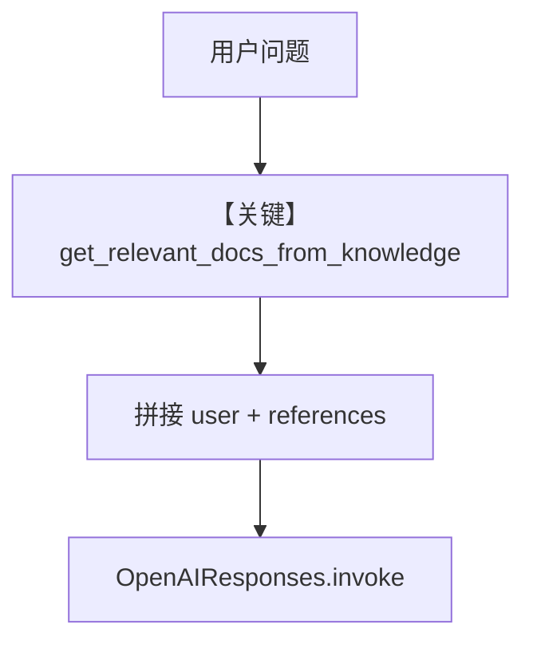

# traditional_rag.py — 实现原理分析

> 源文件：`cookbook/02_agents/07_knowledge/traditional_rag.py`

## 概述

本示例展示 **Traditional RAG（自动注入检索片段到用户消息）**：开启 **`add_knowledge_to_context=True`**，并显式 **`search_knowledge=False`**，关闭 Agentic 工具检索，改为在组装 **user message** 时附加 `<references>` 块（见 `get_user_message` 路径）。

**核心配置一览：**

| 配置项 | 值 | 说明 |
|--------|------|------|
| `model` | `OpenAIResponses(id="gpt-5.2")` | Responses API |
| `knowledge` | `PgVector` hybrid + OpenAI 嵌入 | 与 agentic 示例同型 |
| `add_knowledge_to_context` | `True` | 检索并拼入用户消息 |
| `search_knowledge` | `False` | 关闭 search_knowledge_base 工具链默认行为 |
| `markdown` | `True` | 是 |

## 架构分层

```
get_user_message()
  ├ add_knowledge_to_context → get_relevant_docs_from_knowledge
  └ 拼接 "Use the following references..." + <references>...</references>
（无 search_knowledge 工具说明于 system 的强依赖，且 #3.3.13 因无 resolved 工具链可能不同——以实际 _resolved_knowledge 为准）
```

注：`search_knowledge=False` 时，`Knowledge.build_context` 可能不进入 system（`# 3.3.13` 条件含 `agent.search_knowledge`）。传统 RAG 依赖 **user 侧 references**。

## 核心组件解析

### `get_user_message` 中的 references

`agno/agent/_messages.py` 约 L915–964：当 `add_knowledge_to_context` 为真时检索文档，并把引用附加到 **用户消息字符串**（`# 4.1` 注释段）。

### 与 Agentic RAG 对照

| 模式 | `search_knowledge` | 知识出现位置 |
|------|---------------------|--------------|
| Agentic | `True` | System 中 `<knowledge_base>` + 工具调用 |
| Traditional | `False` + `add_knowledge_to_context` | User 消息中 `<references>` |

### 运行机制与因果链

1. 用户问题字符串作为 query 检索 → 文档拼进 **同一条 user 消息** → 模型直接生成。
2. **无工具循环**中的 `search_knowledge_base`（本配置下）。

## System Prompt 组装

可能仅含 markdown 等默认段，**无** `<knowledge_base>` 工具说明（因 `search_knowledge=False`）。业务知识出现在 **user** 侧 references。

### 还原后的 User 侧附加结构（模板）

```text

Use the following references from the knowledge base if it helps:
<references>
... 文档正文（格式依 references_format，默认 JSON/YAML 等）...
</references>
```

前缀句来自 `_messages.py` 约 L961–963。前面为用户原问题文本。

参照用户句：`How do I make chicken and galangal in coconut milk soup`

## 完整 API 请求

单次 `responses.create` 的 `input` 中含 **developer/system（若有）+ 带 references 的 user**。

## Mermaid 流程图


```mermaid
flowchart TD
    U["用户问题"] --> R["【关键】get_relevant_docs_from_knowledge"]
    R --> M["拼接 user + references"]
    M --> O["OpenAIResponses.invoke"]
```

## 关键源码文件索引

| 文件 | 关键位置 | 作用 |
|------|---------|------|
| `agno/agent/_messages.py` | `get_user_message` L915+；`# 4.1` L954+ | 传统 RAG 拼 user |
| `agno/agent/agent.py` | `add_knowledge_to_context`；`search_knowledge` | Agent 开关 |
