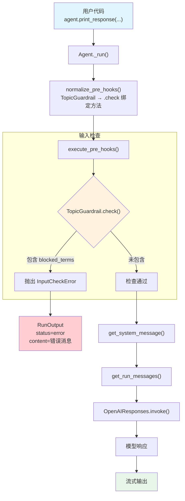

# custom_guardrail.py — 实现原理分析

> 源文件：`cookbook/02_agents/08_guardrails/custom_guardrail.py`

## 概述

本示例展示 Agno 的 **`pre_hooks` + 自定义 `BaseGuardrail`** 机制：通过继承 `BaseGuardrail` 抽象基类实现自定义输入检查逻辑，在 Agent 执行前拦截危险内容。Guardrail 通过 `pre_hooks` 注册，在 `_run()` 的步骤 4 中执行，检查失败时抛出 `InputCheckError` 中断运行。

**核心配置一览：**

| 配置项 | 值 | 说明 |
|--------|------|------|
| `name` | `"Guarded Agent"` | Agent 名称 |
| `model` | `OpenAIResponses(id="gpt-5.2")` | Responses API |
| `pre_hooks` | `[TopicGuardrail()]` | 自定义输入护栏 |
| `post_hooks` | `None` | 未设置 |
| `instructions` | `None` | 未设置 |
| `description` | `None` | 未设置 |
| `markdown` | `True`（默认） | 格式化输出 |

## 架构分层

```
用户代码层                       agno.agent 层
┌─────────────────────────┐    ┌──────────────────────────────────────────┐
│ custom_guardrail.py     │    │ Agent._run()                             │
│                         │    │  ├ _run.py L1250-1256                    │
│ TopicGuardrail          │    │  │  normalize_pre_hooks()                │
│   (BaseGuardrail)       │───>│  │    → TopicGuardrail.check 绑定方法   │
│                         │    │  │                                       │
│ pre_hooks=[             │    │  ├ _hooks.py L43                         │
│   TopicGuardrail()      │    │  │  execute_pre_hooks()                  │
│ ]                       │    │  │    → hook(run_input=RunInput)          │
│                         │    │  │    → InputCheckError? → 中断          │
│                         │    │  │                                       │
│ print_response(         │    │  ├ _messages.py L106                     │
│   "Explain secure...",  │    │  │  get_system_message()                 │
│   stream=True           │    │  │                                       │
│ )                       │    │  ├ _messages.py L1146                    │
└─────────────────────────┘    │  │  get_run_messages()                   │
                               └──┴──────────────────────────────────────┘
                                       │
                                       ▼
                               ┌──────────────────┐
                               │ OpenAIResponses   │
                               │ gpt-5.2           │
                               └──────────────────┘
```

## 核心组件解析

### BaseGuardrail 抽象基类

`BaseGuardrail` 定义在 `agno/guardrails/base.py` L8：

```python
class BaseGuardrail(ABC):
    """所有护栏实现的抽象基类"""

    @abstractmethod
    def check(self, run_input: Union[RunInput, TeamRunInput]) -> None:
        """同步护栏检查"""
        pass

    @abstractmethod
    async def async_check(self, run_input: Union[RunInput, TeamRunInput]) -> None:
        """异步护栏检查"""
        pass
```

子类必须同时实现 `check()` 和 `async_check()` 两个方法。检查通过时返回 `None`，检查失败时抛出 `InputCheckError` 或 `OutputCheckError`。

### TopicGuardrail 自定义实现

用户自定义的 `TopicGuardrail` 检查输入内容中是否包含安全敏感关键词：

```python
class TopicGuardrail(BaseGuardrail):
    def check(self, run_input) -> None:
        content = (run_input.input_content or "").lower()
        blocked_terms = ["build malware", "phishing template", "exploit"]
        # 关键词匹配 → 抛出 InputCheckError 中断执行
        if any(term in content for term in blocked_terms):
            raise InputCheckError(
                "Input contains blocked security-abuse content.",
                check_trigger=CheckTrigger.INPUT_NOT_ALLOWED,
            )
```

### Hook 规范化（normalize_pre_hooks）

`normalize_pre_hooks()`（`utils/hooks.py` L70）在 `_run.py` L1250-1256 首次运行时调用，将 `BaseGuardrail` 实例转换为绑定方法：

```python
# utils/hooks.py L84-88
if isinstance(hook, BaseGuardrail):
    if async_mode:
        result_hooks.append(hook.async_check)  # 异步模式用 async_check
    else:
        result_hooks.append(hook.check)         # 同步模式用 check
```

规范化只执行一次（`agent._hooks_normalised` 标记），后续运行直接使用绑定方法。

### Hook 执行（execute_pre_hooks）

`execute_pre_hooks()`（`_hooks.py` L43）按顺序执行所有 pre_hooks：

```python
# _hooks.py L99-147
for i, hook in enumerate(hooks):
    try:
        # 根据 hook 函数签名过滤参数（自动注入 run_input/agent/session 等）
        filtered_args = filter_hook_args(hook, all_args)
        hook(**filtered_args)
    except (InputCheckError, OutputCheckError) as e:
        raise e  # 直接向上传播，中断 Agent 执行
    except Exception as e:
        log_error(...)  # 其他异常仅记录日志，不中断
```

### 异常处理（_run.py）

`InputCheckError` 在 `_run.py` L628 被捕获：

```python
# _run.py L628-646
except (InputCheckError, OutputCheckError) as e:
    run_response.status = RunStatus.error     # 设置状态为 error
    if run_response.content is None:
        run_response.content = str(e)         # 错误消息作为响应内容
    cleanup_and_store(...)                    # 清理并存储会话
    return run_response                       # 返回错误响应
```

### InputCheckError 与 CheckTrigger

异常类定义在 `agno/exceptions.py` L122-152：

| 类 | 说明 |
|----|------|
| `CheckTrigger` | 枚举：`OFF_TOPIC`, `INPUT_NOT_ALLOWED`, `OUTPUT_NOT_ALLOWED`, `VALIDATION_FAILED`, `PROMPT_INJECTION`, `PII_DETECTED` |
| `InputCheckError` | 输入检查异常，携带 `message`、`check_trigger`、`additional_data` |
| `OutputCheckError` | 输出检查异常，结构与 InputCheckError 相同 |

## System Prompt 组装

| 序号 | 组成部分 | 本文件中的值/来源 | 是否生效 |
|------|---------|-----------------|---------|
| 1 | `system_message`（自定义） | `None` | 否 |
| 3.1 | `instructions` | `None` | 否 |
| 3.1.1 | 模型指令（`get_instructions_for_model`） | OpenAIResponses 默认 | 视模型而定 |
| 3.2.1 | `markdown` | `True`（默认） | 是 |
| 3.2.2 | `add_datetime_to_context` | `False`（默认） | 否 |
| 3.2.3 | `add_location_to_context` | `False`（默认） | 否 |
| 3.2.4 | `add_name_to_context` | `False`（默认） | 否 |
| 3.3.1 | `description` | `None` | 否 |
| 3.3.2 | `role` | `None` | 否 |
| 3.3.3 | instructions 拼接 | 无 | 否 |
| 3.3.4 | additional_information | `["Use markdown to format your answers."]` | 是 |
| 3.3.5 | `_tool_instructions` | `None` | 否 |
| fmt | `resolve_in_context` 变量替换 | 默认 True，无模板变量 | 否 |
| 3.3.7 | `expected_output` | `None` | 否 |
| 3.3.8 | `additional_context` | `None` | 否 |
| 3.3.9 | `add_memories_to_context` | `False`（默认） | 否 |
| 3.3.10 | `add_culture_to_context` | `False`（默认） | 否 |
| 3.3.11 | `add_session_summary_to_context` | `False`（默认） | 否 |
| 3.3.12 | `add_learnings_to_context` | `True`（默认） | 否（无 learning） |
| 3.3.13 | `search_knowledge` instructions | 否（无 knowledge） | 否 |
| 3.3.14 | 模型 system message | 视模型而定 | 视模型而定 |
| 3.3.15 | JSON output prompt | 否（无 output_schema） | 否 |
| 3.3.16 | response model format prompt | 否 | 否 |
| 3.3.17 | `add_session_state_to_context` | `False`（默认） | 否 |

### 最终 System Prompt

```text
<additional_information>
- Use markdown to format your answers.
</additional_information>
```

## 完整 API 请求

**检查通过时（正常执行）：**

```python
client.responses.create(
    model="gpt-5.2",
    input=[
        # 1. System Message（role_map: system → developer）
        {
            "role": "developer",
            "content": "<additional_information>\n- Use markdown to format your answers.\n</additional_information>\n\n"
        },
        # 2. 当前用户输入
        {
            "role": "user",
            "content": "Explain secure password management best practices."
        }
    ],
    stream=True,
    stream_options={"include_usage": True}
)
```

**检查失败时（TopicGuardrail 拦截）：**

> 不会发出 API 请求。`execute_pre_hooks()` 阶段 `TopicGuardrail.check()` 抛出 `InputCheckError`，直接返回 `RunOutput(status=RunStatus.error, content="Input contains blocked security-abuse content.")`。

## Mermaid 流程图



## 关键源码文件索引

| 文件 | 关键函数/类 | 作用 |
|------|------------|------|
| `agno/guardrails/base.py` | `BaseGuardrail` L8 | 护栏抽象基类，定义 check/async_check 接口 |
| `agno/exceptions.py` | `CheckTrigger` L122 | 护栏触发类型枚举 |
| `agno/exceptions.py` | `InputCheckError` L134 | 输入检查异常 |
| `agno/utils/hooks.py` | `normalize_pre_hooks()` L70 | 将 BaseGuardrail 实例转为绑定方法 |
| `agno/utils/hooks.py` | `filter_hook_args()` L156 | 根据函数签名过滤参数 |
| `agno/utils/hooks.py` | `is_guardrail_hook()` L57 | 判断 hook 是否为护栏（后台执行时区分用） |
| `agno/agent/_hooks.py` | `execute_pre_hooks()` L43 | 按顺序执行所有 pre_hooks |
| `agno/agent/_run.py` | 规范化 L1250-1256 | 首次运行时规范化 hooks |
| `agno/agent/_run.py` | pre_hooks 执行 L410-425 | 步骤 4：执行 pre_hooks |
| `agno/agent/_run.py` | 异常处理 L628-646 | 捕获 InputCheckError 设置 error 状态 |
| `agno/agent/agent.py` | `pre_hooks` L176 | Agent 属性定义 |
| `agno/run/agent.py` | `RunInput` L29 | 输入容器，传递给 hook 的参数 |
