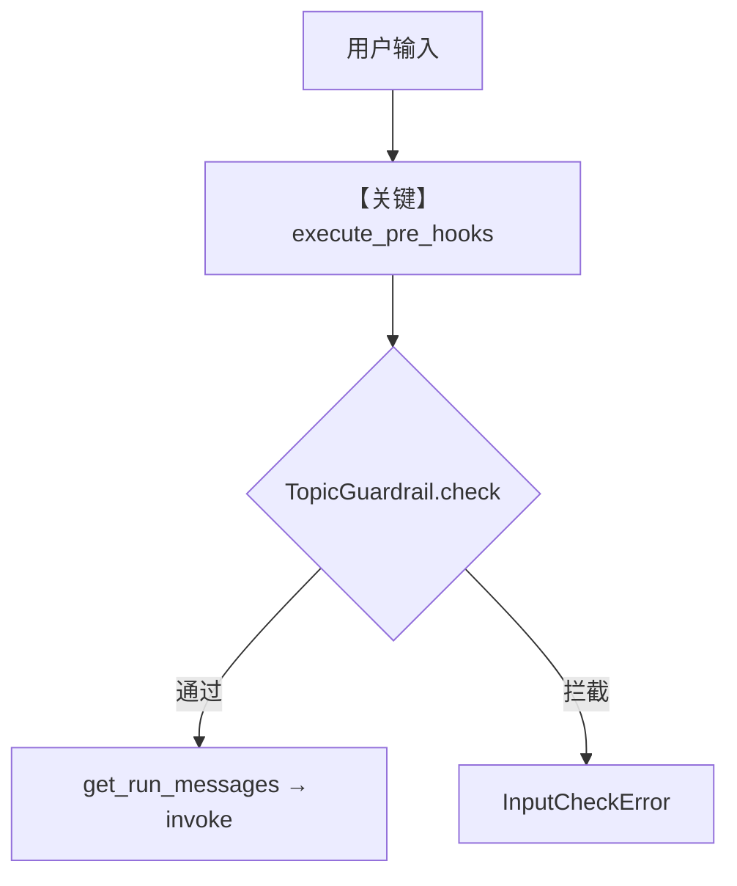

# custom_guardrail.py — 实现原理分析

<!-- cookbook-py-source:start -->
## 完整源码

```python
"""
Custom Guardrail
=============================

Custom Guardrail.
"""

from agno.agent import Agent
from agno.exceptions import CheckTrigger, InputCheckError
from agno.guardrails.base import BaseGuardrail
from agno.models.openai import OpenAIResponses


class TopicGuardrail(BaseGuardrail):
    """Blocks requests that ask for dangerous instructions."""

    def check(self, run_input) -> None:
        content = (run_input.input_content or "").lower()
        blocked_terms = ["build malware", "phishing template", "exploit"]
        if any(term in content for term in blocked_terms):
            raise InputCheckError(
                "Input contains blocked security-abuse content.",
                check_trigger=CheckTrigger.INPUT_NOT_ALLOWED,
            )

    async def async_check(self, run_input) -> None:
        self.check(run_input)


# ---------------------------------------------------------------------------
# Create Agent
# ---------------------------------------------------------------------------
agent = Agent(
    name="Guarded Agent",
    model=OpenAIResponses(id="gpt-5.2"),
    pre_hooks=[TopicGuardrail()],
)

# ---------------------------------------------------------------------------
# Run Agent
# ---------------------------------------------------------------------------
if __name__ == "__main__":
    agent.print_response(
        "Explain secure password management best practices.", stream=True
    )
```

<!-- cookbook-py-source:end -->

> 源文件：`cookbook/02_agents/08_guardrails/custom_guardrail.py`

## 概述

本示例展示 **自定义输入护栏**：继承 `BaseGuardrail`，实现 `check` / `async_check`，在命中敏感词时抛出 `InputCheckError`（`CheckTrigger.INPUT_NOT_ALLOWED`），通过 `pre_hooks` 在 **模型调用前** 拦截。

**核心配置一览：**

| 配置项 | 值 | 说明 |
|--------|------|------|
| `name` | `"Guarded Agent"` | Agent 名 |
| `model` | `OpenAIResponses(id="gpt-5.2")` | Responses API |
| `pre_hooks` | `[TopicGuardrail()]` | 输入检查 |
| `instructions` | `None` | 未设置 |

## 核心组件解析

### `TopicGuardrail`

`blocked_terms` 列表做子串匹配；命中则 `raise InputCheckError(...)`。

### 执行顺序

`_run.py` 在构建消息前调用 `execute_pre_hooks`（约 L418+），pre_hooks 按列表顺序执行。

### 运行机制与因果链

1. **路径**：`print_response` → `execute_pre_hooks` → `TopicGuardrail.check` → 通过则继续 `get_run_messages` → `invoke`。
2. **副作用**：无持久化；仅中断当次 run。
3. **与混合 hooks 示例差异**：本文件仅单一护栏类，无日志 hook。

## System Prompt 组装

无 `instructions`/`markdown` 显式设置；若 system 为空或极短，见 `get_system_message` 空内容规则。

参照用户句（示例中合法）：`Explain secure password management best practices.`

## 完整 API 请求

若护栏通过，仍为 `responses.create`；若抛错，则 **无** API 调用。

## Mermaid 流程图


```mermaid
flowchart TD
    A["用户输入"] --> B["【关键】execute_pre_hooks"]
    B --> C{"TopicGuardrail.check"}
    C -->|通过| D["get_run_messages → invoke"]
    C -->|拦截| E["InputCheckError"]
```

## 关键源码文件索引

| 文件 | 作用 |
|------|------|
| `agno/guardrails/base.py` | `BaseGuardrail` |
| `agno/agent/_hooks.py` | `execute_pre_hooks` |
| `agno/agent/_run.py` | pre_hooks 调用点 L418+ |
| `agno/exceptions` | `InputCheckError`；`CheckTrigger` |
